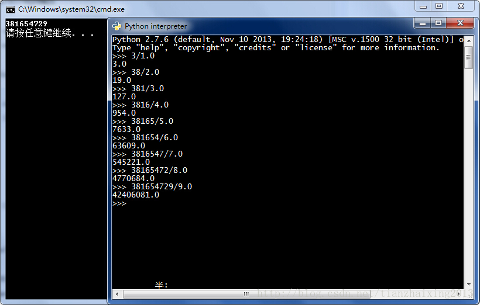

# 1~9数字问题


```cpp
    /*
    *1~9的9个数字，每个数字只能出现一次，要求这样一个9位整数：其第一位能被1整除，前两位能被2整除，
    *前三位能被3整除...依次类推，前9位能被9整除。
    */

    //方法1 ---> 381654729
    #include<iostream>
    #include<vector>
    #include <iomanip>
    bool Used[10];
    vector<long long> v;
    void Dfs(int k, long long val)
    {
        if (k && ((val%k)!= 0))
        {
            return;
        }

        if (9 == k)
        {
            v.push_back(val);
            return;
        }

        for (int i = 1; i <= 9; i++)
        {
            if (!Used[i])
            {
                Used[i] = true;
                Dfs(k+1,val*10+i);
                Used[i] = false;
            }
        }
    }

    int main()
    {
        Dfs(0,0);

        for (int i = 0; i < v.size(); i++)
        {
            cout << setprecision(11)<< v[i] << endl;
        }
        return 0;
    }
```

  


Python代码来自[点击打开链接](http://blog.sina.com.cn/s/blog_967817f20101jwz3.html)


```python
    #Python:

    a   = [1,2,3,4,5,6,7,8,9]
    out = []

    def verify(out):
        length = len(out)
        if length == 0:
            return True
        total = 0
        for i in range(0, length):
            total += pow(10, length - i - 1) * out[i]
        if total % length == 0:
            return True
        else:
            return False

    def dfs(out):
        isOK = verify(out)
        if not isOK:
            return
        if len(out) == len(a):
            print out
            return

        unused = []
        for i in a:
            if i not in out:
                unused.append(i)

        for i in unused:
            out.append(i)          #相当于把当前加入的数入栈
            dfs(out)
            out.remove(out[-1])    #考虑加入的数不满足整除条件，则相当于把刚加进去的数出栈

    dfs(out)
```
