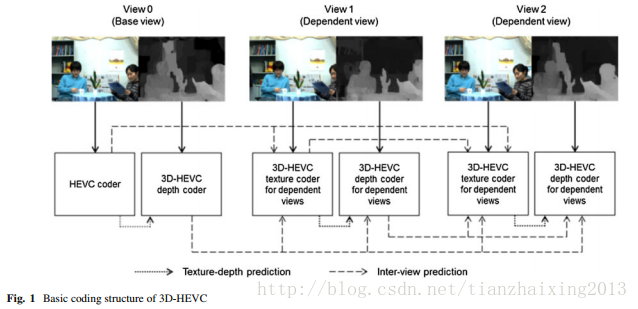
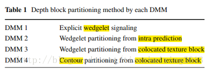

# 3D-HEVC 框图+帧内深度编码简介

1\. 3D-HEVC 编码框图

  

3D-HEVC基本编码结构如上图所示：

①基准视点(Base view)比独立视点(Dependent view)先进行编码；

②独立视点的顺序依据视频序列而定(3D-HEVC不同测试序列的独立视点顺序不一样)；

③对深度编码的修改仅仅影响独立视点的纹理(彩色)编码，而对基准视点中已编码的纹理编码无影响；

④鉴于以上分析，我们可以对修改3D-HEVC中的深度视频编码方案

2\. 3D-HEVC中深度帧内编码

深度数据的帧内编码，包含8种额外的模式：

4种深度模型模式DMM(Depth modeling modes) ---> 3D-HEVC初试测试模型引入

1种链编码模式CCM(Chain coding mode) ---> JCT3V第一次会议引入

3种简单深度编码模式SDC(Simplified depth coding) --->JCT3V第二次会议引入

① DMM:

  

DMM包含三种楔形预测模式(wedgelet prediction modes)和一种外形预测模式(contourprediction mode).

② CCM: CCM用一条链编码来模拟深度块边缘.

③ SDC: SDC是一个包含planar, DC and wedgelet三种模式的残差编码方法。

  

来自：2014_Springer_Unified depth intra coding for 3D video extension of HEVC.pdf