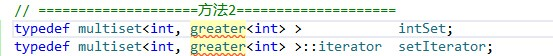

# C++/C学习困惑知识点...不断更新ing

1\. <cstring> <string.h> <string>区别：

<cstring>是包含一些C字符串的操作函数，包含一些常用的C字符串处理函数，比如strcmp、strlen、strcpy之类的函数与原来的<string.h>对应。但头文件的内容在名字空间std 中。

<string>包含的是C++的string类。

2\. assert()函数使用 

assert宏的原型定义在<assert.h>中，其作用是如果它的条件返回错误，则终止程序执行，原型定义：


```
    #include <assert.h>
    void assert( int expression );
```


assert的作用是现计算表达式 expression ，如果其值为假（即为0），那么它先向std::err打印一条出错信息，然后通过调用 abort 来终止程序运行。

已放弃使用assert()的原因是，频繁的调用会极大的影响程序的性能，增加额外的开销。在调试结束后，可以通过在包含#include <assert.h>的语句之前插入 #define NDEBUG 来禁用assert调用，示例代码如下：


```
    #include <stdio.h>
    #define NDEBUG
    #include <assert.h>
```


http://www.cnblogs.com/ggzss/archive/2011/08/18/2145017.html

  


2.void fun() const

修饰类成员函数的const.  
形如:void _Fun() const { };  
你需要知道的几点规则：  
a.const对象只能访问const成员函数,而非const对象可以访问任意  
的成员函数,包括const成员函数.  
b.const对象的成员是不可修改的,然而const对象通过指针维护的对象却  
是可以修改的.  
c.const成员函数不可以修改对象的数据,不管对象是否具有const性质.它在  
编译时,以是否修改成员数据为依据,进行检查.  
e.然而加上mutable修饰符的数据成员,对于任何情况下通过任何手段  
都可修改,自然此时的const成员函数是可以修改它的…  


http://bbs.csdn.net/topics/70204012  


  


3\. rand()函数


```
    int RandomInRange(int min, int max)
    {
        int random = rand() % (max - min + 1) + min;// min ~ max
        return random;
    }
```


  


```
    rand()%(b-a)的范围是0~b-a-1，然后加上a，也就是范围变成了a~b-1。
```


4\. 

  


提示greater不是模板~~~  


解决方案： 添加#include<functional>头文件

  