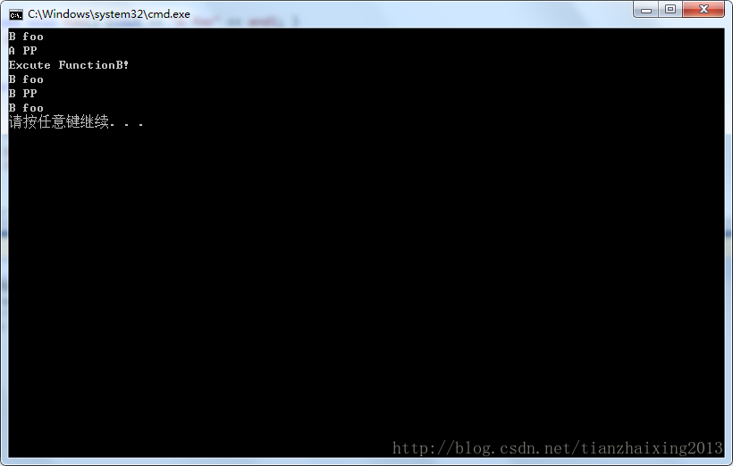

# C++dynamic_cast


```cpp
    #include <iostream>
    #include <string>
    using namespace std;

    class A
    {
    public:
        virtual void foo() {cout << "A foo" << endl; }
        void pp() {cout << "A PP" << endl;}
    };

    class B:public A
    {
    public:
        void foo() { cout << "B foo" << endl;}
        void pp() { cout << "B PP" << endl;}
        void FunctionB() { cout << "Excute FunctionB! " << endl;}
    };

    int main()
    {
        B b;
        A *pa = &b;

        pa->foo(); // 多态, 调用B::foo()
        pa->pp();  // 调用A::pp()
        (dynamic_cast<B*>(pa))->FunctionB();
        (dynamic_cast<B*>(pa))->foo();//调试运行结果与<<程序员面试宝典(第四版)>> P167解释一样! (dynamic_cast<B*>(pa)) 返回空指针
        (dynamic_cast<B*>(pa))->pp();

        (*pa).foo();//调用B::foo()    //调试运行结果与<<程序员面试宝典(第四版)>> P168解释不一样!

        return 0;
    }
```


  


  
```