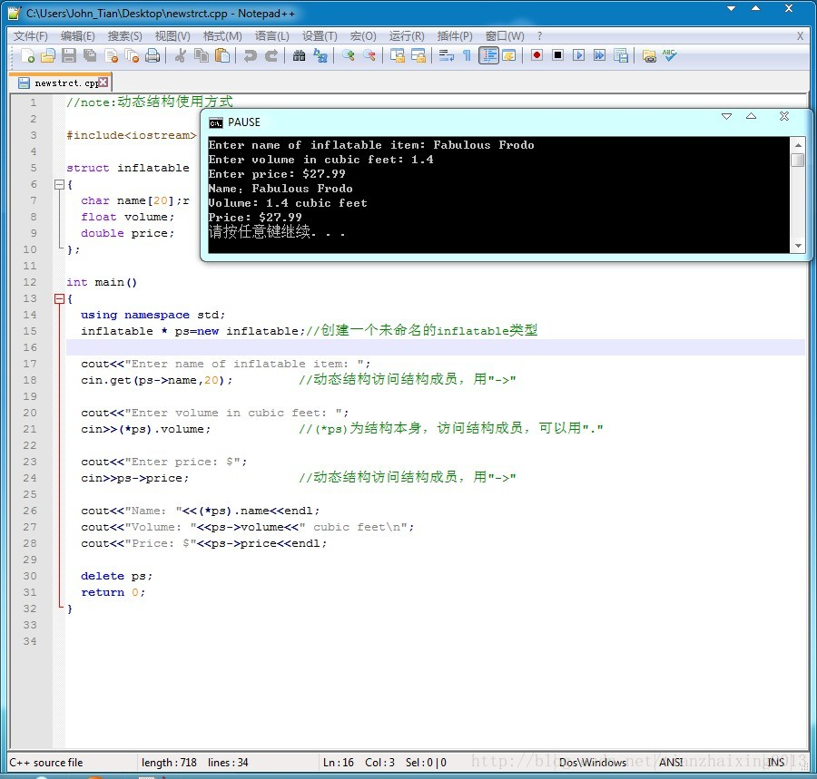

# C++ new创建动态结构(Notepad++ 运行C++实现)

文件运用Notepad++编辑器来实现C++代码的编译，运行，显示。


```cpp
    //note:动态结构使用方式
    #include<iostream>
    struct inflatable
    {
      char name[20];r
      float volume;
      double price;
    };
    int main()
    {
      using namespace std;
      inflatable * ps=new inflatable;//创建一个未命名的inflatable类型

      cout<<"Enter name of inflatable item: ";
      cin.get(ps->name,20);            //动态结构访问结构成员，用"->"

      cout<<"Enter volume in cubic feet: ";
      cin>>(*ps).volume;            //(*ps)为结构本身，访问结构成员，可以用"."

      cout<<"Enter price: $";
      cin>>ps->price;               //动态结构访问结构成员，用"->"

      cout<<"Name："<<(*ps).name<<endl;
      cout<<"Volume: "<<ps->volume<<" cubic feet\n";
      cout<<"Price: $"<<ps->price<<endl;

      delete ps;
      return 0;
    }
```

Notepad++实现运行C++程序的方法，请参考一下连接：

<http://blog.csdn.net/zhgnduking/article/details/8137681>  



