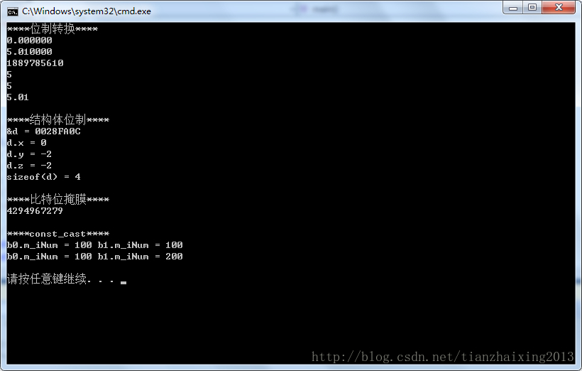

# C++位运算

本文代码主要是对《程序员面试宝典(第四版)》中第12章位运算与嵌入式编程章节的位运算进行学习，实验检测了自己的理解。


```cpp
    #include <iostream>
    #include <stdio.h>

    using namespace std;

    // 1
    struct a
    {
        int x : 1;
        int y : 2;
        int z : 3;
    };

    //2
    #define BIT_MASK(bit_pos) (0x01<<(bit_pos))
    int Bit_Reset(unsigned int *val, unsigned char pos)
    {
        if (pos >= sizeof(unsigned int) * 8)
        {
            return 0;
        }
        *val = (*val & ~BIT_MASK(pos));
        return 1;
    }

    //3
    #define MAX 255
    typedef short Int16;
    struct B
    {
    public:
        int m_iNum;
    };

    int main()
    {
        //位制转换
        cout << "****位制转换****" << endl;
        printf("%f \n", 5);
        printf("%f \n", 5.01);

        printf("%d \n", 5.01);
        printf("%d \n", 5);

        cout << 5 << endl;
        cout << 5.01 << endl;
        cout << endl;

        cout << "****结构体位制****" << endl;
        a d;
        cout << "&d = " << &d << endl;
        d.z = d.x + d.y;
        cout << "d.x = " << d.x << endl;
        cout << "d.y = " << d.y << endl;
        cout << "d.z = " << d.z << endl;
        cout << "sizeof(d) = " << sizeof(d) << endl;
        cout << endl;

        cout << "****比特位掩膜****" << endl;
        unsigned int x = 0xffffffff;
        unsigned char y = 4;
        Bit_Reset(&x, y);
        cout << /*hex <<*/ x << endl;
        cout << endl;

        cout << "****const_cast****" << endl;
        B b0;
        b0.m_iNum = 100;
        const B b1 = b0;
        //b1.m_iNum = 100;  // error !
        cout << "b0.m_iNum = " << b0.m_iNum << " " << "b1.m_iNum = " << b1.m_iNum << endl;
        const_cast<B&>(b1).m_iNum = 200; // const_cast去掉b1的const属性，并重新赋值200
        cout << "b0.m_iNum = " << b0.m_iNum << " " << "b1.m_iNum = " << b1.m_iNum << endl;
        cout << endl;

        return 0;
    }
```

  
