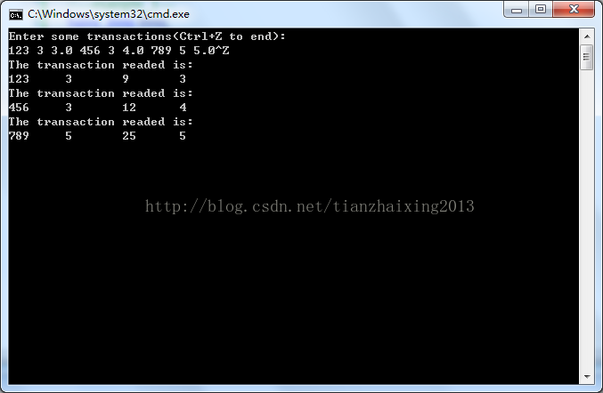
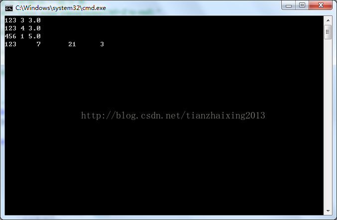
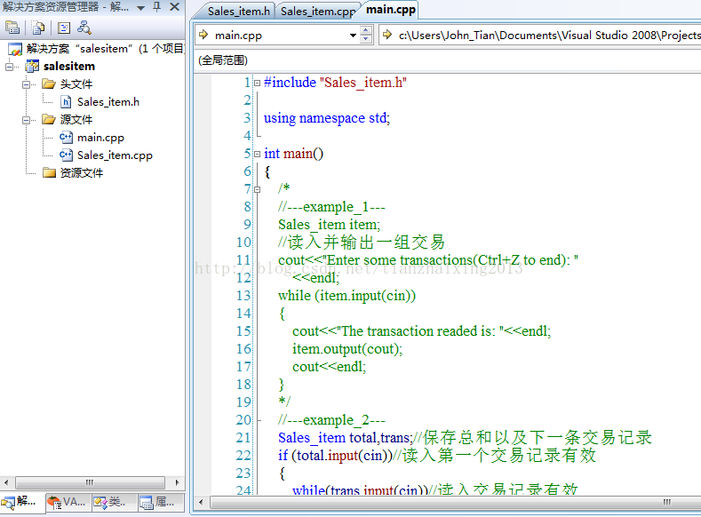

# C++基于类的简单函数项目

1.类头文件（.h）


```cpp
    #ifndef SALESITEM_H
    #define SALESITEM_H

    #include <iostream>
    #include <string>

    class Sales_item{
    public:
        //Sales_item对象操作
        std::istream& input(std::istream& in);
        std::ostream& output(std::ostream& out) const;
        Sales_item add(Sales_item& other);
         double avg_price() const;
         bool same_isbn(const Sales_item &rhs) const
         {
             return isbn==rhs.isbn;
         }
         //默认构造函数需要初始化内置类型的数据成员
         Sales_item::Sales_item(): units_sold(0), revenue(0.0) {}
    private:
        std::string isbn;
        unsigned units_sold;
        double revenue;
    };

    #endif
```


  
  


2.类实现源文件（.cpp）


```
    #include "Sales_item.h"

    std::istream& Sales_item::input(std::istream& in)
    {
        double price;
        in>>isbn>>units_sold>>price;
        //检验是否读入成功
        if (in)
        {
            revenue=units_sold*price;
        }
        else//读入失败：将对象复位为默认状态
        {
            units_sold=0;
            revenue=0.0;
        }
        return in;
    }

    std::ostream& Sales_item::output(std::ostream& out) const
    {
        out<<isbn<<"\t"<<units_sold<<"\t"
            <<revenue<<"\t"<<avg_price();
        return out;
    }

    Sales_item Sales_item::add(Sales_item& other)
    {
        revenue+=other.revenue;
        units_sold+=other.units_sold;
        return *this;
    }

    double Sales_item::avg_price() const
    {
        if (units_sold)
        {
            return revenue/units_sold;
        }
        else
        {
            return 0;
        }
    }
```
cpp


  
  


3.主函数(main.cpp)


```cpp
    #include "Sales_item.h"

    using namespace std;

    int main()
    {
        /*
        //---example_1---
        Sales_item item;
        //读入并输出一组交易
        cout<<"Enter some transactions(Ctrl+Z to end): "
            <<endl;
        while (item.input(cin))
        {
            cout<<"The transaction readed is: "<<endl;
            item.output(cout);
            cout<<endl;
        }
        */
        //---example_2---
        Sales_item total,trans;//保存总和以及下一条交易记录
        if (total.input(cin))//读入第一个交易记录有效
        {
            while(trans.input(cin))//读入交易记录有效
                    if(total.same_isbn(trans))
                     //新读入交易记录的ISBN与前面的相同则更新total
                      total.add(trans);
                    else{
                        //新读入交易记录的ISBN与前面的不同
                        //则输出并重置total
                        total.output(cout)<<endl;
                        total=trans;
                    }
        }
        else
        {
            //无输入数据提示用户
            cout<<"No data?!"<<endl;
             return -1;
        }
        return 0;
    }
```


  
  


4.运行结果

  


example_1

  


example_2



  


  