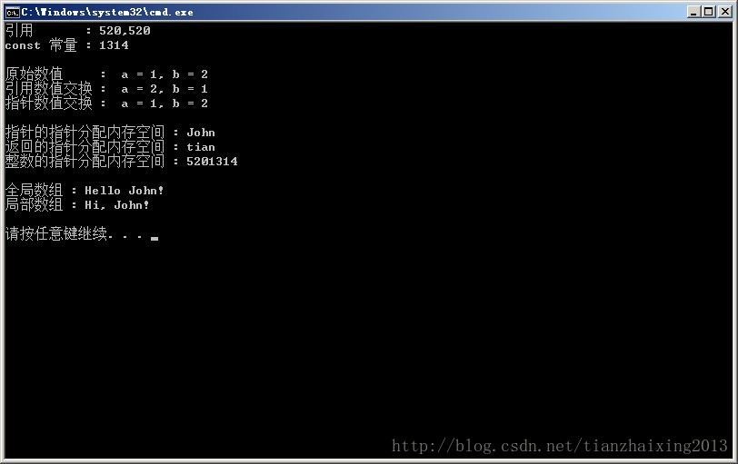

# C++ 引用,指针


```cpp
    #include <iostream>

    using namespace std;

    void swap1(int &p, int &q)
    {// 引用数值交换
        int temp;
        temp = p;
        p = q;
        q = temp;
    }

    void swap2(int *p, int *q)
    {// 指针数值交换
        int temp;
        temp = *p;
        *p = *q;
        *q = temp;
    }

    void Getmemory1(char **p, int num)
    {
        *p = (char *)malloc(sizeof(char) * num);
    }
    char *Getmemory2(char *p, int num)
    {
        p = (char *)malloc(sizeof(char) * num);
        return p;
    }
    void Getmemory(int *z)
    {
        *z = 5201314;
    }


    const char* strA()
    {
        char *str = "Hello John!";      //分配一个全局数组，数据不可修改
        return str;
    }
    const char* strA1()
    {
        static char str[] = "Hi, John!";//分配一个局部数组
        return str;
    }

    int main(int argc, char *argv[])
    {
        int iv = 520;
        int &ivv = iv;        // 声明引用的同时需要进行初始化
        const int iv1 = 1314; // const 常量赋值时，必须同时初始化
        cout << "引用       : " << ivv << "," << iv << endl;
        cout << "const 常量 : " << iv1 << endl << endl;

        int a = 1, b = 2;
        cout << "原始数值     : " << " a = " << a << "," << " b = " << b << endl;
        swap1(a, b);
        cout << "引用数值交换 : " << " a = " << a << "," << " b = " << b << endl;
        swap2(&a, &b);
        cout << "指针数值交换 : " << " a = " << a << "," << " b = " << b << endl;
        cout << endl;

        char *str1 = NULL;
        Getmemory1(&str1, 100);
        strcpy(str1, "John");
        char *str2 = NULL;
        str2 = Getmemory2(str2, 100);
        strcpy(str2, "tian");
        cout << "指针的指针分配内存空间 : " << str1 << endl;
        cout << "返回的指针分配内存空间 : " << str2 << endl;

        int v = 0;
        Getmemory(&v);
        cout << "整数的指针分配内存空间 : " << v << endl;
        cout << endl;

        const char * s1 = strA();
        const char * s2 = strA1();
        cout << "全局数组 : " << s1 << endl;
        cout << "局部数组 : " << s2 << endl;
        cout << endl;

        return 0;
    }
```


  


  


  
```