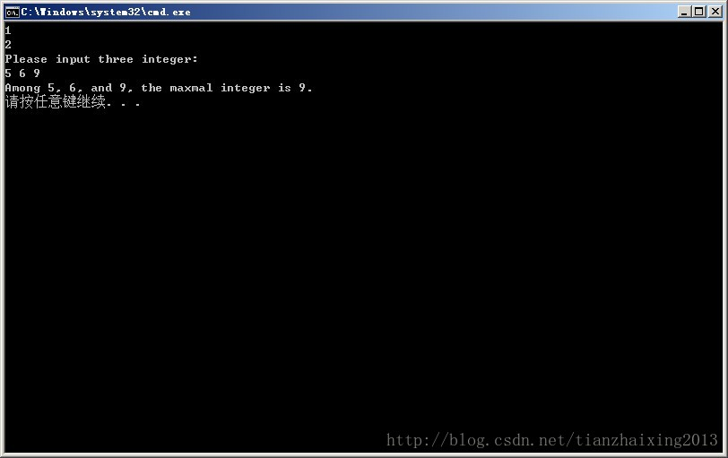

# C++指针类型


```
    void (*f)();  // 函数指针
    void *f();    // 函数返回指针
    const int *;  // 指向const的指针
    int const *;  // 指向const的指针
    int *const ;  // const指针
    const int * const ; // 指向const的const指针
```


  


float(**def)[10]; def 是一个二级指针，它指向一个一维数组的指针，数组的元素都是float

double*(*gh)[10]; gh是一个指针，它指向一个一维数组，数组元素都是double*

double (*f[10]) (); f是一个数组，f有10个元素，这些元素都是函数的指针，指向的函数类型是没有参数且返回double的函数

int *((*b)[10]); 和 int * (*b)[10]; 一样，是一维数组的指针

Long (*fun)(int); 函数指针，指向函数的指针，指针返回值是long, 所带的参数是int

Long *fun(int); 指针函数，是一个带有整型参数，并返回一个long变量的指针的函数

int (*(*F)(int,int))(int);F是一个函数的指针，指向的函数的类型是有两个int参数且返回一个函数指针的函数，返回的函数指针指向有一个int参数且返回int的函数

  


```cpp
    #include <iostream>
    #include <cstdio>

    using namespace std;

    class A
    {
    public:
        int _a;
        A()
        {
            _a = 1;
        }
        void print()
        {
            printf("%d \n", _a);
        }
    };

    class B : public A
    {
    public:
        int _a;
        B()
        {
            _a = 2;
        }
    };

    int max1(int x, int y)
    {
        return x > y ? x : y;
    }

    int main()
    {
        B b0;
        b0.print();             // 构造B类时，先调用A类的构造函数
        printf("%d \n", b0._a); // B类中的_a把A类中的_a覆盖掉了

        int max1(int, int);
        int (*p) (int, int) = &max1;

        int a, b, c, d;
        printf("Please input three integer: \n");
        scanf("%d%d%d", &a, &b, &c);

        d = (*p)((*p)(a, b), c);
        printf("Among %d, %d, and %d, the maxmal integer is %d.\n", a, b, c, d);
        return 0;
    }
```


  
  
```