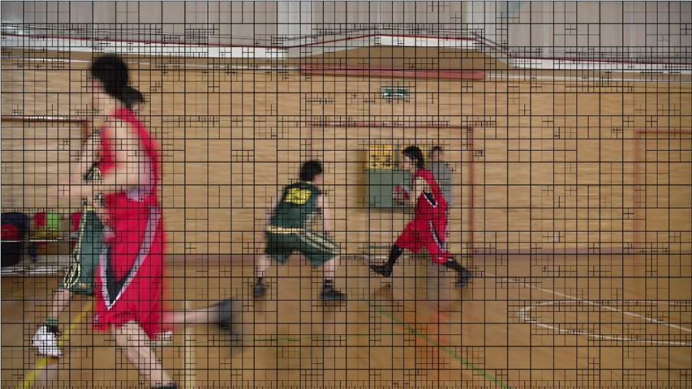

# CU分割信息提取(更新续)

本文主要针对feixiang_john，HEVC_CJL，zhuix7788，yangxiao_xiang等人的CSDN的博客，进行有关CU分割内容的学习和运用。具体相关内容请参考他们的博客：  
feixiang_john：HEVC/H.265参考代码跟踪  
http://blog.csdn.net/feixiang_john/article/details/7876227#comments  
HEVC_CJL：CU的最终划分  
http://blog.csdn.net/hevc_cjl/article/details/8275260  
http://blog.csdn.net/hevc_cjl/article/details/8299529  
http://blog.csdn.net/hevc_cjl/article/details/8639835  
zhuix7788：模式以及划分信息  
http://blog.csdn.net/zhuix7788/article/details/8214685  
yangxiao_xiang： HEVC帧内预测编码之LCU四叉树结构分块  
http://blog.csdn.net/yangxiao_xiang/article/details/8270723  
http://blog.csdn.net/yangxiao_xiang/article/details/8275181  
http://blog.csdn.net/yangxiao_xiang/article/details/8478283  


注意在cpp文件开头加上头文件#include <fstream>

  


```
    ====================================================================================================================
    // Public member functions
    // ====================================================================================================================

    /** \param  rpcCU pointer of CU data class
     */
    //一句话总结获取CU最佳划分的方法：
    //在HM中调用完xCompressCU之后（至少也应该是compressCU调用完它之后，此时最佳PU为m_ppcBestCU[0]），
    //在调用encodeCU之前（也可以之后，这个只要保证pcCU没被修改过即可），
    //对compressCU的参数pcCU进行类似语句: pcCU->getDepth( uiAbsPartIdx )，
    //即可获得Z order为uiAbsPartIdx的4x4块的深度，如果把整个CU每个4x4块的深度确定下来，那么它的划分自然也就确定下来了。
    Void TEncCu::compressCU( TComDataCU*& rpcCU )
    {
      // initialize CU data
      m_ppcBestCU[0]->initCU( rpcCU->getPic(), rpcCU->getAddr() );
      m_ppcTempCU[0]->initCU( rpcCU->getPic(), rpcCU->getAddr() );

    #if RATE_CONTROL_LAMBDA_DOMAIN
      m_addSADDepth      = 0;
      m_LCUPredictionSAD = 0;
      m_temporalSAD      = 0;
    #endif

      // analysis of CU
      xCompressCU( m_ppcBestCU[0], m_ppcTempCU[0], 0 );//获取最佳PU为m_ppcBestCU[0]

      //=======LCU分割单元深度信息输出2013.3.27================
      UInt LCUDepth[256] ;
      ofstream outfile("BasketballdrillCU.txt",ios::in|ios::app);
      for (Int i=0;i<256;i+=4)  //CU分割最大为8x8，而存储分割信息是4x4，故i+=4处理
      {
        LCUDepth[i]=  m_ppcBestCU[0]->getDepth(i);
        outfile<<LCUDepth[i]<<;
        outfile<<endl;
      }
      //--------------------------------------------------------

    #if ADAPTIVE_QP_SELECTION
      if( m_pcEncCfg->getUseAdaptQpSelect() )
      {
        if(rpcCU->getSlice()->getSliceType()!=I_SLICE) //IIII
        {
          xLcuCollectARLStats( rpcCU);
        }
      }
    #endif
    }
```


  
  
  
注释：由于是basketballdrive.yuv第一帧，且分辨率为1920x1080，像素点数目不是8的倍数，故出现了最后一行的分割情况异样。  


  


  


  