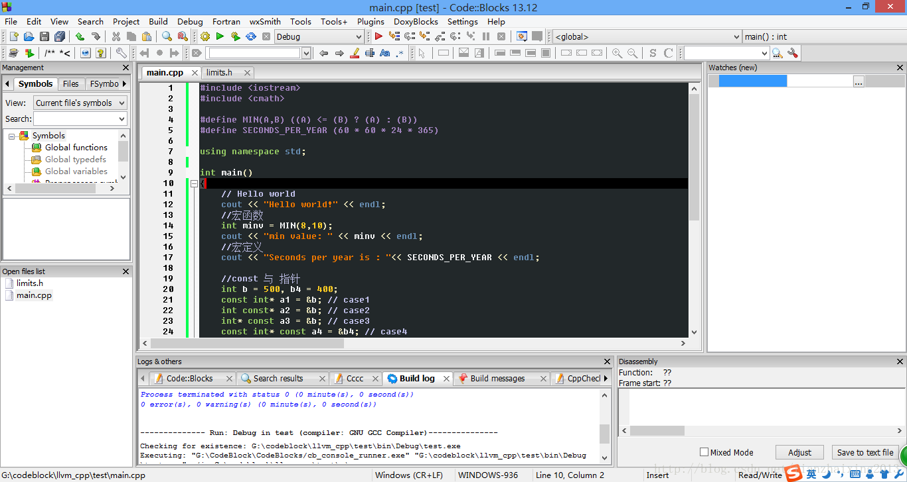
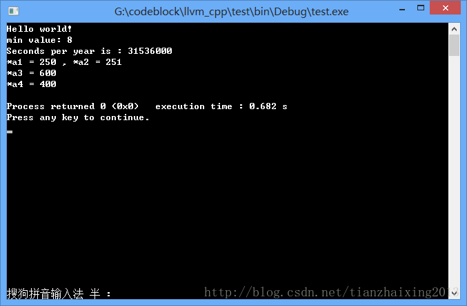

# Code::blocks C++宏，const，指针

今天接触了小型的编译器，但是功能非常强大，名字叫Code::blocks，来自室友推荐的http://tieba.baidu.com/p/2846007324?fr=ala0&pstaala=3百度贴吧。

功能强悍，可以编译好多程序，构建好多工程，如QT, GUI, ARM,C++/C等等...

1.软件编程截图：

  


2.宏函数，宏定义，const和指针


```cpp
    #include <iostream>
    #include <cmath>

    #define MIN(A,B) ((A) <= (B) ? (A) : (B))
    #define SECONDS_PER_YEAR (60 * 60 * 24 * 365)

    using namespace std;

    int main()
    {
        // Hello world
        cout << "Hello world!" << endl;
        //宏函数
        int minv = MIN(8,10);
        cout << "min value: " << minv << endl;
        //宏定义
        cout << "Seconds per year is : "<< SECONDS_PER_YEAR << endl;

        //const 与 指针
        int b = 500, b4 = 400;
        const int* a1 = &b; // case1
        int const* a2 = &b; // case2
        int* const a3 = &b; // case3
        const int* const a4 = &b4; // case4

        //case 1 and case 2 : const 在 * 左侧 const 修饰变量 b, 即 b 为常量
        //*a1 = 250; //wrong! G:\codeblock\llvm_cpp\test\main.cpp|27|error: assignment of read-only location '* a1'
        //*a2 = 250; //G:\codeblock\llvm_cpp\test\main.cpp|28|error: assignment of read-only location '* a2'
        b = 250;
        int c = 251;
        a2 = &c;
        cout << "*a1 = " << *a1 << " , " << "*a2 = " << *a2 <<endl;

        //case 3 : const 在 * 右侧 const 修饰指针 a3, 即 a3 为const 指针
        // 定义的时候必须初始化
        *a3 = 600;
        cout << "*a3 = " << *a3 << endl;

        //case 4 : 第1个const 修饰 b, 即 b 为常量; 第2个const 修饰 a4, 即a4 为const 指针
        cout << "*a4 = " << *a4 << endl;

        return 0;
    }
```


  
  
```