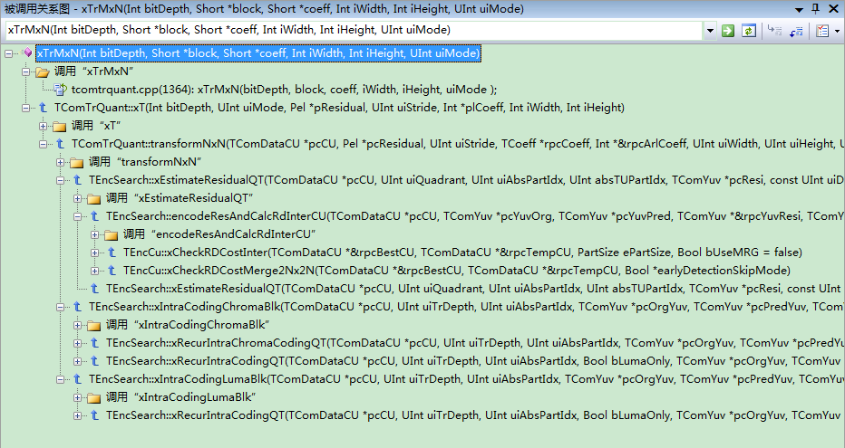

# DST，蝶形运算


```
    /** MxN forward transform (2D)
    *  \param block input data (residual)
    *  \param coeff output data (transform coefficients)
    *  \param iWidth input data (width of transform)
    *  \param iHeight input data (height of transform)
    */

    //对帧内预测模式的4x4块进行DST变换，其余的根据块大小分别做蝶形快速变换（4x4，8x8，16x16，32x32）
    void xTrMxN(Int bitDepth, Short *block,Short *coeff, Int iWidth, Int iHeight, UInt uiMode)
    {
      Int shift_1st = g_aucConvertToBit[iWidth]  + 1 + bitDepth-8; // log2(iWidth) - 1 + g_bitDepth - 8
      Int shift_2nd = g_aucConvertToBit[iHeight]  + 8;             // log2(iHeight) + 6

      Short tmp[ 64 * 64 ];

      if( iWidth == 4 && iHeight == 4)
      {
        if (uiMode != REG_DCT)
        {//离散正弦变换DST
          fastForwardDst(block,tmp,shift_1st); // Forward DST BY FAST ALGORITHM, block input, tmp output
          fastForwardDst(tmp,coeff,shift_2nd); // Forward DST BY FAST ALGORITHM, tmp input, coeff output
        }
        else
        {//4*4蝶形运算
          partialButterfly4(block, tmp, shift_1st, iHeight);
          partialButterfly4(tmp, coeff, shift_2nd, iWidth);
        }

      }
      else if( iWidth == 8 && iHeight == 8)
      { //8*8蝶形运算
        partialButterfly8( block, tmp, shift_1st, iHeight );
        partialButterfly8( tmp, coeff, shift_2nd, iWidth );
      }
      else if( iWidth == 16 && iHeight == 16)
      { //16*16蝶形运算
        partialButterfly16( block, tmp, shift_1st, iHeight );
        partialButterfly16( tmp, coeff, shift_2nd, iWidth );
      }
      else if( iWidth == 32 && iHeight == 32)
      { //32*32蝶形运算
        partialButterfly32( block, tmp, shift_1st, iHeight );
        partialButterfly32( tmp, coeff, shift_2nd, iWidth );
      }
    }
    /** MxN inverse transform (2D)反变换针对2D的情况
    *  \param coeff input data (transform coefficients)
    *  \param block output data (residual)
    *  \param iWidth input data (width of transform)
    *  \param iHeight input data (height of transform)
    */
    void xITrMxN(Int bitDepth, Short *coeff,Short *block, Int iWidth, Int iHeight, UInt uiMode)
    {
      Int shift_1st = SHIFT_INV_1ST;
      Int shift_2nd = SHIFT_INV_2ND - (bitDepth-8);

      Short tmp[ 64*64];
      if( iWidth == 4 && iHeight == 4)
      {
        if (uiMode != REG_DCT)
        {
          fastInverseDst(coeff,tmp,shift_1st); // Inverse DST by FAST Algorithm, coeff input, tmp output
          fastInverseDst(tmp,block,shift_2nd); // Inverse DST by FAST Algorithm, tmp input, coeff output
        }
        else
        {
          partialButterflyInverse4(coeff,tmp,shift_1st,iWidth);
          partialButterflyInverse4(tmp,block,shift_2nd,iHeight);
        }
      }
      else if( iWidth == 8 && iHeight == 8)
      {
        partialButterflyInverse8(coeff,tmp,shift_1st,iWidth);
        partialButterflyInverse8(tmp,block,shift_2nd,iHeight);
      }
      else if( iWidth == 16 && iHeight == 16)
      {
        partialButterflyInverse16(coeff,tmp,shift_1st,iWidth);
        partialButterflyInverse16(tmp,block,shift_2nd,iHeight);
      }
      else if( iWidth == 32 && iHeight == 32)
      {
        partialButterflyInverse32(coeff,tmp,shift_1st,iWidth);
        partialButterflyInverse32(tmp,block,shift_2nd,iHeight);
      }
    }
```


  