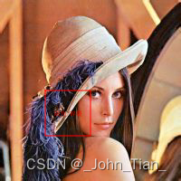

# Golang 在图像中绘制矩形框

#### 文章目录


```
  * Golang 在图像中绘制矩形框
  *     * 1\. 依赖
    * 2\. 源码
    * 3\. 结果
    * 4\. 参考
    * 5\. 说明
```


## Golang 在图像中绘制矩形框

从获取的坐标信息，在图像中绘制矩形框，并添加标注信息。

### 1\. 依赖

  * 字体 simsun.ttc
  * 第三方库 github.com/fogleman/gg


### 2\. 源码


```go
    package main

    import (
        "encoding/json"
        "fmt"
        "image"
        "image/color"
        "image/draw"
        "log"
        "math"
        "reflect"
        "strings"

        "github.com/fogleman/gg"
    )

    // test_draw_rect_text 画图像矩形, 标注, 颜色; 返回保存图像路径
    // ref: https://github.com/fogleman/gg/blob/master/examples/rotated-image.go
    func test_draw_rect_text(im_path, font_path, detect_label, save_path string, x, y, w, h float64) {
        // Load image
        im, err := gg.LoadImage(im_path)
        if err != nil {
            log.Fatal(err)
        }

        // 1 method
        // iw, ih := im.Bounds().Dx(), im.Bounds().Dy()
        // Set Context
        // dc := gg.NewContext(iw, ih)

        // Draw image
        // dc.DrawImage(im, 0, 0)

        // 2 method
        dc := gg.NewContextForImage(im)

        // Set color and line width
        dc.SetHexColor("#FF0000")
        dc.SetLineWidth(1)

        // Draw rectangle
        dc.DrawRoundedRectangle(x, y, w, h, 0)
        // Store set
        dc.Stroke()

        // Set font and draw label
        var font_height float64 = 7
        if err := dc.LoadFontFace(font_path, font_height); err != nil {
            panic(err)
        }
        rect_center_x := x + w/2
        rect_center_y := y + h/2
        dc.DrawStringAnchored(detect_label, rect_center_x, rect_center_y, 0.5, 0.5)
        dc.Clip()

        // Save png image
        dc.SavePNG(save_path)
    }

    func main() {
        im_path := "/home/tianzx/Pictures/lena.jpeg"
        font_path := "/home/tianzx/ai_model/simsun.ttc"
        detect_label := "缺角/碎裂"
        save_path := "/home/tianzx/Pictures/lena_test.png"
        var x, y, w, h float64 = 50, 100, 50, 50
        test_draw_rect_text(im_path, font_path, detect_label, save_path, x, y, w, h)
    }
```


### 3\. 结果

  


### 4\. 参考

  * [gg](https://github.com/fogleman/gg)


### 5\. 说明

> 导入的Golang第三方库，并不是都使用了，按需进行删减。
```