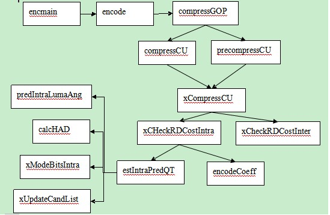

# HEVC参考软件代码框架总结

1.编码器程序从"TAppEncoder"工程中的encmain.cpp文件开始的，此文件中包含程序运行的入口函数"main"，在main函数中主要做了编码器对象的创建、分析配置文件，初始化配置参数，和编码器最重要的功能"encode"。

2.在"encode"函数中，主要实现了读取YUV文件的数据、初始化工具对象例如：GOPEncoder、SliceEncoder、CUEncder……。在此函数里，还包括一个encode函数，调用CompressGOP函数来具体执行编码任务。

3.在CompressGOP函数中，完成了以下的功能：

一，InitGOP将文件的码流分成若干GOP以便后续程序能够顺利执行。

二，InitEncSlice创建编码的Slice。

三，在此函数中，还包括preCompressSlice和CompressSlice两个函数，前者的作用是选择不同的lamuda进行编码（编码是调用了CompressCU函数，后续介绍），后者是在最好的lamuda下进行编码。

四，循环滤波

五，……（熵编码等，还没看）。

4.在xCompressCU函数中（CompressCU函数的主体也是调用xComprssCU函数），先进行帧间预测xCheckRDCostMerge2Nx2N，xCheckRDCostInter等。在做完帧间预测后进行阵内预测，这是调用的函数是xCheckRDCostIntra，在xCompressCU函数的后续部分，还递归调用自身以实现对每个CU的编码。变换编码在encodeCoeff中实现，量化在xCheckIntraPCM完成。

5.xCheckRDCostIntra函数，主要完成帧内预测的任务，对亮度的预测使用estIntraPredQT，对色度使用estIntraPredChromaQT。

6.estIntraPredQT函数，在思想对亮度的处理和色度的处理是一样的，所以只介绍亮度的处理函数。在estIntraPredQT函数中，主要完成了RDCost的选择，在其中predIntraLumaAng函数实现了方向的预测；calcHAD函数计算了SATD；xModeBitsIntra函数计算编码的码率；xUpdateCandList更新了最好的RDCost所使用的模式。

  

转载地址http://blog.csdn.net/smells2/article/details/7699803  

  