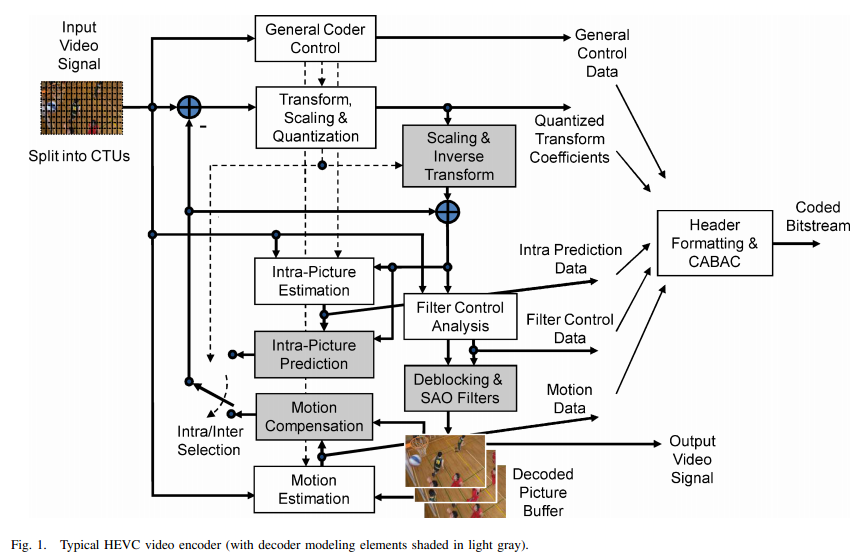

# HEVC编码流程解读

HEVC的视频编码层采用从H.261标准之后一直使用的混合编码方法（帧内、帧间预测和2-D变换编码）。图1所示为HEVC的混合视频编码器方框图。（理解有误地方，还请多加指教，O(∩_∩)O谢谢）

  

具体的编码流程如下所述。每帧图像分割成多个以块为单位的区域，分割信息传输到解码端。一个视频序列的第一帧（或者是一个视频序列的每个空白随机接入点（CRA, clean random access point）的第一帧）只采用帧内预测（即只运用同一帧图像相邻区域间的空域信息进行预测，但该帧并不与其他帧相互独立）。视频序列的其他帧或者两个CRA之间的其他帧，大多采用时域帧间预测方式预测进行块预测。帧间预测的编码过程由运动数据组成，这些运动数据包含用于每个块采样点预测的参考帧和运动矢量（MV, motion vector）。编码器和解码器运用作为边信息传输的MV和模式选择数据组成的运动补偿（MC, motion compensation）来生成同一的帧间预测信号。

帧内或帧间预测的残差信号（即原始块和它的预测块的不同信息），通过线性空域变换传输。变换系数经过扩展、量化、熵编码，和预测信息一起传输。

编码器复制解码器的处理环路（图1所示中的灰色部分），这两个处理过程为后来数据产生相同的预测。因此，量化的变换系数通过反扩展、反变换来复制解码的近似残差信号。这个残差信号加上预测信息后经过一个或两个环路滤波器来平滑滤除由于基于块处理和量化产生的块效应等影响。这个最终的图像表征（即解码端输出图像的复制品）存储在已解码图像的缓存器中，以便用于后续图像的预测。一般而言，图像的编码和解码处理过程与它们从源头（即视频源）到来的顺序不同。因此，需要区别解码器的解码顺序（即码流顺序）和输出顺序（即显示顺序）。

一般而言，人们希望HEVC处理的视频是逐行扫描图像（可能是因为视频输入的就是那种格式，或者为了消除隔行扫描优于编码）。HEVC的设计编码特征中没有明确表示支持隔行扫描的使用，因为隔行扫描已经不再用于显示，并且使用这种隔行扫描的情况越来越少。然而，HEVC引入的一个数据元语法允许编码器通过编码每个场（即每个视频帧的偶数场和奇数场）来处理隔行扫描视频。这种方法编码隔行扫描视频不仅有效，而且没有给解码器额外处理这种视频的负担。（转载请注明出处，谢谢）