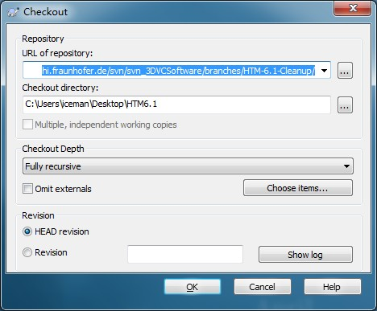
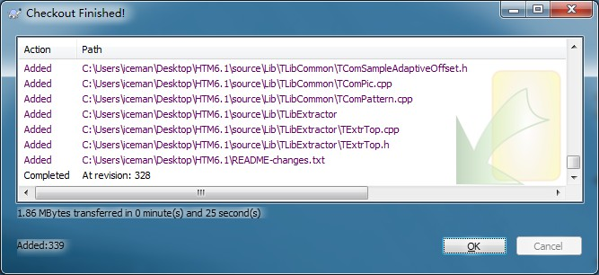

# HTM-下载

工作准备，首先电脑上面安装有SVN软件，这个软件可以在网上搜索到。http://tortoisesvn.net/downloads.html

1.登录http://hevc.info/

2.点击[HEVC 3D extension software repository (at HHI)](https://hevc.hhi.fraunhofer.de/svn/svn_3DVCSoftware/ "HEVC 3D extension software repository \(at HHI\)")

3.点击[branches/](https://hevc.hhi.fraunhofer.de/svn/svn_3DVCSoftware/branches/)

4.点击[HTM-6.1-Cleanup/](https://hevc.hhi.fraunhofer.de/svn/svn_3DVCSoftware/branches/HTM-6.1-Cleanup/)

5.复制浏览器地址https://hevc.hhi.fraunhofer.de/svn/svn_3DVCSoftware/branches/HTM-6.1-Cleanup/

6.在桌面新建文件夹，命名为HTM6.1，然后选中右击，选择SVN Checkout...出现如下图所示界面：

  

7.点击OK,等带下载完毕，出现下图所示：

  

8.点击OK完成HTM6.1下载

  

  

  

  