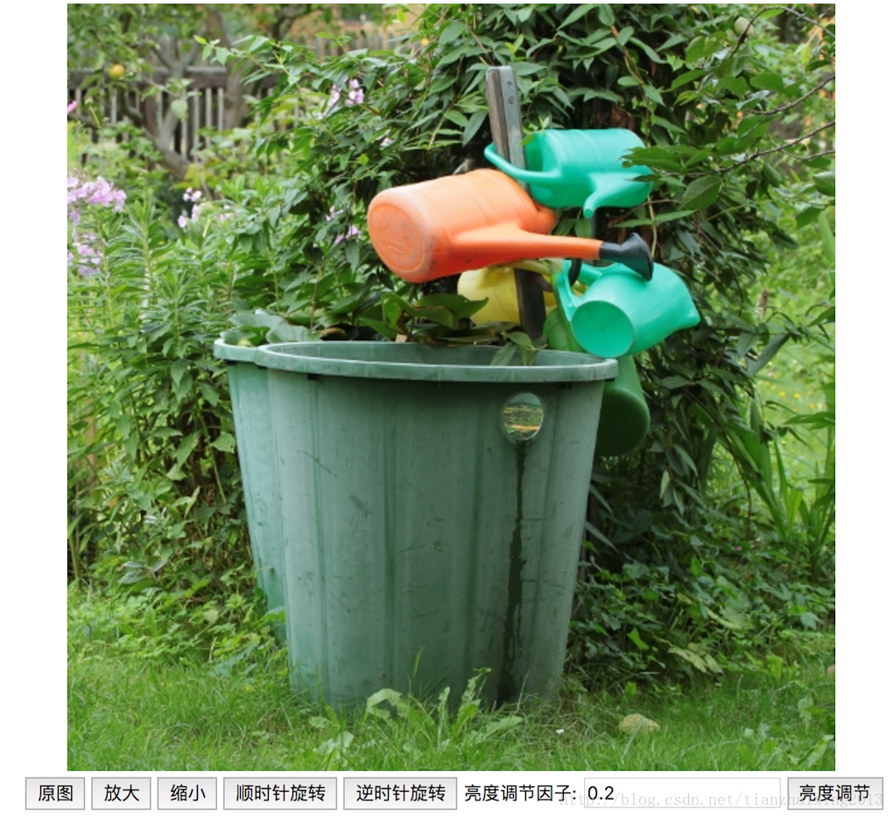
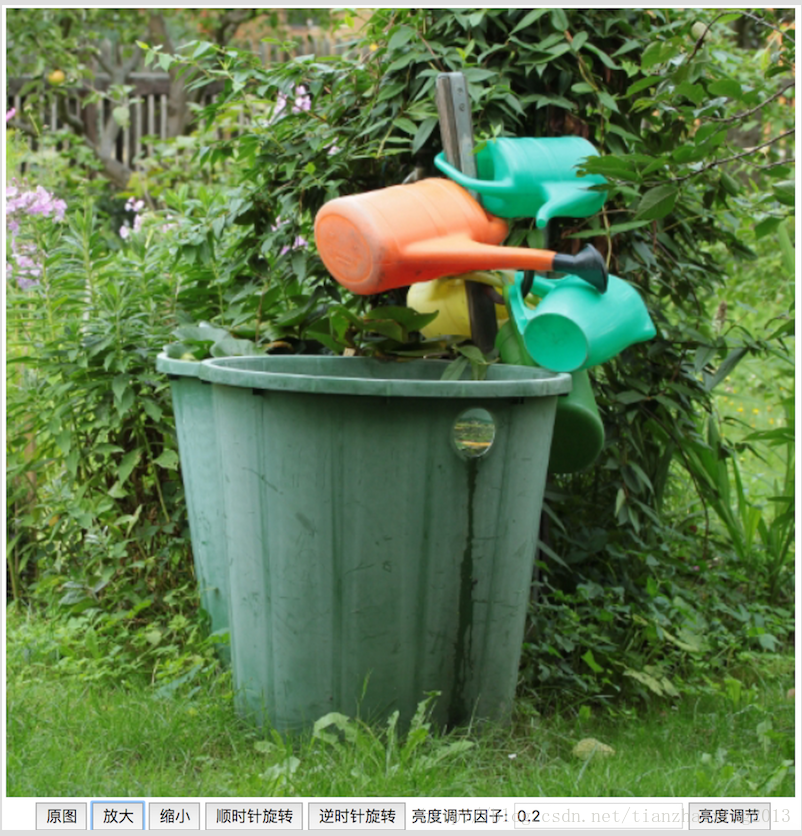
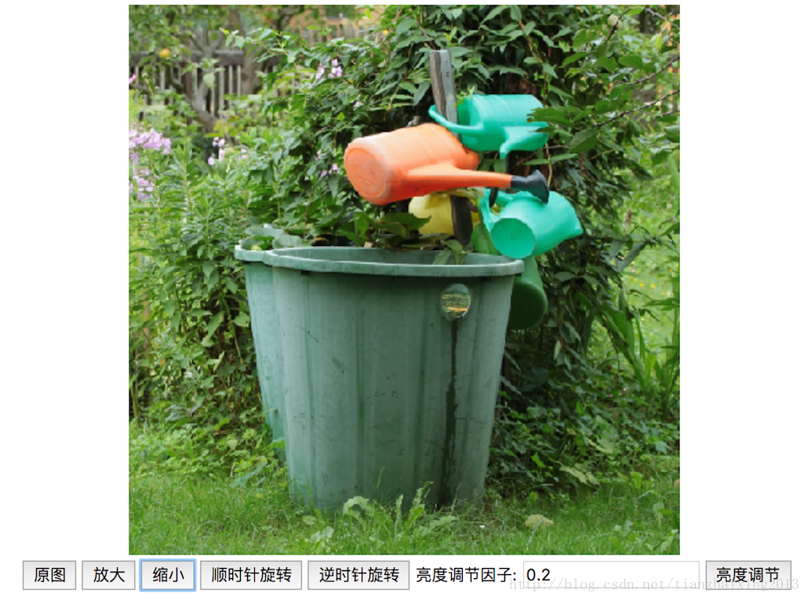
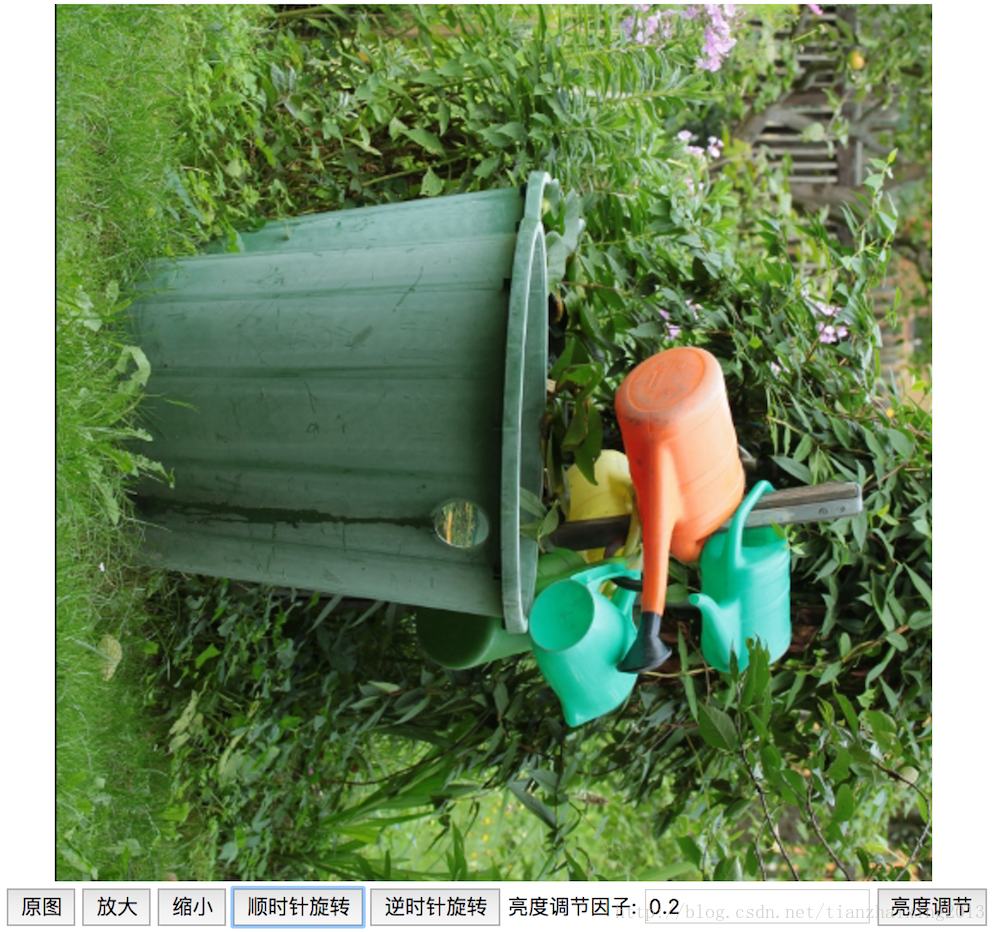
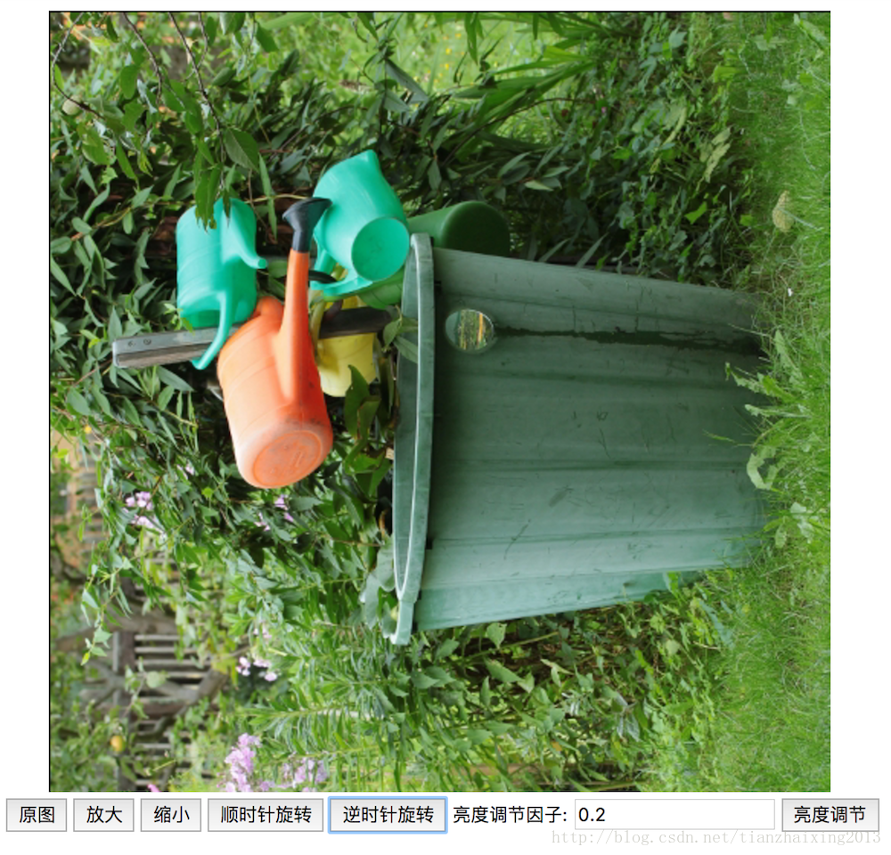
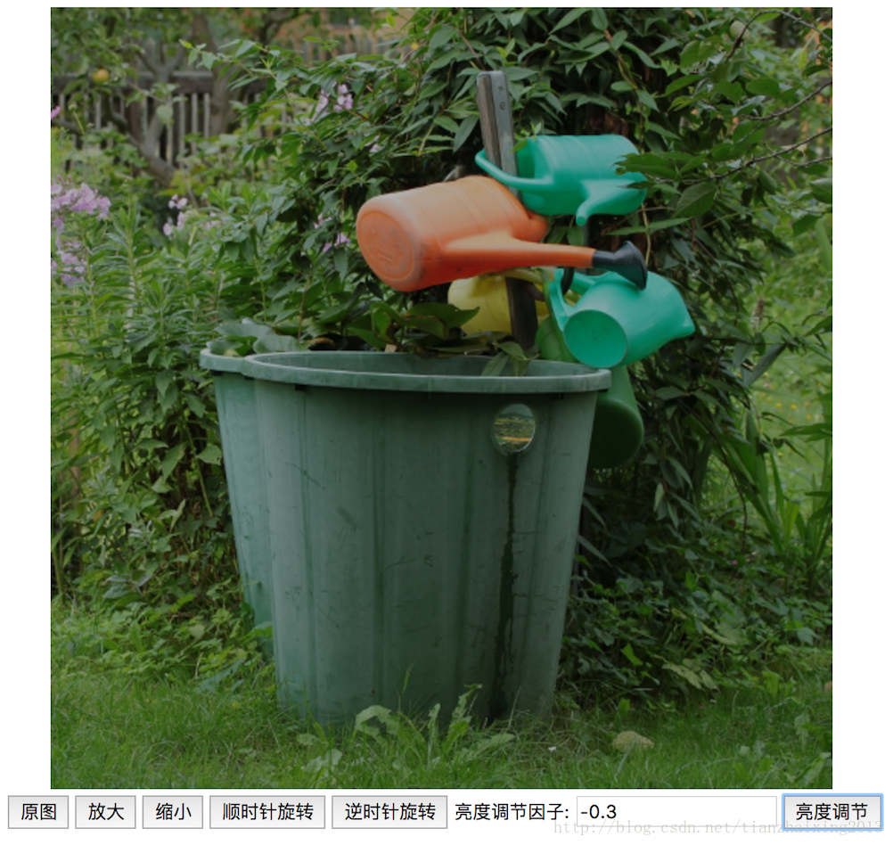
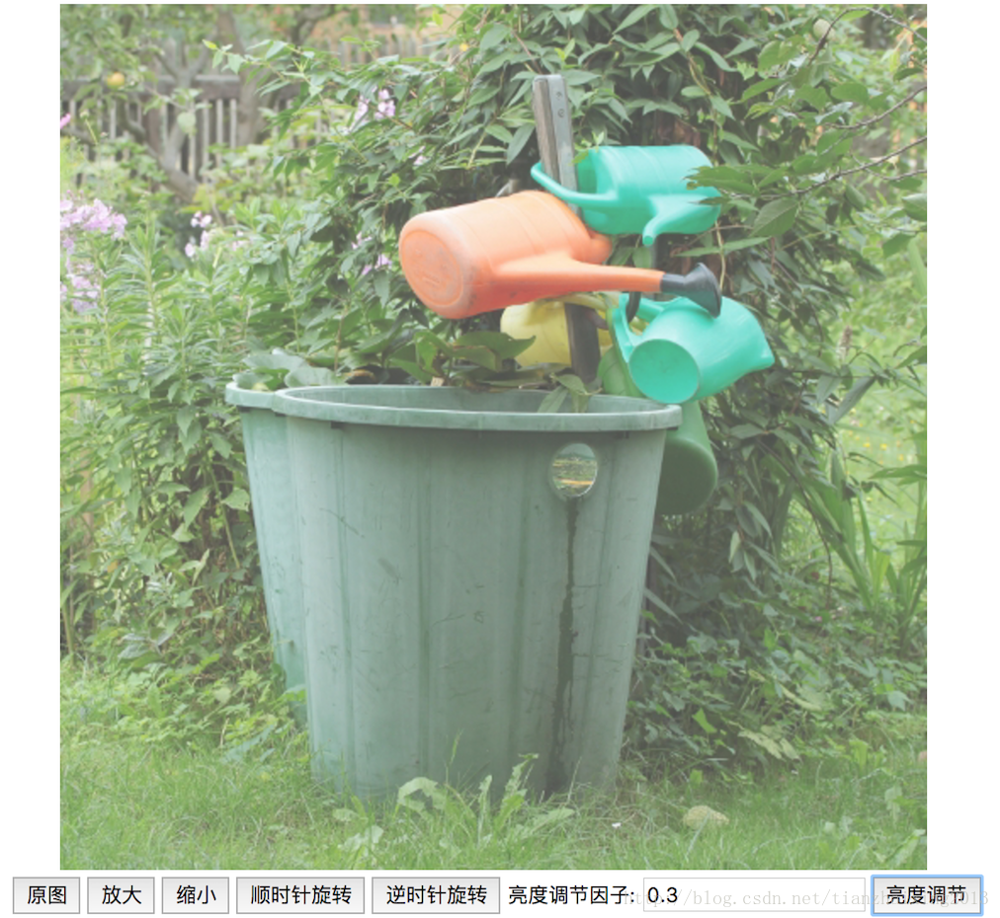

# HTML5 利用JavaScript 实现图像基本操作

### 前言

近期利用业余时间，我用JavaScript实现了一下HTML5网页端的图像处理基本操作，其实，主要是用[jimp](https://github.com/oliver-moran/jimp) 这个JavaScript库。

### 代码

本文，主要实现了图像的**放大、缩小、旋转和亮度调节** 功能。具体实现代码，如下所示。


```
    <!DOCTYPE html>
    <html>
        <head>
        <meta charset="UTF-8">
            <title>Jimp browser example 1</title>
        </head>
        <body>
            <div style="text-align:center;">
                 <br />
                <button onclick="getSrcImg()">原图</button>
                <button onclick="zoomInImg()">放大</button>
                <button onclick="zoomOutImg()">缩小</button>
                <button onclick="rotateImgClockwise()">顺时针旋转</button>
                <button onclick="rotateImgAntiClock()">逆时针旋转</button>
                亮度调节因子:
                <input id="Bfactor" type="number" name="bdv" mix="-1" max="1" value=0.2 />
                <button onclick="brightenImg()">亮度调节</button>
            </div>

            <script src="./lib/jimp.min.js" type="text/javascript"></script>
            <script type="text/javascript">
                var myImage = document.getElementById("myImage");

                function getSrcImg()
                {
                    var mySrc = "https://upload.wikimedia.org/wikipedia/commons/0/01/Bot-Test.jpg";
                    myImage.setAttribute("src", mySrc);
                }

                function zoomInImg()
                {
                    var scale = 1.2;
                    var width = myImage.width * scale;
                    var height = myImage.height * scale;
                    Jimp.read(myImage.src, function (err, image) {
                        image.resize(width, height, Jimp.RESIZE_BILINEAR)
                             .getBase64(Jimp.MIME_JPEG, function (err, src) {
                                  myImage.setAttribute("src", src);
                             });
                    }).catch(function (err) {
                        console.error(err);
                    });
                }

                function zoomOutImg()
                {
                    var scale = 0.8;
                    var width = myImage.width * scale;
                    var height = myImage.height * scale;
                    Jimp.read(myImage.src, function (err, image) {
                        image.resize(width, height, Jimp.RESIZE_NEAREST_NEIGHBOR)
                             .getBase64(Jimp.MIME_JPEG, function (err, src) {
                                  myImage.setAttribute("src", src);
                             });
                    }).catch(function (err) {
                        console.error(err);
                    });
                }

                function rotateImgClockwise()
                {
                    var degree = 90;
                    Jimp.read(myImage.src, function (err, image) {
                        image.rotate(degree, false)
                             .getBase64(Jimp.MIME_JPEG, function (err, src) {
                                  myImage.setAttribute("src", src);
                             });
                    }).catch(function (err) {
                        console.error(err);
                    });
                }

                function rotateImgAntiClock()
                {
                    var degree = -90;
                    Jimp.read(myImage.src, function (err, image) {
                        image.rotate(degree, false)
                             .getBase64(Jimp.MIME_JPEG, function (err, src) {
                                  myImage.setAttribute("src", src);
                             });
                    }).catch(function (err) {
                        console.error(err);
                    });
                }

                function brightenImg()
                {
                    var bfactor = document.getElementById("Bfactor");
                    var factor = parseFloat(bfactor.value);
                    if (isNaN(factor))
                    {
                        alert("亮度调节因子输入值为空!");
                    }
                    else
                    {
                        if (factor < -1 || factor > 1)
                        {
                            alert("亮度调节因子输入值范围为-1到1的小数!");
                        }
                        else
                        {
                            Jimp.read(myImage.src, function (err, image) {
                            image.brightness(factor) // -1 ~ +1
                                 .getBase64(Jimp.MIME_JPEG, function (err, src) {
                                      myImage.setAttribute("src", src);
                                 });
                            }).catch(function (err) {
                                console.error(err);
                            });
                        }
                    }

                }
            </script>

        </body>
    </html>
```


### 结果

  * 初始化




  * 原图->放大




  * 原图->缩小




  * 原图->顺时针旋转




  * 原图->逆时针旋转




  * 原图->亮度调节变暗




  * 原图->亮度调节变亮




### jimp

**jimp.min.js** 按照jimp的[README](https://github.com/oliver-moran/jimp)进行编译获取。