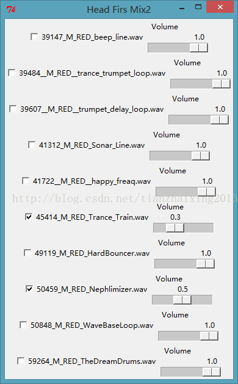

# 《Head First Programming》---python 10_GUI Mixer2

1. sound_panel模块


```python
    from tkinter import *
    import pygame.mixer

    class SoundPanel(Frame):
        def __init__(self, app, mixer, sound_file):
            Frame.__init__(self, app)              #这里用到了tkinter的Frame
            self.track = mixer.Sound(sound_file)
            self.track_playing = IntVar()
            track_button = Checkbutton(self,
                                       variable = self.track_playing,
                                       command = self.track_toggle,
                                       text = sound_file
                                       )
            track_button.pack(side = LEFT)

            self.volume = DoubleVar()
            self.volume.set(self.track.get_volume())
            volume_scale = Scale(self,
                                 variable = self.volume,
                                 from_ = 0.0,
                                 to = 1.0,
                                 resolution = 0.1,
                                 command = self.change_volume,
                                 label = 'Volume',
                                 orient = HORIZONTAL
                                 )
            volume_scale.pack(side = RIGHT)

        def track_toggle(self):
            if self.track_playing.get() == 1:#囧,刚开始.get()未写一直没有声音
                self.track.play(loops = -1)  #循环播放至结束
            else:
                self.track.stop()

        def change_volume(self, v):
            self.track.set_volume(self.volume.get())
```

  
2. hfmix主程序 


```python
    from tkinter import *
    from sound_panel import *
    import pygame.mixer
    import os            #与操作系统相关的模块

    app = Tk()
    app.title("Head Firs Mix2")

    mixer = pygame.mixer
    mixer.init()

    dirList = os.listdir(".")
    for fname in dirList:
        if fname.endswith(".wav"):
            panel = SoundPanel(app, mixer, fname)
            panel.pack()

    def shutdown():
        mixer.stop()#书中这里有问题的，改正为mixer
        app.destroy()

    app.protocol("WM_DELETE_WINDOW", shutdown)
    app.mainloop()
```

3. 运行截图：

  