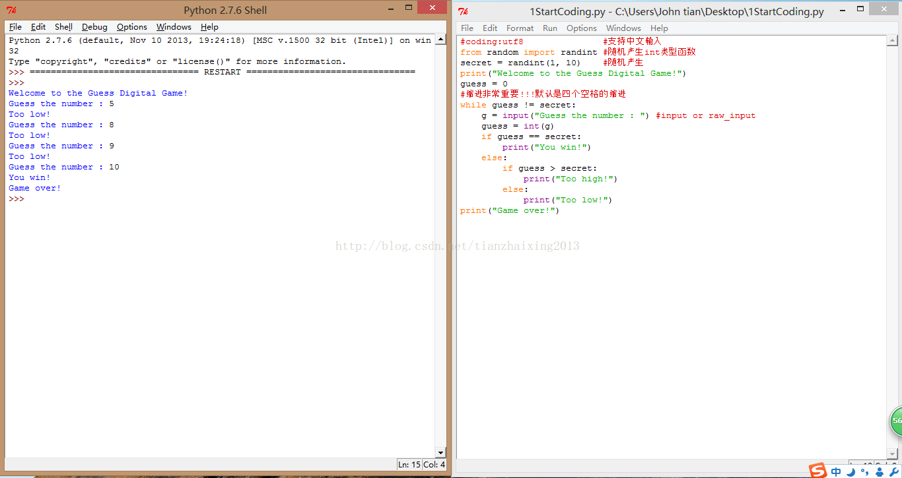

# 《Head First Programming》---python  1_开始编码

本专题主要依据《Head First Programming》(深入浅出)---python实现相关代码。

第一章节开始编码


```python
    #coding:utf8               #支持中文输入
    from random import randint #随机产生int类型函数
    secret = randint(1, 10)    #随机产生
    print("Welcome to the Guess Digital Game!")
    guess = 0
    #缩进非常重要!!!默认是四个空格的缩进
    while guess != secret:
        g = input("Guess the number : ") #input or raw_input
        guess = int(g)
        if guess == secret:
            print("You win!")
        else:
            if guess > secret:
                print("Too high!")
            else:
                print("Too low!")
    print("Game over!")
```


  
  
```