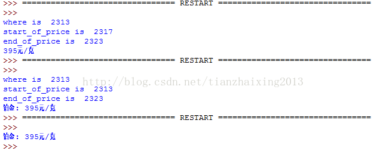

# 《Head First Programming》---python 2_文本数据

本章主要用到python 3.3.5版本自带urllib库函数，find()方法，实现对指定网址中需要内容的提取工作。如，目前我需要给女友购买一个铂金戒指作为订婚礼物，则通过QQ浏览器百度搜索老凤祥官方网站<http://www.laofengxiang.com/index.php>，以获取首页提供的最新铂金价格。


利用Python的实现代码如下所示：


```python
    import urllib.request

    page = urllib.request.urlopen("http://www.laofengxiang.com/index.php")

    text = page.read().decode("utf8")
    #print(text)

    where = text.find('铂金: ')
    #print("where is ", where)

    start_of_price = where
    #print("start_of_price is ", start_of_price)

    end_of_price = start_of_price + 10
    #print("end_of_price is ", end_of_price)

    price = (text[start_of_price:end_of_price])
    print(price)
```


