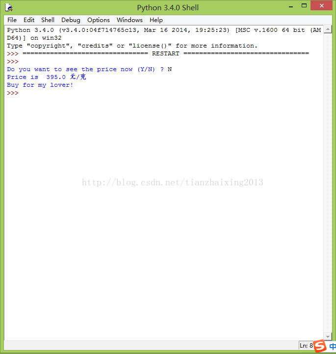

# 《Head First Programming》---python 3_函数

函数


```python
    import urllib.request
    import time

    def get_price():

        page = urllib.request.urlopen("http://www.laofengxiang.com/index.php")
        text = page.read().decode("utf8")
        #print(text)
        where = text.find("铂金: ")
        #print(where)
        start_of_price = where + 4;
        #print(start_of_price)
        end_of_price = start_of_price + 3
        #print(end_of_price)
        #print(text[start_of_price:end_of_price])
        return (text[start_of_price:end_of_price])

    price_now = input("Do you want to see the price now (Y/N) ? ")
    if price_now == "Y":
        print(get_price())
    else:
        price = float(get_price())
        while price > 499.9:
            time.sleep(3600) #每隔1小时刷新一次
            price = float(get_price())
        print("Price is ", price, "元/克")
        print("Buy for my lover!")
```


  
  


  
```