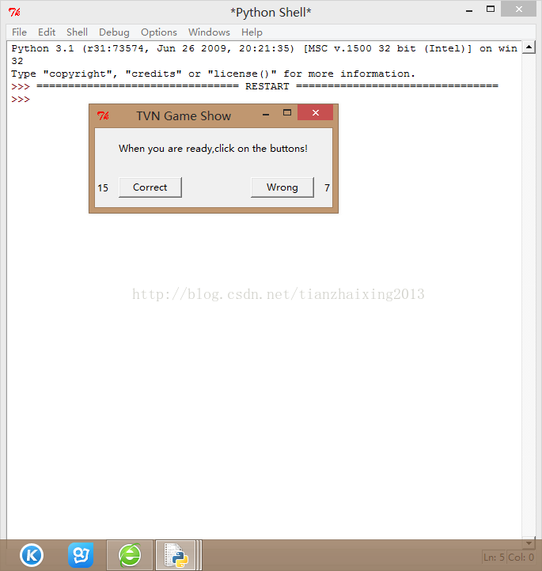

# 《Head First Programming》---python 7_GUI搭建

本章主要实现简单GUI的搭建，用到第三方python库--pygame 和python自带库tkinter.

需要说明的是，pygame和python的版本号一定要一致。不然，可能无法运行成功！！！

本文使用 [Windows x86 MSI Installer (3.1)](https://www.python.org/ftp/python/3.1/python-3.1.msi) [(sig)](https://www.python.org/download/releases/python-3.1.msi.asc)(python3.1) 和 [pygame-1.9.1.win32-py3.1.msi](http://pygame.org/ftp/pygame-1.9.1.win32-py3.1.msi) 3MB(pygame3.1)   


需要用到的声音文件可以从 [sound files](http://programming.itcarlow.ie/hfprog_sounds.zip) (http://programming.itcarlow.ie/resources.html)


```python
    from tkinter import *
    import pygame.mixer

    def play_correct_sound():
        num_good.set(num_good.get()+1)
        correct_s.play()

    def play_wrong_sound():
        num_bad.set(num_bad.get()+1)
        wrong_s.play()

    app = Tk()
    app.title("TVN Game Show")
    app.geometry('300x100+200+100')

    sounds = pygame.mixer
    sounds.init()

    correct_s = sounds.Sound("correct.wav")
    wrong_s = sounds.Sound("wrong.wav")

    num_good = IntVar()
    num_good.set(0)
    num_bad = IntVar()
    num_bad.set(0)

    lab = Label(app,text='When you are ready,click on the buttons!',height = 3)
    lab.pack()
    lab1 = Label(app,textvariable = num_good)
    lab1.pack(side = 'left')
    lab2 = Label(app,textvariable = num_bad)
    lab2.pack(side = 'right')

    b1 = Button(app,text='Correct',width = 10, command = play_correct_sound)
    b1.pack(side = 'left', padx = 10, pady = 10)
    b2 = Button(app,text='Wrong', width = 10, command = play_wrong_sound)
    b2.pack(side = 'right', padx = 10, pady = 10)

    app.mainloop()
```


  
   


  
```