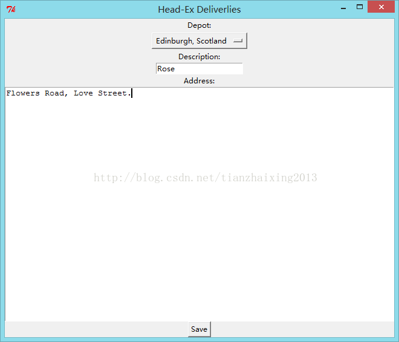

# 《Head First Programming》---python 8 and 8 1/2_GUI, data, exception

这两章节，主要是应用python自带GUI库tkinter 和异常处理机制，实现对名为Head-Ex快递公司的订单写入保存功能。


```python
    from tkinter import *
    #import tkinter.messagebox

    def save_data():#写入订单信息
        try:#用于捕获异常
            fileD = open("deliveries.txt", "a")
            fileD.write("Depot:\n")
            fileD.write("%s\n" % depot.get())
            fileD.write("Description:\n")
            fileD.write("%s\n" % description.get())
            fileD.write("Address:\n")
            fileD.write("%s\n" % address.get("1.0", END))
            depot.set(None)
            description.delete(0, END)
            address.delete("1.0", END)#起始行号1, 起始列号0
        except Exception as ex:#用于处理异常
            tkinter.messagebox.showerror("Error", "Can't write to the file!!!\n%s" % ex)

    def read_depots(file):
        depots = [] #空列表
        depots_t = open(file)
        for line in depots_t:
            depots.append(line.strip())
        return depots

    app = Tk()
    app.title('Head-Ex Deliverlies')
    Label(app, text = "Depot:").pack()

    depot = StringVar()#可变字符串类型变量depot
    depot.set(None)
    options = read_depots("depots.txt")#存储已经有的内容
    OptionMenu(app, depot, *options).pack()

    Label(app, text = "Description:").pack()
    description = Entry(app)#多用于单行文本输入
    description.pack()

    Label(app, text = "Address:").pack()
    address = Text(app)#多用于多行文本输入
    address.pack()

    Button(app, text = "Save", command = save_data).pack()#command相应保存数据函数
    app.mainloop()
```


  
1\. 已知快递仓库信息存储在depots.txt文本中 

Cambridge, MA  
Cambridge, UK  
Seatle, WA  
New York, NY  
Dallas, TX  
Boston, MA  
Rome, Italy  
Male, Maldives  
Luxor, Egypt  
Rhodes, Greece  
Edinburgh, Scotland  


2.GUI运行界面

  


  


3.输出订单信息保存在deliveries.txt中

Depot:  
Edinburgh, Scotland  
Description:  
Rose  
Address:  
Flowers Road, Love Street.  
```