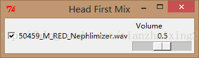

# 《Head First Programming》---python 9_GUI Mixer

本章主要利用tkinter库和pygame库，实现GUI界面的点击选择音乐文件控制音乐播放/关闭，同时利用水平滑动标尺控制音量大小。

  


```python
    from tkinter import *
    import pygame.mixer

    def track_toggle():
        if track_playing.get() == 1:
            track.play(loops = -1)

        else:
            track.stop()

    def change_volume(v):
        track.set_volume(volume.get())

    app = Tk()
    app.title("Head First Mix")

    mixer = pygame.mixer
    mixer.init()

    sound_file = "50459_M_RED_Nephlimizer.wav"
    track = mixer.Sound(sound_file)
    track_playing = IntVar()
    track_button = Checkbutton(app, variable = track_playing,
                               command = track_toggle,
                               text = sound_file)
    track_button.pack(side = LEFT)

    volume = DoubleVar()
    volume.set(track.get_volume())
    volume_scale = Scale(variable = volume,
                         from_ = 0.0,
                         to = 1.0,
                         resolution = 0.1,
                         command = change_volume,
                         label = "Volume",
                         orient = HORIZONTAL)
    volume_scale.pack(side = RIGHT)

    def shutdown():
        track.stop()
        app.destroy()
    app.protocol("WM_DELETE_WINDOW", shutdown)


    app.mainloop()
```


  
1\. 音乐文件下载地址：  [sound files](http://programming.itcarlow.ie/final-chapters-sounds.zip)

2.程序运行截图

  
```