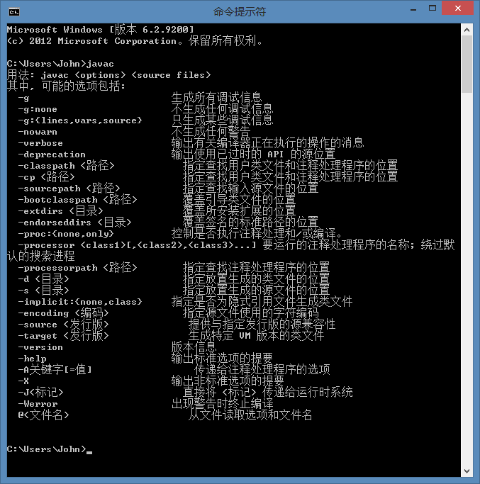
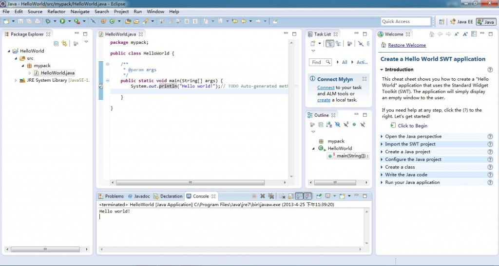

# JAVA-第二天

JAVA-学习第二天，安装配置JAVA！！！

JDK(java develop kit),就是java程序的开发环境。

JRE(java runtime environment),就是java程序的运行环境。

[【java】Windows7 下环境变量设置](http://blog.csdn.net/tianshuai11/article/details/7367700)  

http://blog.csdn.net/tianshuai11/article/details/7367700

  

1.java 下载

http://www.oracle.com/technetwork/cn/java/javase/downloads/jdk7-downloads-1880260-zhs.html  

2.可视化软件eclipse下载

http://www.eclipse.org/  

3.mypack HelloWorld.java HelloWorld.class

