# Java入门第一季

本文主要用于汇总之前自学慕课网上[Java入门第一季](http://www.imooc.com/learn/85) 的学习内容。至于**Java开发环境的搭建** ，请参看[这里](http://www.imooc.com/video/1459)。

### 一、Eclipse 程序的移植

程序的移植   
第一步：选择属性-菜单栏最下！   
第二步：有个Location   
项目复制   
导入：   
右键选择import   
选择General–Existing Projects into Workspace   
下一步   
Browse-找到项目位置，导入

### 二、变量和常量

  * java关键字

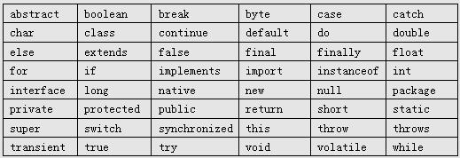


```java
    public class HelloWorld {
        public static void main(String[] args){
            System.out.println("hello imooc");
        }
    }
```


#### 标识符

**标识符** 就是用于给 Java 程序中变量、类、方法等命名的符号。
使用标识符时，需要遵守几条规则：


```
  * 标识符可以由**字母、数字、下划线（_）、美元符（$）** 组成，但**不能包含 @、%、空格等** 其它特殊字符，**不能以数字开头** 。譬如：123name 就是不合法滴；
  * 标识符不能是Java **关键字** 和 **保留字** （ Java 预留的关键字，以后的升级版本中有可能作为关键字），但可以 **包含** 关键字和保留字。如：不可以使用 void 作为标识符，但是 Myvoid 可以。
  * 标识符是**严格区分大小写** 的。 所以，一定要分清楚 imooc 和 IMooc 是两个不同的标识符哦！
  * 标识符的命名最好能反映出其作用，做到**见名知意** 。
```
java


#### 变量

在Java中，我们通过三个元素描述变量：**变量类型、变量名以及变量值** 。   
**Java 中的标点符号是英文的。**
1\. 变量名由多单词组成时，第一个单词的首字母小写，其后单词的首字母大写，俗称骆驼式命名法（也称驼峰命名法），如 myAge   
2\. 变量命名时，尽量简短且能清楚的表达变量的作用，做到见名知意。如：定义变量名 stuName 保存“学生姓名”信息

> PS： Java 变量名的长度没有限制，但 Java 语言是区分大小写的，所以 price 和 Price 是两个完全不同的变量哦！

Java 语言是一种**强类型** 语言。通俗点说就是，在 Java 中存储的数据都是有类型的，而且**必须在编译时就确定其类型** 。 Java 中有两类数据类型：   
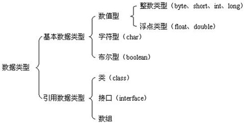

在 Java 的领域里，**基本数据类型** 变量存的是数据本身，而**引用类型** 变量存的是保存数据的空间地址。   
常用的基本数据类型有：   
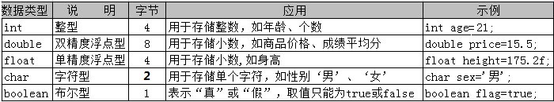


```java
**String** 是一种常见的**引用数据类型** ，用来表示字符串。在程序开发中，很多操作都要使用字符串来完成，例如系统中的用户名、密码、电子邮箱等。


    public class HelloWorld{
        public static void main(String[] args) {
            String name="爱慕课";
              char sex='男';
              int    num=18;
              double price=120.5;
              boolean  isOK=true;
            System.out.println(name);
            System.out.println(sex);
            System.out.println(num);
            System.out.println(price);
            System.out.println(isOK);
        }
    }
```


1、Java 中的变量需要先声明后使用;   
2、变量使用时，可以声明变量的同时进行初始化,也可以先声明后赋值;   
3、变量中每次只能赋一个值，但可以修改多次;   
**4、main 方法中定义的变量必须先赋值，然后才能输出**
5、虽然语法中没有提示错误，但在实际开发中，变量名不建议使用中文，容易产生安全隐患，譬如后期跨平台操作时出现乱码等等.

##### 自动类型转换

当然自动类型转换是需要满足特定的条件的：   
1\. 目标类型能与源类型兼容，如 double 型兼容 int 型，但是 char 型不能兼容 int 型；   
2\. 目标类型大于源类型，如 double 类型长度为 8 字节， int 类型为 4 字节，因此 double 类型的变量里直接可以存放 int 类型的数据，但反过来就不可以了。

##### 强制类型转换

**语法：**( 数据类型 ) 数值
强制类型转换可能会造成数据的丢失。


```
    double a = 78.6;// a = 78.6
    int b = (int)a; // b = 78
```


#### 常量

所谓**常量** ，我们可以理解为是一种特殊的变量，它的值被设定后，在程序运行过程中**不允许改变** 。   
**语法：** `final 常量类型 常量名 = 值;`
常量名一般使用大写字符。eg: `final char SEX = "男";`

#### 如何在Java中使用注释

**一般来说，对于一份规范的程序源代码而言，注释应该占到源代码的 1/3 以上。**

Java 中注释有三种类型：**单行注释、多行注释、文档注释。**

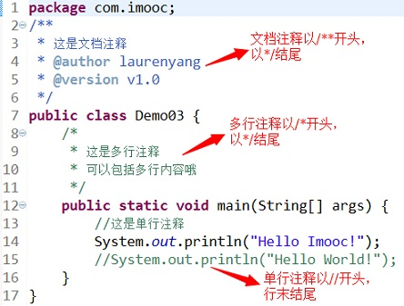

我们可以通过 `javadoc` 命令从文档注释中提取内容，生成程序的 API 帮助文档。


```
    javadoc -d doc Demo03.java
```


> 使用文档注释时还可以使用 javadoc 标记，生成更详细的文档信息：   
>  @author 标明开发该类模块的作者   
>  @version 标明该类模块的版本   
>  @see 参考转向，也就是相关主题   
>  @param 对方法中某参数的说明   
>  @return 对方法返回值的说明   
>  @exception 对方法可能抛出的异常进行说明

### 三、常用的运算符

**运算符** 是一种**“功能”** 符号，用以通知 Java 进行相关的运算。
Java 语言中常用的运算符可分为如下几种：   
Ø 算术运算符   
Ø 赋值运算符   
Ø 比较运算符   
Ø 逻辑运算符   
Ø 条件运算符

#### 算术运算符

**算术运算** 符主要用于进行基本的算术运算，如加法、减法、乘法、除法等。Java 中常用的算术运算符：
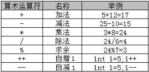   
其中，++ 和 – 既可以出现在操作数的左边，也可以出现在右边，但结果是不同的。   
一定要注意哦！自增和自减运算符只能用于操作变量，不能直接用于操作数值或常量！例如 5++ 、 8– 等写法都是错误滴！

> % 用来求余数，也称为**取模运算符** 。

#### 赋值预算符

**赋值运算符** 是指为变量或常量指定数值的符号。如可以使用 “=” 将右边的表达式结果赋给左边的操作数。Java 支持的常用赋值运算符，如下表所示：
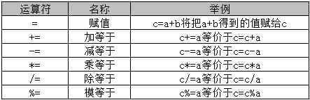

#### 比较运算符

**比较运算符** 用于判断两个数据的大小，例如：大于、等于、不等于。比较的结果是一个布尔值（ true 或 false ）。Java 中常用的比较运算符如下表所示：
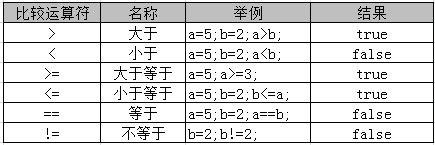

>   * `> 、 < 、 >= 、 <=` 只支持左右两边操作数是数值类型
>   * `== 、 !=` 两边的操作数既可以是数值类型，也可以是引用类型
> 


```java
    public class HelloWorld{
        public static void main(String[] args) {
            int a=16;
            double b=9.5;
            String str1="hello";
            String str2="imooc";
            System.out.println("a等于b：" + (a ==  b));
            System.out.println("a大于b：" + (a >  b));
            System.out.println("a小于等于b：" + (a <=  b));
            System.out.println("str1等于str2：" + (str1 ==  str2));
        }
    }
```


运行结果：


```
    a等于b：false
    a大于b：true
    a小于等于b：false
    str1等于str2：false
```
java


> str1和str2的比较也可以用，str1.equals(str2)!

#### 逻辑运算符

**逻辑运算符** 主要用于进行逻辑运算。Java 中常用的逻辑运算符如下表所示：
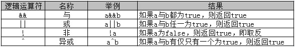

当使用逻辑运算符时，我们会遇到一种很有趣的“短路”现象。

  * 譬如：( one > two ) && ( one < three ) 中，如果能确定左边 one > two 运行结果为 false , 则系统就认为已经没有必要执行右侧的 one < three 啦。
  * 同理，在( one > two ) || ( one < three ) 中，如果能确定左边表达式的运行结果为 true , 则系统也同样会认为已经没有必要再进行右侧的 one < three 的执行啦！


```java
    public class HelloWorld {
        public static void main(String[] args) {
            boolean a = true; // a同意
            boolean b = false; // b反对
            boolean c = false; // c反对
            boolean d = true; // d同意

            System.out.println((a && b) + "未通过");
        System.out.println((a || b) + "通过");
        System.out.println((!a) + "未通过");
        System.out.println((c^d) + "通过");
        }
    }
```


运行结果：


```
    false未通过
    true通过
    false未通过
    true通过
```


#### 条件运算符

条件运算符（ ? : ）也称为 **“三元运算符”** 。

**语法形式：** `布尔表达式 ？ 表达式1 ：表达式2`

**运算过程：** 如果布尔表达式的值为 true ，则返回 表达式1 的值，否则返回 表达式2 的值。

#### 运算符优先级

所谓优先级，就是在表达式中的运算顺序。Java 中常用的运算符的优先级如下表所示：

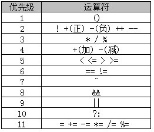

**级别为 1 的优先级最高，级别 11 的优先级最低** 。

> 大家没必要去死记运算符的优先级顺序，实际开发中，一般会使用**小括号** 辅助进行优先级管理。


```java
    public class HelloWorld {
        public static void main(String[] args) {
            int m = 5;
            int n = 7;
            int x = (m * 8 / (n+2) ) % m;
            System.out.println("m:" + m);
            System.out.println("n:" + n);
            System.out.println("x:" + x);
        }
    }
```


运行结果：


```
    m:5
    n:7
    x:4
```


### 四、流程控制语句

#### 条件语句之IF

##### if

对于“需要先判断条件，条件满足后才执行的情况”，就可以使用 **if 条件语句** 实现。

语法：


```
    if (条件成立时) {
        条件成立时执行的代码
    }
```


执行过程：   
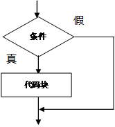

> 如果 if 条件成立时的执行语句只有一条，是可以省略大括号！

##### if…else

**if…else** 语句的操作比 if 语句多了一步: 当条件成立时，则执行 if 部分的代码块； 条件不成立时，则进入 else 部分。
语法：


```
    if (条件的布尔表达式) {
        代码1
    }else{
        代码2
    }
```


执行过程：   
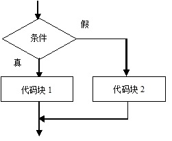

##### 多重if

**多重if语句** ，在条件 1 不满足的情况下，才会进行条件 2 的判断；当前面的条件均不成立时，才会执行 else 块内的代码。
语法：


```
    if(条件1){
        代码1
    } else if (条件2){
        代码2
    } else {
        代码3
    }
```


执行过程：   
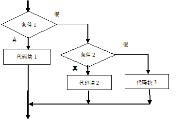

> 当需要判断的条件是连续的区间时，使用多重 if 语句非常方便！

##### 嵌套 if

**嵌套 if 语句** ，只有当外层 if 的条件成立时，才会判断内层 if 的条件。
语法：


```
    if(条件1){
        if(条件2){
            代码1
        }else{
            代码2
        }
    }else{
        代码3
    }
```


执行过程:   
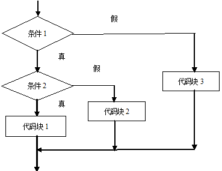

#### 条件语句之switch

当需要对选项进行等值判断时，使用 `switch` 语句更加简洁明了。   
语法：


```
    switch(表达式){
      case 值1:
        执行代码1
        break;
      case 值2:
        执行代码2
        break;
      case 值n:
        执行代码n
        break;
      default:
        默认执行的代码
    }
```


**执行过程：** 当 switch 后表达式的值和 case 语句后的值相同时，从该位置开始向下执行，直到遇到 break 语句或者 switch 语句块结束；
如果没有匹配的 case 语句则执行 default 块的代码。

  1. switch 后面小括号中表达式的值必须是整型或字符型；
  2. case 后面的值可以是常量数值，`如 1、2`；也可以是一个常量表达式，`如 2+2` ；但不能是变量或带有变量的表达式，`如 a * 2`；
  3. `case` 匹配后，执行匹配块里的程序代码，如果没有遇见 `break` 会继续执行下一个的 `case` 块的内容，直到遇到 `break` 语句或者 `switch` 语句块结束；
  4. 可以把功能相同的 case 语句合并起来；
  5. default 块可以出现在任意位置，也可以省略。


#### 循环语句之 while

Java 常用的3种循环： **while 、 do…while 、 for** 。   
语法：


```
    while(判断条件){
      循环操作
    }
```


执行过程：   
1\. 判断 while 后面的条件是否成立( true / false )；   
2\. 当条件成立时，执行循环内的操作代码 ，然后重复执行1、2，直到循环条件不成立为止。

> 特点：先判断，后执行

#### 循环语句之do…while

**do…while** 循环与 **while** 循环语法有些类似，但执行过程差别比较大。
语法：


```
    do {
      循环操作
    }while(判断条件);
```
java


执行过程：

  1.   

  2. 先执行一遍循环操作，然后判断循环条件是否成立；
  3. 如果条件成立，继续执行1、2，直到循环条件不成立为止。   


> 特点： 先执行，后判断   
>  do…while 语句保证循环至少被执行一次！ 


```java
    public class HelloWorld {
        public static void main(String[] args) {

            int sum = 0; // 保存 1-50 之间偶数的和

            int num = 2; // 代表 1-50 之间的偶数

            do {
                //实现累加求和
                sum += num;

                num = num + 2; // 每执行一次将数值加2，以进行下次循环条件判断

            } while (  num<=50  ); // 满足数值在 1-50 之间时重复执行循环

            System.out.println(" 50以内的偶数之和为：" + sum );
        }
    }
```


执行结果：


```
    50以内的偶数之和为：650
```


#### 循环语句之for

语法：


```
    for(循环变量初始化; 循环条件; 循环变量变化){
      循环操作
    }
```


执行过程：   
1\. 执行循环变量初始化部分，设置循环的初始状态，此部分在整个循环中只执行一次；   
2\. 进行循环条件的判断，如果条件为 true，则执行循环体内代码；如果为 false，则直接退出循环；   
3\. 执行循环变量变化部分，改变循环变量的值，以便进行下一次条件判断；   
4\. 依次重新执行2、3、4，直到退出循环。

> 特点：相比 while 和 do…while 语句结构更加简洁易读!

1、for关键字后面括号中的三个表达式必须用 “;” 隔开，三个表达式都可以省略，但 “;” 不能省略；


```
  * 省略“循环变量初始化”，可以在 for 语句之前由赋值语句进行变量初始化操作；
  * 省略“循环条件”，可能会造成循环将一直执行下去，也就是我们常说的“死循环”现象(避免这种情况发生，需在合适的位置进行**break**)；
  * 省略“循环变量变化”，可以在循环体中进行循环变量的变化。
```


2、for循环变量初始化和循环变量变化部分，可以是使用 “,” 同时初始化或改变多个循环变量的值。   
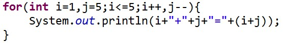

3、循环条件部分可以使用**逻辑运算符** 组合的表达式，表示复杂判断条件，但一定注意运算的优先级!

#### 循环跳转语句之 break

在 Java 中，我们可以使用**break** 语句退出指定的循环，直接执行循环后面的代码。


```java
    public class HelloWorld {
        public static void main(String[] args) {
            // 保存累加值
            int sum = 0;

            // 从1循环到10
            for (int i = 1; i <= 10; i++) {
                // 每次循环时累加求和
                sum = sum + i;
                // 判断累加值是否大于20，如果满足条件则退出循环
                if (sum>20) {
                    System.out.print("当前的累加值为:" + sum);
                    //退出循环
                    break;
                }
            }
        }
    }
```


执行结果：


```
    当前的累加值为:21
```
java


#### 循环跳转语句之 continue


```java
**continue** 的作用是跳过循环体中剩余的语句执行下一次循环。


    public class HelloWorld {
        public static void main(String[] args) {
            int sum = 0; // 保存累加值
            for (int i = 1; i <= 10; i++) {
                // 如果i为奇数,结束本次循环，进行下一次循环
                if (i%2 != 0 ) {
                    continue;
                }
                sum = sum + i;
            }
            System.out.print("1到10之间的所有偶数的和为：" + sum);
        }
    }
```


执行结果：


```
    1到10之间的所有偶数的和为：30
```


#### 循环语句之多重循环

循环体中包含循环语句的结构称为**多重循环** 。   
三种循环语句可以自身嵌套，也可以相互嵌套，最常见的就是二重循环。   
在二重循环中，外层循环每执行一次，内层循环要执行一圈。   
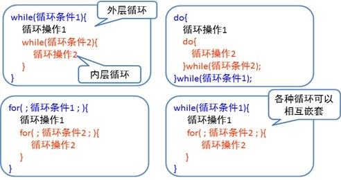


```java
    public class HelloWorld {
        public static void main(String[] args) {
            System.out.println("打印直角三角形");
            // 外层循环控制行数
            for (int i = 1; i<=3; i++) {
                // 内层循环控制每行的*号数
                // 内层循环变量的最大值和外层循环变量的值相
                for (int j = 1; j<=i; j++) {
                    System.out.print("*");
                }
                // 每打印完一行后进行换行
                System.out.println();
            }
        }
    }
```


执行结果：


```
    打印直角三角形
    *
    **
    ***
```
java


#### 练习


```java
    public class HelloWorld {
        public static void main(String[] args){
            int num = 999;
            int count = 0;
            for(; num!=0; num/=10){
                count++;
            }
            System.out.println("它是个"+count+"位的数！");
        }
    }
```


执行结果：


```
    它是个3位的数！
```


### 五、编程练习

功能描述：为指定成绩加分，直到分数大于等于 60 为止，输出加分前和加分后的成绩，并统计加分的次数。   
Solution:


```java
    public class HelloWorld {
        public static void main(String[] args) {
            // 变量保存成绩
            int score = 53;

            // 变量保存加分次数
            int count = 0;

            //打印输出加分前成绩
            System.out.println("加分前成绩: "+score);

            // 只要成绩小于60，就循环执行加分操作，并统计加分次数
            while(score < 60){
                score += 1;
                count += 1;
            }
            //打印输出加分后成绩，以及加分次数
            System.out.println("加分后成绩: "+score);
            System.out.println("共加了: "+count+"次!");
        }
    }
```


执行结果：


```
    加分前成绩: 53
    加分后成绩: 60
    共加了: 7次!
```


#### 由用户输入成绩信息


```
    import java.util.Scanner;
    Scanner input=new Scanner(System.in);
    int a=input.nextInt();//整型数
    //浮点数
    float fscore = input.nextFloat();
    double dscore = input.nextDouble();
```
java


Eclipse Debug步骤：   
第一步：初步确定可能出错的代码行；   
第二步：在目标代码行数前空白位置双击，设置断点；   
第三步：按工具栏上debug按钮（甲壳虫按钮），此时程序执行至断点之前；   
第四步：按step over或F6进行单步执行，每按一次执行一步。


```java
    package org.jt;
    import java.util.Scanner;

    /**
     *  功能：实现接收三个班级的各四名学员的成绩信息，然后计算每个班级学员的平均分。
     *  知识点：二重循环，外层循环控制班级的数量，内层循环控制每个班级的学员数量。
     */
    public class HelloWorld {
        public static void main(String[] args) {
            int classNum = 3; // 班级数量
            int stuNum = 4;   // 学生数量
            double sum = 0.0; // 成绩总和
            double avg = 0.0; // 成绩平均分
            Scanner input = new Scanner(System.in); // 创建Scanner对象
            for (int i = 1; i <= classNum; i++) { // 外层循环控制班级的数量
                sum = 0.0; // 容易出现BUG的地方
                System.out.println("***请输入第"+i+"个班级的成绩***");
                for (int j = 1; j <= stuNum; j++) { // 内层循环控制每个班级的学员数量
                    System.out.println("请输入第"+j+"个学员的成绩");
                    int score = input.nextInt(); // 获取用户输入的学员成绩
                    sum = sum + score;            // 累计班级每个学员的成绩
                }
                avg = sum/stuNum; // 计算平均分
                System.out.println("第"+i+"个班级学生的平均分为"+avg);
            }
        }
    }
```


执行结果：


```
    ***请输入第1个班级的成绩***
    请输入第1个学员的成绩
    75
    请输入第2个学员的成绩
    84
    请输入第3个学员的成绩
    91
    请输入第4个学员的成绩
    58
    第1个班级学生的平均分为77.0
    ***请输入第2个班级的成绩***
    请输入第1个学员的成绩
    90
    请输入第2个学员的成绩
    66
    请输入第3个学员的成绩
    53
    请输入第4个学员的成绩
    89
    第2个班级学生的平均分为74.5
    ***请输入第3个班级的成绩***
    请输入第1个学员的成绩
    74
    请输入第2个学员的成绩
    97
    请输入第3个学员的成绩
    63
    请输入第4个学员的成绩
    78
    第3个班级学生的平均分为78.0
```


### 六、数组

**数组** 可以理解为是一个巨大的“盒子”，里面可以按**顺序** 存放多个**类型相同** 的数据，数组中的元素都可以通过下标来访问，下标从 **0** 开始。

Java 中操作数组只需要四个步骤：   
1、 声明数组   
**语法：** `数据类型[ ] 数组名;` 或者 `数据类型 数组名[ ];`
其中，数组名可以是任意合法的变量名!

2、 分配空间   
简单地说，就是指定数组中最多可存储多少个元素   
**语法：** `数组名 = new 数据类型 [ 数组长度 ];`
其中，数组长度就是数组中能存放元素的个数!

> 话说，我们也可以将上面的两个步骤合并，在声明数组的同时为它分配空间。`int[] scores = new int[5];` 或者 `int scores[] = new int[5];`

3、 赋值   
分配空间后就可以向数组中放数据了，数组中元素都是通过下标来访问的。

4、 处理数组中数据   
我们可以对赋值后的数组进行操作和处理，如获取并输出数组中元素的值。

在 Java 中还提供了另外一种直接创建数组的方式，它将声明数组、分配空间和赋值合并完成。


```
    int[] scores = {78, 91, 84, 68};
    // 等价于
    int[] scores = new int[]{78, 91, 84, 68};
```


#### 使用循环操作数组

`数组名.length`用于获取数组的长度；   
数组下标从 **0** 开始，范围是 **0** 至 **数组长度-1** 。


```java
    public class HelloWorld {
        public static void main(String[] args) {
            // 定义一个整型数组，并赋初值
            int[] nums = new int[] { 61, 23, 4, 74, 13, 148, 20 };
            int max = nums[0]; // 假定最大值为数组中的第一个元素
            int min = nums[0]; // 假定最小值为数组中的第一个元素
            double sum = 0;// 累加值
            double avg = 0;// 平均值

            for (int i = 0; i < nums.length; i++) { // 循环遍历数组中的元素
            // 如果当前值大于max，则替换max的值
            if(nums[i]>max){
             max = nums[i];
            }

            // 如果当前值小于min，则替换min的值
            if(nums[i]<min){
                min = nums[i];
            }

            // 累加求和
            sum += nums[i];
            }

            // 求平均值
           avg = sum/nums.length;

            System.out.println("数组中的最大值：" + max);
            System.out.println("数组中的最小值：" + min);
            System.out.println("数组中的平均值：" + avg);
        }
    }
```


执行结果：


```
    数组中的最大值：148
    数组中的最小值：4
    数组中的平均值：49.0
```
java


#### 使用Arrays类操作数组

**Arrays类** 是Java中提供的一个工具类，在 **java.util** 包中。该类中包含了一些方法用来直接操作数组，比如可直接实现数组的排序、搜索等。

Arrays 中常用的方法：

1、 排序   
**语法：** `Arrays.sort(数组名);`
可以使用 sort( ) 方法实现对数组的排序，只要将数组名放在`sort( )`方法的括号中，就可以完成对该数组的排序（按升序排列）。

2、 将数组转换为字符串   
**语法：**`Arrays.toString(数组名);`
可以使用 `toString( )`方法将一个数组转换成字符串，该方法按**顺序** 把多个数组元素连接在一起，多个元素之间使用**逗号和空格** 隔开。


```java
    //导入Arrays类
    import java.util.Arrays;

    public class HelloWorld {
        public static void main(String[] args) {
            // 定义一个字符串数组
            String[] hobbys = { "sports", "game", "movie" };

            // 使用Arrays类的sort()方法对数组进行排序
            Arrays.sort(hobbys);

            // 使用Arrays类的toString()方法将数组转换为字符串并输出
            System.out.println(Arrays.toString(hobbys));
        }
    }
```


执行结果：


```
    [game, movie, sports]
```


#### 使用foreach操作数组

**foreach** 并不是 Java 中的关键字，是 **for** 语句的特殊简化版本，在遍历数组、集合时， foreach 更简单便捷。
语法：


```java
    for(元素类型 元素变量:遍历对象){
        执行的代码
    }


    import java.util.Arrays;

    public class HelloWorld {

        public static void main(String[] args) {

            // 定义一个整型数组，保存成绩信息
            int[] scores = { 89, 72, 64, 58, 93 };

            // 对Arrays类对数组进行排序
            Arrays.sort(scores);

            // 使用foreach遍历输出数组中的元素
            for (int score: scores) {
                System.out.println(score);
            }
        }
    }
```


执行结果：


```
    58
    64
    72
    89
    93
```


#### 二维数组

所谓**二维数组** ，可以简单的理解为是一种“特殊”的一维数组，它的每个数组空间中保存的是一个一维数组。

使用二维数组的步骤如下：   
1、 声明数组并分配空间


```
    数据类型[][] 数组名 = new 数据类型[行的个数][列的个数];
    //或者
    数据类型[][] 数组名;
    数组名 = new 数据类型[行的个数][列的个数];
```


2、 赋值   
二维数组的赋值，和一维数组类似，可以通过下标来逐个赋值，注意索引从 **0** 开始!


```
    数组名[行的索引][列的索引 = 值;
    // 声明的同时进行赋值
    数据类型[][] 数组名 = {{值1, 值2...}, {值11, 值22...}, {值21, 值22...}};
```
java


3、 处理数组   
**二维数组的访问和输出** 同一维数组一样，只是多了一个下标而已。在循环输出时，需要里面再内嵌一个循环，即使用二重循环来输出二维数组中的每一个元素。

> 在定义二维数组时也可以**只指定行的个数** ，然后再为每一行分别指定列的个数。如果每行的列数不同，则创建的是不规则的二维数组!!!


```java
    public class HelloWorld {
        public static void main(String[] args) {

            // 定义两行三列的二维数组并赋值
             String[][] names={{"tom","jack","mike"},{"zhangsan","lisi","wangwu"}};

            // 通过二重循环输出二维数组中元素的值
            for (int i = 0; i < names.length    ; i++) {
                for (int j = 0; j < names[i].length; j++) {
                    System.out.println(names[i][j]);
                }
                System.out.println();
            }
        }
    }
```


执行结果：


```
    tom
    jack
    mike

    zhangsan
    lisi
    wangwu
```


### 七、方法

所谓**方法** ，就是用来解决一类问题的代码的有序组合，是一个功能模块。   
一般情况下，定义一个方法的语法是：


```
    访问修饰符 返回值类型 方法名(参数类比){
        方法体
    }
```


其中：   
1、访问修饰符：方法允许被访问的权限范围， 可以是**public、protected、private** 甚至可以**省略** ，其中 public 表示该方法可以被其他任何代码调用；

2、返回值类型：方法返回值的类型，如果方法不返回任何值，则返回值类型指定为 **void** ；如果方法具有返回值，则需要指定返回值的类型，并且在方法体中使用 **return** 语句返回值；

3、方法名：定义的方法的名字，必须使用合法的标识符；

4、参数列表：传递给方法的参数列表，参数可以有多个，多个参数间以**逗号** 隔开，每个参数由**参数类型和参数名** 组成，以**空格** 隔开；

根据方法是否带参、是否带返回值，可将方法分为四类：


```java
    Ø 无参无返回值方法
    Ø 无参带返回值方法
    Ø 带参无返回值方法
    Ø 带参带返回值方法


    public class HelloWorld {

        //定义了一个方法名为 print 的方法，实现输出信息功能
        public void print() {
            System.out.println("Hello World");
        }

        public static void main(String[] args){

            //在 main 方法中调用 print 方法
            HelloWorld test=new HelloWorld();
            test.print();
        }
    }
```


执行结果：


```
    Hello World
```
java


#### 无参无返回值方法

如果方法不包含参数，且没有返回值，我们称为**无参无返回值的方法** 。

使用步骤：   
1\. 定义方法   
\+ 方法体放在一对大括号中，实现特定的操作；   
\+ 方法名主要在调用这个方法时使用，需要注意命名的规范，**一般采用第个单词首字母小写，其他单词首字母大写的形式** 。   
2\. 调用方法   
当需要调用方法执行某个操作时，可以先创建类的对象，然后通过`对象名.方法名();`来实现。


```java
    public class HelloWorld {

        public static void main(String[] args) {
            // 创建对象，对象名为hello
            HelloWorld hello = new HelloWorld();

            // 调用方法
            hello.showMyLove();
        }

        /*
         * 定义无参无返回值的方法
         */
        public void showMyLove() {
            System.out.println("我爱慕课网!");
        }
    }
```


执行结果：


```
    我爱慕课网!
```


#### 无参带返回值方法

如果方法不包含参数，但有返回值，我们称为**无参带返回值的方法** 。   
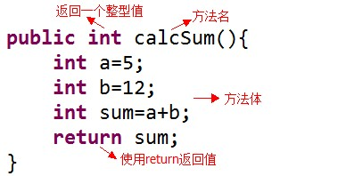

> 调用带返回值的方法时需要注意，由于方法执行后会返回一个结果，因此在调用带返回值方法时一般都会接收其返回值并进行处理!

不容忽视的“小陷阱”：   
1\. 如果方法的返回类型为 `void` ，则方法中**不能** 使用 `return` 返回值！   
2\. 方法的返回值**最多** 只能有一个，不能返回多个值!   
3\. 方法返回值的类型**必须兼容** ，例如，如果返回值类型为 `int`，则**不能** 返回 `String` 型值!

  * Demo1


```java
    public class HelloWorld {

        public static void main(String[] args) {
            // 创建名为hello的对象
            HelloWorld hello = new HelloWorld();

            // 调用hello对象的calcAvg()方法，并将返回值保存在变量avg中
            double avg = hello.calcAvg();
            System.out.println("平均成绩为：" + avg);
        }

        // 定义一个返回值为double类型的方法
        public double  calcAvg() {
            double java = 92.5;
            double php = 83.0;
            double avg = (java + php) / 2; // 计算平均值
            // 使用return返回值
            return avg;
        }
    }
```
java


执行结果：`平均成绩为：87.75`

  * Demo2


```java
    public class HelloWorld {

        //完成 main 方法
        public static void main(String[] args) {

            // 创建对象，对象名为hello
            HelloWorld hello = new HelloWorld();

            // 调用方法并将返回值保存在变量中
            int maxScore = hello.getMaxAge();
            // 输出最大年龄
            System.out.println("最大年龄为：" + maxScore);
        }

        /*
         * 功能：输出学生年龄的最大值
         * 定义一个无参的方法，返回值为年龄的最大值
         * 参考步骤：
         * 1、定义一个整形数组 ages ，保存学生年龄，数组元素依次为 18 ,23 ,21 ,19 ,25 ,29 ,17
         * 2、定义一个整形变量 max ,保存学生最大年龄，初始时假定数组中的第一个元素为最大值
         * 3、使用 for 循环遍历数组中的元素，并与假定的最大值比较，如果比假定的最大值要大，则替换当前的最大值
         * 4、使用 return 返回最大值
         */
        public int getMaxAge() {
        int ages[] = {18 ,23 ,21 ,19 ,25 ,29 ,17};
        int max = 0;
        for (int age: ages){
            if (age > max){
                max = age;
            }
        }
        return max;
        }
    }
```


执行结果：`最大年龄为：29`

#### 带参无返回值方法

通过在方法中加入**参数列表** 接收外部传入的数据信息，参数可以是**任意** 的**基本类型数据或引用类型数据** 。

调用带参方法与调用无参方法的语法类似，但在调用时必须传入**实际的参数值**!   
`对象名.方法名(实参1,实参2,...,实参n);`

很多时候，我们把定义方法时的参数称为**形参** ，目的是用来定义方法需要传入的**参数的个数和类型** ；把调用方法时的参数称为**实参** ，是传递给方法**真正** 被处理的值。

一定不可忽视的问题：   
1\. 调用带参方法时，必须保证实参的数量、类型、顺序与形参一一对应!   
2\. 调用方法时，实参不需要指定数据类型。   
3\. 方法的参数可以是基本数据类型，如 `int、double`等，也可以是引用数据类型，如 `String、数组`等。   
4\. 当方法参数有多个时，多个参数间以**逗号** 分隔。

#### 带参带返回值方法

如果方法既包含参数，又带有返回值，我们称为**带参带返回值的方法** 。


```java
    import java.util.Arrays;

    public class HelloWorld {
        public static void main(String[] args) {
            HelloWorld hello = new HelloWorld();
            int[] scores={79,52,98,81};

            //调用方法，传入成绩数组，并获取成绩的个数
            int count=hello.sort(scores);

            System.out.println("共有"+count+"个成绩信息！");
        }

        /*
         * 功能：将考试成绩排序并输出，返回成绩的个数
         * 定义一个包含整型数组参数的方法，传入成绩数组
         * 使用Arrays类对成绩数组进行排序并输出
         * 方法执行后返回数组中元素的个数
         */
        public int sort(int[] scores){
            Arrays.sort(scores);
            System.out.println(Arrays.toString(scores));
            //返回数组中元素的个数
            return scores.length;
        }
    }
```


执行结果：


```
    [52, 79, 81, 98]
    共有4个成绩信息！
```
java


#### 方法的重载

  * 什么是方法的重载呢？
如果同一个类中包含了两个或两个以上**方法名相同、方法参数的个数、顺序或类型不同** 的方法，则称为**方法的重载** ，也可称该**方法被重载** 了。

  * 如何区分调用的是哪个重载方法呢？
当调用被重载的方法时， Java会根据参数的个数和类型来判断应该调用哪个重载方法，参数完全匹配的方法将被执行。

  * 判断方法重载的依据
1、 必须是在同一个类中   
2、 方法名相同   
3、 方法参数的个数、顺序或类型不同   
4、 **与方法的修饰符或返回值没有关系**

  * Demo1


```java
    public class HelloWorld {
        public static void main(String[] args) {

            // 创建对象
            HelloWorld hello = new HelloWorld();

            // 调用无参的方法
            hello.print();

            // 调用带有一个字符串参数的方法
            hello.print("JohnTian");

            // 调用带有一个整型参数的方法
            hello.print(29);
        }

        public void print() {
            System.out.println("无参的print方法");
        }

        public void print(String name) {
            System.out.println("带有一个字符串参数的print方法，参数值为：" + name);
        }

        public void print(int age) {
            System.out.println("带有一个整型参数的print方法，参数值为：" + age);
        }
    }
```


执行结果：


```
    无参的print方法
    带有一个字符串参数的print方法，参数值为：JohnTian
    带有一个整型参数的print方法，参数值为：29
```


  * Demo2


```java
    //导入java.util.Arrays;
    import java.util.Arrays;


    public class HelloWorld {
        public static void main(String[] args) {

             // 创建对象，对象名为hello
            HelloWorld hello = new HelloWorld();

            // 调用方法并将返回值保存在变量中
            int[] nums = hello.getArray(8);

            // 将数组转换为字符串并输出
            System.out.println(Arrays.toString(nums));
        }

        /*
         * 功能：创建指定长度的int型数组，并生成100以内随机数为数组中的每个元素赋值
         * 定义一个带参带返回值的方法，通过参数传入数组的长度，返回赋值后的数组
         */
        public int[] getArray(int length) {
            // 定义指定长度的整型数组
            int[] nums = new int[length];

            // 循环遍历数组赋值
            for ( int i = 0; i < nums.length; i++) {
                // 产生一个100以内的随机数，并赋值给数组的每个成员
                nums[i] = (int)(Math.random()*100);
            }
            return nums; // 返回赋值后的数组
        }
    }
```
java


执行结果：`[78, 12, 49, 65, 85, 18, 45, 73]`

### 八、编程练习


```java
    import java.util.Arrays;

    public class HelloWorld {

        //完成 main 方法
        public static void main(String[] args) {

            int[] scores = {89, -23, 64, 91, 119, 52, 73};
            HelloWorld hello = new HelloWorld();
            System.out.println("考试成绩的前三名为: ");
            hello.getTop3(scores);

        }

        //定义方法完成成绩排序并输出前三名的功能
        public void getTop3(int[] scores) {
            Arrays.sort(scores);
            int cnt = 0, score = 0;
            for (int i = scores.length - 1; i >= 0 ; i--) {
                score = scores[i];
                if (score > 100) {
                    continue;
                } else {
                    System.out.println(score);
                    cnt += 1;
                    if (cnt == 3){
                        break;
                    }
                }
            }
        }
    }
```


执行结果：


```
    考试成绩的前三名为:
    91
    89
    73
```


### 参考

[Java入门第一季](http://www.imooc.com/learn/85)