# Java入门第二季

本文主要用于汇总之前自学慕课网上[Java入门第二季](http://www.imooc.com/learn/124) 的学习内容。至于**Java开发环境的搭建** ，请参看[这里](http://www.imooc.com/video/1459)。


```
  *     * 一类和对象
      * 什么是类和对象
      * 如何定义java中的类
      * 如何使用java中的对象
      * 成员变量和局部变量
        * 成员变量和局部变量定义
        * 成员变量和局部变量区别
      * 构造方法
      * static 使用之静态变量
      * static 使用之静态方法
      * static 使用之静态初始化块
    * 二封装
      * 使用包管理java类
      * 访问修饰符
      * this
      * Java中的内部类
        * 成员内部类
        * 静态内部类
        * 方法内部类
    * 三继承
      * 方法的重写
      * 继承初始化顺序
      * final关键字
      * super关键字
      * Object类
    * 四多态
      * 引用类型转换
      * 抽象类
      * 接口
      * UML
    * 参考
```


### 一、类和对象

#### 什么是类和对象

1. 外物皆对象，客观存在的事物皆为对象。
2. 面向对象，关注对象（关注具体事物的信息）。
3. 类是抽象的概念，仅仅是模板，确定对象将拥有的特征和功能。
4. 类的特点： 类是对象的类型。 类是具有相同属性和方法的一组对象的集合。
5. 什么是对象的属性：对象具有的各种特征。
6. 什么是对象的方法：对象能执行的操作。
7. 类和对象的关系：类是对象的模子。
8. 类和对象的区别：类是抽象的概念，不能直接使用。对象是具体的，可以直接使用的具体信息。

#### 如何定义java中的类

1. 类的重要性：所有java程序都以类class为组织单元。
2. 定义类的步骤：


```
     * 定义类名
     * 编写类的属性（可以没有）
     * 编写类的方法（可以没有，必须有输出值，如System.out.println();）

    public class 类名{
        //定义属性部分(成员变量)
        属性1的类型 属性1;
        属性2的类型 属性2;
        ...
        属性n的类型 属性n;
        //定义方法部分
        方法1;
        方法2;
        ...
        方法m;
    }
```


```java
    //1. 定义一个类
    public class Telphone {
      //2. 属性（成员变量）有什么
      float screen;
      float cpu;
      float mem;
      //3. 方法 干什么
      void call() {
          System.out.println("Telphone有打电话的功能！");
      }
      void sendMessage(){
          System.out.println("Telphone有发短信的功能！");
      }
    }
```
java


#### 如何使用java中的对象

使用对象的步骤：   
1\. 创建对象:   
`类名 对象名 = new 类名();`   
Telphone phone = new Telphone();   
2\. 使用对象   
引用对象的属性:`对象名.属性`   
phone.screen = 5; // 给screen属性赋值   
引用对象的方法：`对象名.方法名()`   
phone.sendMessage();//调用sendMessage()方法

  * Telphone.java


```java
    package com.imooc;

    //1. 定义一个类
    public class Telphone {
        //2. 属性（成员变量）有什么
        float screen;
        float cpu;
        float mem;
        //3. 方法 干什么
        void call() {
            System.out.println("Telphone有打电话的功能！");
        }
        void sendMessage(){
            System.out.println("screen:"+screen+" cpu:"+cpu+" mem:"+mem+" Telphone有发短信的功能！");
        }
    }
```


* InitailTelphone.java


```java
    package com.imooc;

    public class InitailTelphone {

        public static void main(String[] args) {
            // TODO Auto-generated method stub
            Telphone phone = new Telphone();
            phone.sendMessage();
            //给实例变量赋值
            phone.screen = 5.0f;
            phone.cpu = 1.4f;
            phone.mem = 2.0f;
            //调用对象的方法
            phone.sendMessage();
        }
    }
```


* 运行结果


```
    screen:0.0 cpu:0.0 mem:0.0 Telphone有发短信的功能！
    screen:5.0 cpu:1.4 mem:2.0 Telphone有发短信的功能！
```
java


#### 成员变量和局部变量

##### 成员变量和局部变量定义

  1. **成员变量(默认值是0)定义在类中，用来描述对象将要有什么。** 可以被本类的所有方法使用，也可以被其他类的方法使用。
  2. **局部变量定义在方法中，用来临时保存数据** 。只能在当前的方法中使用。不会自动赋初始值的。


##### 成员变量和局部变量区别

  1. 作用域不同   
局部变量的作用域仅限定义他的方法中   
成员变量的作用域在整个类内部可见！
  2. 初始值不同   
**Java不会给局部变量赋初始值！**
Java会给成员变量赋初始值！
  3. 在同一个方法中，不允许有同名的局部变量，但在不同的方法中可以有同名变量。
  4. 成员变量与局部变量重名时，局部变量具有更高的优先级。


#### 构造方法

  1. 使用new+构造方法创建一个新得对象；
  2. 构造方法是java类中得一个用来初始化对象得方法；
  3. 构造方法与类同名没有返回值；   
`   
public 构造方法名(){   
//初始化代码
}
`
  4. 当没有指定构造方法时，系统会自动添加**无参的构造方法** ，当有指定的构造方法时，系统不会自动添加`public 构造方法名（）{}`构造方法！
  5. **有参的构造方法** ，初始化对象成员变量的值。
  6. **构造方法的重载** ：方法名相同，但参数不同的构造方法，调用时会自动根据不同的参数选择相应的方法。
  7. 构造方法不但可以给对象的属性赋值，还可以保证给对象的属性赋一个合理的值。可以使用条件语句等避免传值不正确! 


Telphone.java


```java
    package com.imooc;

    public class Telphone {
        float screen;
        float cpu;
        float mem;
        public Telphone(){
            System.out.println("无参的构造方法执行了！");
        }
        public Telphone(float newScreen, float newCpu, float newMem) {
            if(newScreen < 3.5f) {
                System.out.println("您输入的参数有问题，自动赋值3.5!");
                screen = 3.5f;
            }else{
                screen = newScreen;
            }
            cpu = newCpu;
            mem = newMem;
            System.out.println("有参的构造方法执行了！");
        }
    }
```


InitialTelphone.java


```java
    package com.imooc;

    public class InitialTelphone {

        public static void main(String[] args) {
            // TODO Auto-generated method stub
            // 通过无参的构造方法创建对象
            Telphone phone = new Telphone();
            // 通过有参的构造方法创建对象，初始化成员变量
            Telphone phone2 = new Telphone(1.5f, 1.4f, 2.0f);
        }

    }
```


执行结果


```java
    无参的构造方法执行了！
    您输入的参数有问题，自动赋值3.5!
    有参的构造方法执行了！
```


#### static 使用之静态变量

Java 中被**static** 修饰的成员称为**静态成员或类成员** 。它属于整个类所有，而不是某个对象所有，即被类的所有对象所共享。静态成员可以使用**类名直接访问** ，也可以使用**对象名进行访问** 。

> 当然，鉴于他作用的特殊性更推荐用**类名访问**!

**使用 static 可以修饰变量、方法和代码块。**

静态成员属于整个类，当系统第一次使用该类时，就会为其分配内存空间直到该类被卸载才会进行资源回收！

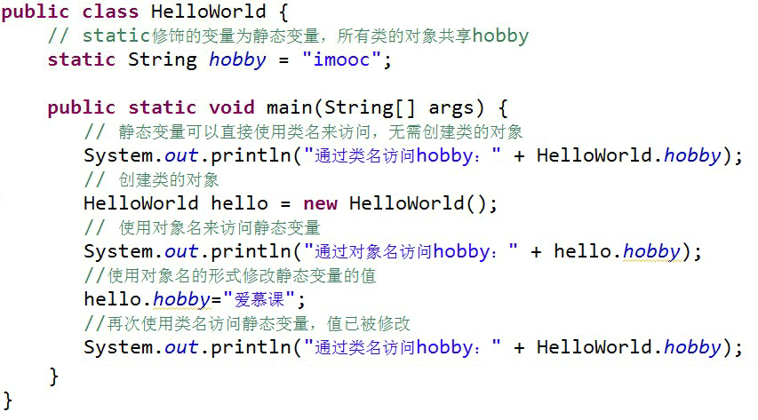   
执行结果：   
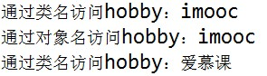

#### static 使用之静态方法

与静态变量一样，我们也可以使用 static 修饰方法，称**为静态方法或类方法** 。其实之前我们一直写的 main 方法就是静态方法。

  1. 静态方法中可以直接调用同类中的静态成员，但**不能直接调用非静态成员!**   
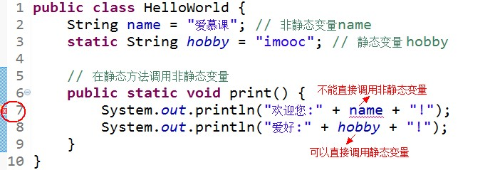   
如果希望在**静态方法** 中调用非静态变量，可以通过创建类的对象，然后通过对象来访问**非静态变量** 。   
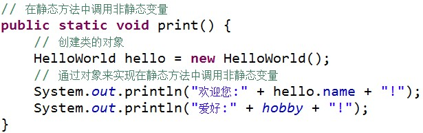

  2. 在普通成员方法中，则可以直接访问同类的非静态变量和静态变量。   
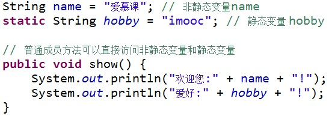

  3. **静态方法** 中不能直接调用非静态方法，需要通过对象来访问**非静态方法** 。   
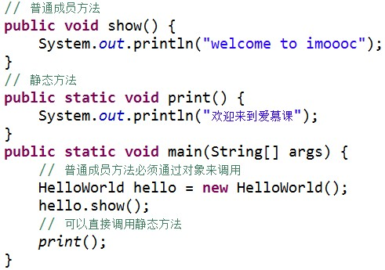


#### static 使用之静态初始化块

Java 中可以通过初始化块进行数据赋值。   
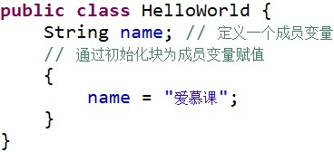

在类的声明中，可以包含多个初始化块，当创建类的实例时，就会依次执行这些代码块。如果使用 **static** 修饰初始化块，就称为**静态初始化块** 。

  1. **静态初始化块** 只在类加载时执行，且**只会执行一次** ；
  2. **静态初始化块只能给静态变量赋值，不能初始化普通的成员变量** ；
  3. 程序运行时**静态初始化块** 最先被执行，然后执行**普通初始化块** ，最后才执行**构造方法** 。


```java
    public class HelloWorld {

        String name; // 声明变量name
        String sex; // 声明变量sex
        static int age;// 声明静态变量age

        // 构造方法
        public  HelloWorld () {
            System.out.println("通过构造方法初始化name");
            name = "tom";
        }

        // 初始化块
        {
            System.out.println("通过初始化块初始化sex");
            sex = "男";
        }

        // 静态初始化块
        static {
            System.out.println("通过静态初始化块初始化age");
            age = 20;
        }

        public void show() {
            System.out.println("姓名：" + name + "，性别：" + sex + "，年龄：" + age);
        }

        public static void main(String[] args) {

            // 创建对象
            HelloWorld hello = new HelloWorld();
            // 调用对象的show方法
            hello.show();

        }
    }
```


执行结果：


```
    通过静态初始化块初始化age
    通过初始化块初始化sex
    通过构造方法初始化name
    姓名：tom，性别：男，年龄：20
```


### 二、封装

面向对象三大特性：**封装、继承、多态。**

**封装** 将类的某些信息隐藏在类的内部，不允许外部程序访问，而是通过该类提供的方法来实现对隐藏信息的操作和访问。
a.只能通过规定的方法访问数据
b.隐藏类的实例细节，方便修改和实现。

**封装的实现步骤** ：
1\. 修改属性的可见性；2\. 创建getter/setter方法；`public 返回值类型 get属性名（）{return 属性值；}``public void set属性名（）{}`3\. 在getter/setter方法中加入属性控制语句。

* Telphone.java


```java
    package com.imooc;

    public class Telphone {
        private float screen;
        private float cpu;
        private float mem;

        public float getScreen() {
            return screen;
        }

        public void setScreen(float newScreen){
            screen = newScreen;
        }

        public Telphone(){
            System.out.println("无参的构造方法执行了！");
        }
        public Telphone(float newScreen, float newCpu, float newMem){
            screen = newScreen;
            cpu = newCpu;
            mem = newMem;
            System.out.println("有参的构造方法执行了！");
        }
    }
```
java


  * InitialTelphone.java


```java
    package com.imooc;

    public class InitialTelphone {

        public static void main(String[] args) {
            // TODO Auto-generated method stub
            Telphone phone = new Telphone();
            Telphone phone2 = new Telphone(3.5f, 1.2f, 2.0f);
            phone2.setScreen(6.0f);
            System.out.println("screen:" + phone2.getScreen());
        }
    }
```


* 执行结果


```
    无参的构造方法执行了！
    有参的构造方法执行了！
    screen:6.0
```


#### 使用包管理java类

1.包的作用：管理java中的文件、解决同名文件的冲突
2.包的定义：`package 包名`
注意： 必须在java源文件的第一行
包名间可以使用”.”号进行隔开（类似文件目录的概念）
eg:com.imooc.MyClass;
3.系统中的包


```
    java.(功能).(类)
    java.lang.(类) 包含java语言基础的类
    java.util.(类) 包含java语言中的各种工具类
    java.io.(类) 输出相关功能的类
```


4.包的使用


```
  * 通过`import`关键字，在某个文件中使用其他文件中的类。eg:import com.immoc.music.MyClass
  * java中，包的命名规范是**全小写字母拼写** 。
  * 在使用的包名后面加`*`号可以加载此包下的所有文件，（如：`com.imooc.*`）也可以加载某个具体**子包** 下的所有文件。
```


> 注：默认情况下，同包下所有的类是共享的。标准的做法是在文件中用import导入要使用的类。

#### 访问修饰符

| **访问修饰符** 的定义：可以修饰属性和方法的访问范围。 访问修饰符的种类和限制范围： 访问修饰符 | 本类 | 同包 | 子类 | 其他 |
| --------------------------------------------------------------------------------------------------- | ---- | ---- | ---- | ---- |
| private                                                                                             | √   |      |      |      |
| 默认                                                                                                | √   | √   |      |      |
| protected                                                                                           | √   | √   | √   |      |
| public                                                                                              | √   | √   | √   | √   |

#### this

1. `this` 关键字代表当前对象this.属性 操作当前对象的属性this.方法 调用当前对象的方法
2. 封装对象的属性的时候，经常会使用this关键字


```java
    package com.imooc;

    public class Telphone {

        private float screen;
        private float cpu;
        private float mem;

        public void sendMessage(){
            System.out.println("sendMessage");
        }

        public float getScreen() {
            return screen;
        }
        public void setScreen(float screen) {
            this.screen = screen;
            this.sendMessage();
        }
        public float getCpu() {
            return cpu;
        }
        public void setCpu(float cpu) {
            this.cpu = cpu;
        }
        public float getMem() {
            return mem;
        }
        public void setMem(float mem) {
            this.mem = mem;
        }
        public Telphone(){
            System.out.println("com.imooc.Telphone无参的构造方法执行了！");
        }
        public Telphone(float newScreen, float newCpu, float newMem){
            screen = newScreen;
            cpu = newCpu;
            mem = newMem;
            System.out.println("有参的构造方法执行了！");
        }

    }
```


#### Java中的内部类

* 内部类和外部类
  **内部类** （ Inner Class ）就是定义在另外一个类里面的类。与之对应，包含内部类的类被称为**外部类** 。
* 内部类的主要作用


```
    * 内部类提供了更好的封装，可以把内部类隐藏在外部类之内，不允许同一个包中的其他类访问该类。
    * 内部类的方法可以直接访问外部类的所有数据，包括私有的数据。
    * 内部类所实现的功能使用外部类同样可以实现，只是有时使用内部类更方便。
  * 内部类可分为以下几种
```
java

成员内部类   
静态内部类   
方法内部类   
匿名内部类


```java
    //外部类HelloWorld
    public class HelloWorld {

        // 内部类Inner，类Inner在类HelloWorld的内部
        public class Inner {

            // 内部类的方法
            public void show() {
                System.out.println("welcome to imooc!");
            }
        }

        public static void main(String[] args) {

            // 创建外部类对象
            HelloWorld hello = new HelloWorld();
            // 创建内部类对象
            Inner i = hello.new Inner();
            // 调用内部类对象的方法
            i.show();
        }
    }
```


执行结果：`welcome to imooc!`

##### 成员内部类

内部类中最常见的就是**成员内部类** ，也称为**普通内部类** 。

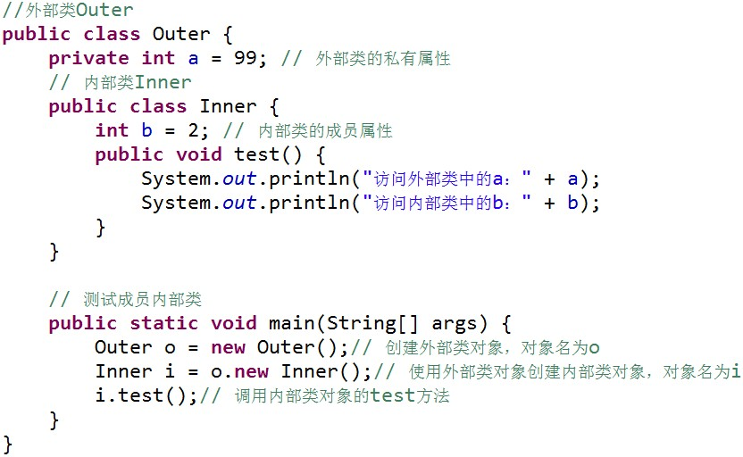

运行结果为：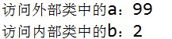

成员内部类的使用方法：

1. Inner 类定义在 Outer 类的内部，相当于 Outer 类的一个成员变量的位置，Inner类可以使用任意访问控制符，如 public 、 protected 、 private 等；
2. Inner 类中定义的 test() 方法可以直接访问 Outer 类中的数据，而不受访问控制符的影响，如直接访问 Outer 类中的私有属性a；
3. 定义了成员内部类后，必须使用外部类对象来创建内部类对象，而不能直接去 new 一个内部类对象，即：`内部类 对象名 = 外部类对象.new 内部类( );`
4. 编译上面的程序后，会发现产生了两个 .class 文件。
   
   其中，第二个是外部类的 .class 文件，第一个是内部类的 .class 文件，即成员内部类的 .class 文件总是这样：**外部类名$内部类名.class**

> 1. 外部类是不能直接使用内部类的成员和方法,可先创建内部类的对象，然后通过内部类的对象来访问其成员变量和方法。
> 2. 如果外部类和内部类具有相同的成员变量或方法，内部类默认访问自己的成员变量或方法，如果要访问外部类的成员变量，可以使用 this 关键字。
>    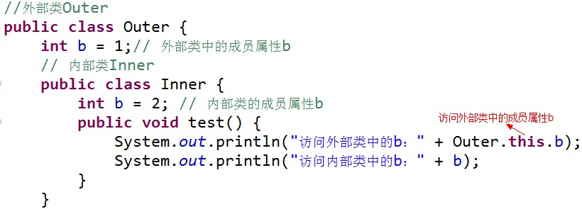
>    运行结果：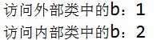


```java
    //外部类HelloWorld
    public class HelloWorld{
        //外部类的私有属性name
        private String name = "imooc";
        //外部类的成员属性
        int age = 20;

        //成员内部类Inner
        public class Inner {
            String name = "爱慕课";
            //内部类中的方法
            public void show() {
                System.out.println("外部类中的name："+HelloWorld.this.name);
                System.out.println("内部类中的name："+name);
                System.out.println("外部类中的age："+age);
            }
        }

        //测试成员内部类
        public static void main(String[] args) {
            //创建外部类的对象
            HelloWorld o = new HelloWorld ();
            //创建内部类的对象
            Inner inn =  o.new Inner();
            //调用内部类对象的show方法
            inn.show();
        }
    }
```


执行结果:


```
    外部类中的name：imooc
    内部类中的name：爱慕课
    外部类中的age：20
```
java


##### 静态内部类

静态内部类是**static** 修饰的内部类，这种内部类的特点是：   
1\. 静态内部类不能直接访问外部类的非静态成员，但可以通过 `new 外部类().成员` 的方式访问;   
2\. 如果外部类的静态成员与内部类的成员名称相同，可通过“类名.静态成员”访问外部类的静态成员；如果外部类的静态成员与内部类的成员名称不相同，则可通过“成员名”直接调用外部类的静态成员;   
3\. 创建静态内部类的对象时，不需要外部类的对象，可以直接创建 `内部类 对象名= new 内部类()`.

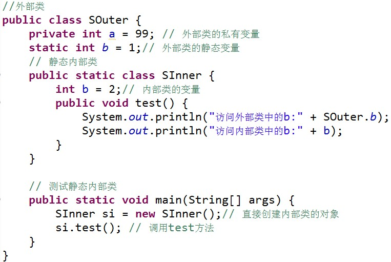   
运行结果: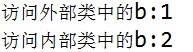


```java
    //外部类
    public class HelloWorld {
        // 外部类中的静态变量score
        private static int score = 84;
        // 创建静态内部类
        public  static  class SInner {
            // 内部类中的变量score
            int score = 91;
            public void show() {
                System.out.println("访问外部类中的score："+HelloWorld.score);
                System.out.println("访问内部类中的score："+score);
            }
        }

        // 测试静态内部类
        public static void main(String[] args) {
            // 直接创建内部类的对象
            SInner si = new SInner();
            // 调用show方法
            si.show();
        }
    }
```


执行结果：


```
    访问外部类中的score：84
    访问内部类中的score：91
```


##### 方法内部类

**方法内部类** 就是内部类定义在外部类的方法中，方法内部类只在该方法的内部可见，即**只在该方法内可以使用** 。

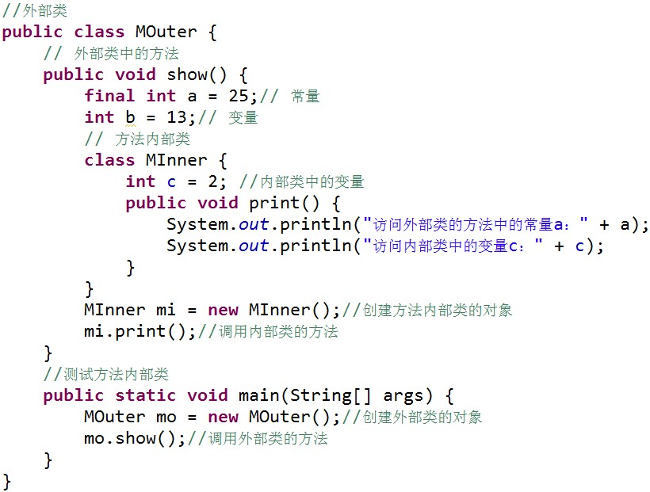

> 由于方法内部类不能在外部类的方法以外的地方使用，因此方法内部类不能使用访问控制符和 static 修饰符。


```java
    //外部类
    public class HelloWorld {
        private String name = "爱慕课";
        // 外部类中的show方法
        public void show() {
            // 定义方法内部类
            class MInner {
                int score = 83;
                public int getScore() {
                    return score + 10;
                }
            }
            // 创建方法内部类的对象
            MInner mi = new MInner();
            // 调用内部类的方法
            int newScore = mi.getScore();
            System.out.println("姓名：" + name + "\n加分后的成绩：" + newScore);
        }

        // 测试方法内部类
        public static void main(String[] args) {
            // 创建外部类的对象
            HelloWorld mo = new HelloWorld();
            // 调用外部类的方法
            mo.show();
        }
    }
```


执行结果：


```
    姓名：爱慕课
    加分后的成绩：93
```


---

### 三、继承

**继承的概念：** 继承是类与类的一种关系，是一种“is a”的关系。（一个类只能继承一个父类）

**继承的好处：**

* 子类拥有父类的所有属性和方法。（private修饰的成员无法继承）
* 实现代码复用。

**语法规则：**

`class 子类 extends 父类`

#### 方法的重写

方法的重写：如果子类对继承父类的方法不满意是可以重新写父类继承的方法的，当调用方法时会优先调用子类的方法

2.语法规则：
**返回值类型，方法名，参数的类型及个数** 都要与父类继承的方法相同，才叫**方法的重写** 。

#### 继承初始化顺序

* 继承的初始化顺序：
  1.初始化父类再初始化子类；2.先执行初始化对象中属性，再执行构造方法中的初始化。
* 子类对象的初始化执行顺序：
  1-父类对象属性初始化
  2-父类构造方法
  3-子类对象属性初始化
  4-子类构造方法

#### final关键字

final关键字：使用final关键字做标识有“最终的”含义。

1. **修饰类** 则该类**不能** 被继承
2. **修饰方法** 则该方法**不能** 被重写
3. **修饰属性** 则该类的属性**不会** 进行**隐式初始化** （类属性的默认初始化即类的初始化必须有值）或在构造方法中赋值（前面进行了声明，在类的构造方法中在进行赋值。）**（两种方式只能选在一种进行不能两者同时使用）**
4. **修饰变量** 则变量的值只能符一次值，在声明的时候进行赋值，其称为**常量** 。

#### super关键字

* super关键字
  在对象的内部使用，可以代表父类对象。


```
    * 访问父类的属性 `super.age`
    * 访问父类的方法 `super.eat()`
  * super的应用
```


```
    * 子类的构造的过程当中必须调用其父类的构造方法。
    * 如果子类的构造方法中没有显示调用父类的构造方法，则系统默认调用父类无参的构造方法。
    * 如果显示的调用构造方法，必须在子类的构造方法的第一行。
    * 如果子类构造方法中既没有显示调用父类的构造方法，而父类又没有无参的构造方法，则编译出错。
```


#### Object类

**Object类是所有类的父类** ，如果一个类没有使用extends关键字明确标识继承另外一个类，那么这个类默认继承Object类。
**Object类中的方法，适合所有子类。**

* toString()方法

  * 在Object类里面定义toString()方法的是返回的对象的哈希code码（**对象地址字符串** ）

> 如果直接输出对象名，就会执行toString()方法。例如：System.out.println(实例化对象名);

* 可以通过重写toString()方法输出对象的属性。


```
        public String toString() {

        return "HelloWorld[name="+name+"]";

        }
```
java


  * equals()方法
  * **equals** 比较的是对象的**引用** 是否指向同一块内存地址。

Object的equals方法比较的是**内存地址** ，重写equals方法可以比较值（**eclipse重写可以右键-resource-generate equals** ）

1 基本数据类型(`byte,short,char,int,long,float,double,boolean`)之间的比较，应用双等号（**==** ）,比较的是他们的值。 

2 复合数据类型用**==** 比较时，比较的是**内存中的存放地址** ；用**equals** 进行比较时，在没有重写equals方法情况下，比较的还是内存地址，因为Object类的equals方法也是用==进行比较的，**重写之后比较的是值** 。

> 例如String类（重写了equals方法），equals比较的是值，==比较的是地址。

Animal.java


```java
        package com.imooc;

        public class Animal extends Object {
            public int age = 10;
            public String name;
            public void eat(){
                System.out.println("动物具有吃东西的能力");
            }
            public Animal() {
                //System.out.println("Animal类执行了。");
                //age = 20;
            }

            public Animal(int age) {
                this.age = age;
            }

        }
```


Dog.java


```java
        package com.imooc;

        public class Dog extends Animal {
            public int age = 20;
            public void eat(){
                System.out.println("狗具有吃骨头的能力");
            }

            public Dog() {
                //super(); // 隐式调用可以不写，如果显示调用必须写在子类构造方法第一行
                //System.out.println("Dog类执行了。");
            }

            public void method() {
                System.out.println("父类属性" + super.age);
                System.out.println("子类属性" + age);
                System.out.println("父类方法");
                super.eat();
                System.out.println("子类方法");
                eat();
            }

            @Override
            public String toString() {
                return "Dog [age=" + age + "]";
            }

        //  @Override
        //  public int hashCode() {
        //      final int prime = 31;
        //      int result = 1;
        //      result = prime * result + age;
        //      return result;
        //  }

            @Override
            public boolean equals(Object obj) {
                if (this == obj)
                    return true;
                if (obj == null)
                    return false;
                if (getClass() != obj.getClass())
                    return false;
                Dog other = (Dog) obj;
                if (age != other.age)
                    return false;
                return true;
            }

        }
```
java


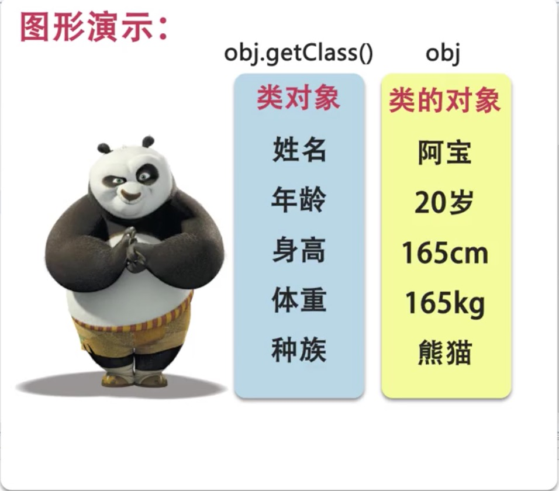

Initial.java


```java
        package com.imooc;

        public class Initial {

            public static void main(String[] args) {
                // TODO Auto-generated method stub
                Dog dog = new Dog();
                dog.age = 15;
                Dog dog2 = new Dog();
                dog2.age = 15;
                if(dog.equals(dog2)) {
                    System.out.println("两个对象是相同的");
                } else {
                    System.out.println("两个对象是不相同的");
                }
                //dog.method();
                //System.out.println(dog);
            }

        }
```


程序执行结果：

    两个对象是相同的

---

### 四、多态

    1. 引用的多态
(1).父类的引用可以指向本类的对象
(2).**父类的引用可以指向子类的对象** （**但不能调用子类独有的成员** ）

    2. 方法的多态
(1).创建本类对象时，调用的方法是本类的方法。
(2).创建子类对象时，调用的方法是重写的方法或继承父类的方法。

#### 引用类型转换


```
    1. 向上类型转换(隐式/自动类型转换),是小类型到大类型的转换。(**无风险**)
    2. 向下类型转换(强制类型转换),是大类型到小类型的转换。(**有风险**)
    3. `instanceof`运算符，来解决引用对象的类型，避免类型转换的安全性问题。
```


Animal.java


```java
    package com.imooc;

    public class Animal {
        public void eat() {
            System.out.println("动物具有吃的能力");
        }
    }
```
java


Dog.java


```java
    package com.imooc;

    public class Dog extends Animal {
        public void eat() {
            System.out.println("狗是吃肉的");
        }
        public void watchDoor() {
            System.out.println("狗具有看门的能力");
        }
    }
```


Cat.java


```
    package com.imooc;

    public class Cat extends Animal {

    }
```


Initial.java


```java
    package com.imooc;

    public class Initial {

        public static void main(String[] args) {
            // TODO Auto-generated method stub
            /*
            Animal obj1 = new Animal(); // 引用多态：父类的引用可以指向本类的对象
            Animal obj2 = new Dog(); // 引用多态：父类的引用可以指向子类的对象,但不能调用子类独有的成员
            //Dog obj3 = new Animal();
            obj1.eat(); // 方法多态： 父类的方法
            obj2.eat(); // 方法多态：子类的方法
            Animal obj3 = new Cat();
            obj3.eat(); // 方法多态：子类继承父类的方法
            //obj2.watchDoor();  // 子类独有的方法 obj2 不能调用。
            */
            Dog dog = new Dog();
            Animal animal = dog;    // 自动类型提升/向上类型转换
            if (animal instanceof Dog) {
                Dog dog2 = (Dog)animal; // 强制类型转换/向下类型转换
            } else {
                System.out.println("无法进行类型转换，转换为Dog类型");
            }
            //Cat cat = (Cat)animal; // 1. 编译时 Cat类型；2. 运行时 Dog类型
            if(animal instanceof Cat) {
                Cat cat = (Cat) animal;
            } else {
                System.out.println("无法进行类型转换，转换为Cat类型");
            }
        }

    }
```


程序执行结果：

    无法进行类型转换，转换为Cat类型

#### 抽象类

    1. 语法定义: 抽象类前使用`abstract`关键字修饰。
    2. 应用场景：
a. 某个父类只是知道其子类应该包含怎样的方法，但无法准确知道这些子类如何实现这些方法；

> 抽象类约束子类必须有哪些方法，但并不关注子类如何去实现这些方法。

b. 从多个具有相同特性的类中提取出一个抽象类，以这个作为子类的模板，从而避免了设计子类的随意性。

    3. 作用
不关注子类的实现，但约束子类必须有哪些特征。

    4. 使用规则
a.`abstract`定义抽象类
b. `abstract`定义抽象方法，只有声明，不需要实现
c. 包含抽象方法的类是抽象类
d. **抽象类中可以包含该普通的方法，也可以没有抽象方法**
e. **抽象类不能直接创建，可以定义引用变量**

抽象方法没有方法体以**分号** 结束。

> 包含抽象方法的类一定是抽象类，抽象类和抽象方法都需要添加关键字 abstract，且顺序为 abstract class

Telphone.java


```
    package com.imooc;

    public abstract class Telphone {
        public abstract void call();
        public abstract void message();
    }
```
java


CellPhone.java


```java
    package com.imooc;

    public class CellPhone extends Telphone {

        @Override
        public void call() {
            // TODO Auto-generated method stub\
            System.out.println("通过键盘来打电话");

        }

        @Override
        public void message() {
            // TODO Auto-generated method stub
            System.out.println("通过键盘来发短信");
        }

    }
```


SmartPhone.java


```java
    package com.imooc;

    public class SmartPhone extends Telphone {

        @Override
        public void call() {
            // TODO Auto-generated method stub
            System.out.println("通过语音打电话");

        }

        @Override
        public void message() {
            // TODO Auto-generated method stub
            System.out.println("通过语音发短信");
        }

    }
```
java


Initial.java


```java
    package com.imooc;

    public class Initial {

        public static void main(String[] args) {
            // TODO Auto-generated method stub
            Telphone tel1 = new CellPhone();
            tel1.call();
            tel1.message();
            Telphone tel2 = new SmartPhone();
            tel2.call();
            tel2.message();
        }

    }
```


程序执行结果：


```
    通过键盘来打电话
    通过键盘来发短信
    通过语音打电话
    通过语音发短信
```


#### 接口

**接口** 可以理解为一种特殊的类，由全局常量和公共的抽象方法所组成。

    1. 如果说类是一种具体的实现体，那么接口就是定义某一批类所需要遵守的**规范** 。它不需要关心这些类的内部数据，也不关心类里方法的实现细节，**它只规定这些类里必须提供某些方法** 。


```
    2. 定义接口基本语法：

           修饰符 [abstract] interface 接口名 [extends 父接口1，父接口2……]{
           零到多个常量的定义……
           零到多个抽象方法的定义……
           }
```


> 接口就是用来被继承、被实现的、修饰符一般建议用**public** , **不能** 用private,protected。

    1. 接口中定义的属性都是常量，即使定义是不添加**publi static final** 修饰符，系统也会自动加上；
接口中定义的方法都是抽象方法，即使定义时不添加**public abstract** 修饰符，系统也会自动加上。

    2. 一个类可以实现一个或多个接口，实现接口使用**impements** 关键字。
继承父类实现接口的语法格式为：


```
    [修饰符] class 类名 extends 父类 implements 接口1，接口2 …
    {
        类体部分//如果继承了抽象类，需要实现继承的抽象方法；
        //如果继承了接口中的抽象方法，需要实现接口中的抽象方法
    }
```


接口的引用：`接口名 对象名=new 已经实现的接口名();`
如果要继承父类，继承父类必须在实现接口之前
在eclipse中，接口的命名通常要在前面加上I，用来表示不同
5\. 接口也可以与**匿名内部类** 配合使用，匿名内部类就是没有名字的内部类，它并不关注类的名字，只在使用时定义，语法格式为：


```
    Interface i = new Interface(){
    public void method(){
    System.out.println("匿名内部类实现接口的方式")；
    ｝
    ｝；
    i.method();//引用接口
```


Telphone.java


```
    package com.imooc;

    public abstract class Telphone {
        public abstract void call();
        public abstract void message();
    }
```


CellPhone.java


```java
    package com.imooc;

    public class CellPhone extends Telphone {

        @Override
        public void call() {
            // TODO Auto-generated method stub\
            System.out.println("通过键盘来打电话");

        }

        @Override
        public void message() {
            // TODO Auto-generated method stub
            System.out.println("通过键盘来发短信");
        }

    }
```
java


SmartPhone.java


```java
    package com.imooc;

    public class SmartPhone extends Telphone implements IPlayGame {

        @Override
        public void call() {
            // TODO Auto-generated method stub
            System.out.println("通过语音打电话");

        }

        @Override
        public void message() {
            // TODO Auto-generated method stub
            System.out.println("通过语音发短信");
        }

        @Override
        public void playGame() {
            // TODO Auto-generated method stub
            System.out.println("具有了玩游戏的功能");
        }

    }
```


IPlayGame.java


```
    package com.imooc;

    public interface IPlayGame {
        public void playGame();
    }
```


Psp.java


```java
    package com.imooc;

    public class Psp implements IPlayGame {

        @Override
        public void playGame() {
            // TODO Auto-generated method stub
            System.out.println("具有了玩游戏的功能");
        }

    }
```
java


Initial.java


```java
    package com.imooc;

    public class Initial {

        public static void main(String[] args) {
            // TODO Auto-generated method stub
            Telphone tel1 = new CellPhone();
            tel1.call();
            tel1.message();
            Telphone tel2 = new SmartPhone();
            tel2.call();
            tel2.message();

            IPlayGame ip1 = new SmartPhone();
            ip1.playGame();
            IPlayGame ip2 = new Psp();
            ip2.playGame();

            IPlayGame ip3 = new IPlayGame() {

                @Override
                public void playGame() {
                    // TODO Auto-generated method stub
                    System.out.println("使用匿名内部类的方式实现接口");
                }
            };
            ip3.playGame();

            new IPlayGame() {
                public void playGame() {
                    // TODO Auto-generated method stub
                    System.out.println("使用匿名内部类的方式实现接口2");
                }
            }.playGame();
        }

    }
```


程序执行结果：


```
    通过键盘来打电话
    通过键盘来发短信
    通过语音打电话
    通过语音发短信
    具有了玩游戏的功能
    具有了玩游戏的功能
    使用匿名内部类的方式实现接口
    使用匿名内部类的方式实现接口2
```


#### UML

    1. UML**Unified Modeling Language（UML）** 又称统一建模语言或标准建模语言
是一个支持模型化和软件系统开发的图形化语言
为软件开发的所有阶段提供模型化和可视化支持
    2. UML图示
UML2.2中一共定义了14中图示（diagrams）。
    3. 常用UML图

    ***用例图（The Use Case Diagram）**
用例图能够以可视化的方式，表达系统如何满足所收集的业务规则，以及特定的用户需求等信息。
       * **序列图（The Sequence Diagram）**
角色和对象的关系，关系的是序列。序列图用于按照交互发生的一系列顺序，显示对象之间的这些交互。
       * **类图（The class Diagram）**
描述类和类之间的关系，属性和方法。UML类图、业务逻辑和所有支持结构一同被用于定义全部的代码结构。
`- 代表private方法`
`+ 代表public方法`
    4. UML建模工具
有**Visio、Rational Rose、PowerDesign** 三种建模工具


```
       1. Rational Rose，它是IBM的；
       2. Microsoft的 Microsoft Office Visio；
       3. PowerDesigner
```


> 程序开发用Rational Rose，可以帮你生成很多代码和文件；Visio非常适合做流程图；PowerDesign用来做数据库建模很强，可以跟数据库直接连接，并进行正向反向生成。

教程参考[这里](http://www.imooc.com/video/3029)

---

### 参考

[Java入门第二季](http://www.imooc.com/learn/124)
