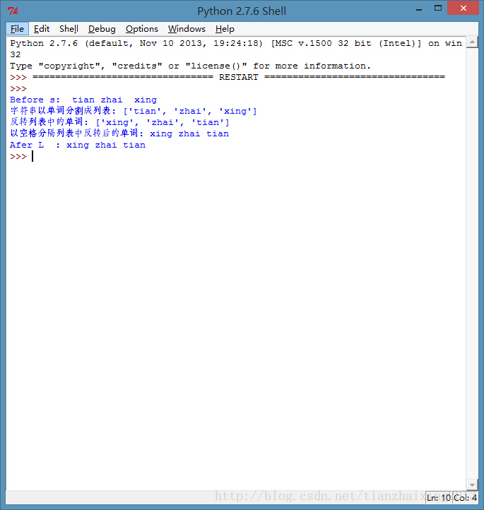

# LeetCodeOJ--Reverse Words in a String(python版本)

Given an input string, reverse the string word by word.

For example,  
Given s = "`the sky is blue`",  
return "`blue is sky the`".

[click to show clarification.](https://oj.leetcode.com/problems/reverse-words-in-a-string/#)

Clarification:

  * What constitutes a word?
A sequence of non-space characters constitutes a word.
  * Could the input string contain leading or trailing spaces?
Yes. However, your reversed string should not contain leading or trailing spaces.
  * How about multiple spaces between two words?
Reduce them to a single space in the reversed string.


1.测试版本代码： 


```
    # -*- coding: cp936 -*-
    s = " tian zhai  xing  "
    print "Before s:",s
    def reverseWords(s):
        L = s.split() #单词拆分成列表
        print "字符串以单词分割成列表: %s" % L
        L.reverse()#反转列表中单词
        print "反转列表中的单词: %s" % L
        s1 = ' '.join(L)#列表以空格分割单词，返回字符串
        print "以空格分隔列表中反转后的单词: %s" % s1
        return s1
        #return s1.rstrip()#字符串删除首尾空格和回车
    L = reverseWords(s)
    print "Afer L  :",L
```


  


2.测试版本截图： 

   


3.提交AC版本代码： 


```python
    class Solution:
        # @param s, a string
        # @return a string
        def reverseWords(self, s):
            L = s.split()#字符串以单词分隔成列表
            L.reverse()#反转列表中的单词
            s1 = ' '.join(L)#以空格分隔列表中反转后的单词，返回字符串
            return s1
```


  
```