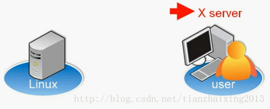
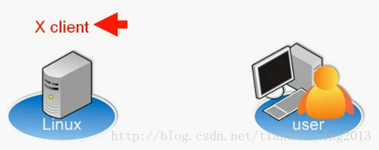
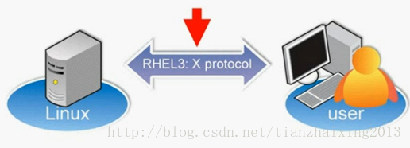
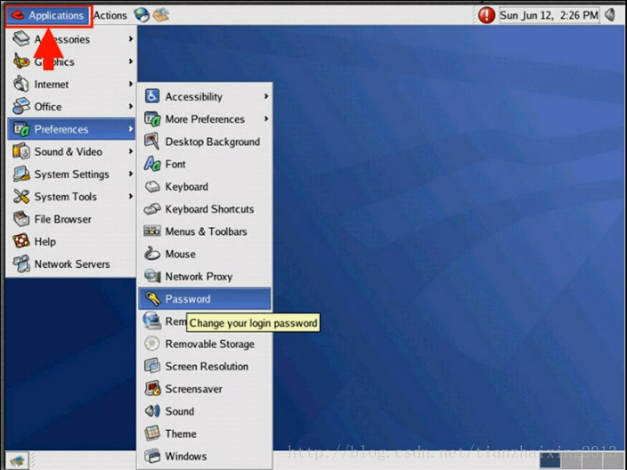
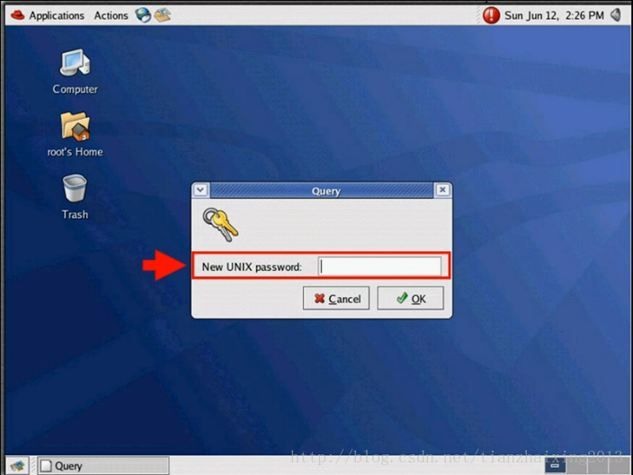

# Linux Overview

一、UNIX history:  
1969 Bell Labs first version  
AT&T 注册UNIX商标  
  
二、UNIX principles:  
1.所有的东西都以档案形式存在，包含硬体  
2.设定存在文字档  
3.每个程序都很小，只实现单一的功能  
4.不需要使用者界面  
5.可以串联许多单一的小程序来执行比较复杂的工作  
  
三、GNU 计划和FSF  
1.GNU 1984开始 目的建立一个自由开放的作业系统 clone 核心  
1990完成  
gcc, emacs,etc  
2.Free Software Foundation自由软体基金会  
1）GNU计划的主要赞助单位，非盈利组织  
2）不论目的如何，使用该软体的自由；  
3）有研究该软体如何应用的自由，和改写该软体以符合自己应用的自由  
4）重新散步该软体的自由  
5）有改善利用该软体的自由，并且可以发版的自由  
  
四、GPL-GNU 通用公共执照  
copyleft相对copyright  
  
五、Linux起源  
由Torvalds开发，1991芬兰大学生，开发Linux核心，该核心集合了GNU应用，为一个自由的类UNIX的操作系统。  
  
六、Linux特色  
1.Linux和UNIX相似  
2.多人多工的使用环境  
3.支持很多的硬体设备  
4.可以获得很多资源  
  
七、Red Hat Enterprise Linux(RHEL)  
1.Linux最新核心  
2.常用的应用程式  
3.需要安装或设定的软体  
4.所有相关的技术资源  
  
八、RHEL安装的系统需求  
1.Pentium Pro 或者更好的CPU 256MB RAM  
2.64-bit Intel/AMD 512 MB RAM  
3.2-6GB 硬碟空间  
4.可以开机的光碟片  
  
九、本机登录  
1.文字下local login(root登录提示字元#,一般localhost提示登录字元$)  
2.图形界面下local login(Username Password)  
  
十、什么是Virtual Consoles  
1.允许使用者(使用Virtural Consoles)使用多个非GUI登录  
2.有6个默认可用virtual consoles  
3.CTRL-ALT-F[1-6](在提示字元后输入tty查看当前virtual consoles)  
4.CTRL-ALT-F7切换至图形界面  
  
十一、什么是Xorg GUI Framework  
GUI:Graphical User Interface  
Xorg:http://www.x.org  
该架构可用于显示图形应用和环境  
也负责维护Xclient和Xserver架构  

  

  

  

  

  

  

十二、Xorg有哪些图形界面的环境  
1.GNOME:默认的桌面环境  
2.KDE:支持RHL(Red Hat Linux)的桌面环境  
  
十三、如何启用Xorg  
1.开机图形界面登录，就可以直接进入Xorg界面  
2.开机文字界面登录(boots to a virtual console login)，就必须手动进入Xorg界面  
在提示字元后面输入startx手动进入Xorg界面  
  
十四、变更密码  
1.第一次登录Linux后应该变更密码  

2.图形界面时，Applications->Preferences->Password

  

  

  

  

3.文字界面时，在提示字元后面输入passwd。只有root可以变更其他用户的密码  
  
  
  