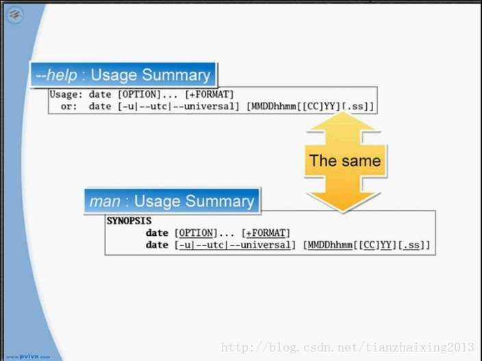
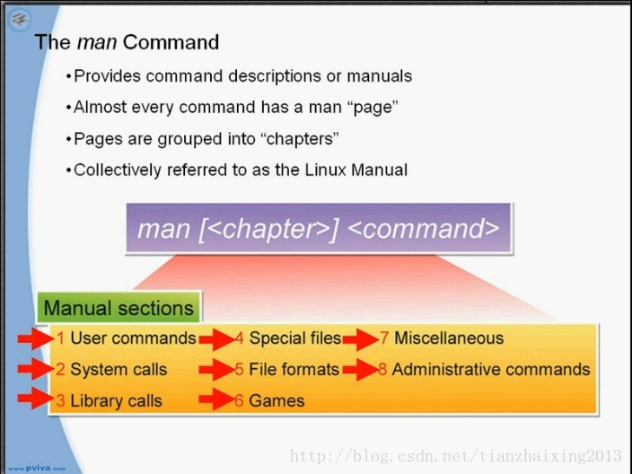

# Linux 运行指令和获取指令帮助

MVP:Most Valuable Professional最有价值的专家  
  
一、Linux指令的语法以及语法的操作示范  
1.command [options] [arguments]  
  
  
2.有两个空格；options可以改变指令的功能；  
ls：列出档案  
ls -l:查看档案的详细咨询（档案的权限、档案的容量、档案的建立时间、档案的名称）  
-l表示Long List  
ls --all:查看所有的档案（包括隐藏档，档案名称开头为.）  
ls -a:查看所有的档案（包括隐藏档，档案名称开头为.）  
  
  
3.Word options usually preceded by "--": --all;  
Single-letter options usually preceded by "-": -a;  
can be passed as "-a -b -c"or"-abc";  
  
4.arguments:档案名称或指令所需要的其他资料或是路径  
ls -l /tmp :可以查看/tmp目录里面的档案名称  
cp install.log/tmp :就是把install.log复制到/tmp目录里面  
passwd -S user1:-S(或者--status)查看密码状态 查看user1的密码  
useradd user2:新增一个用户user2  
  
  
二、介绍简单的指令及操作  
1.date:显示目前的日期和时间  
date --help:获取date指令的说明  
date -s 22:02:设置时间  
date +%T:时分秒的格式显示时间（+加号）  
date +%D%T:月日年 时分秒显示时间（格式%D和%T之间无空格）  
  
  
2.cal:显示日历  
cal:显示目前月份日历  
cal 6 2006:指定显示2006年6月日历  
cal 2006:显示2006年所有月份的日历  
cal 2006 > 2006calendar:把2006的日历输入到2006calendar的档案里（>表示输出）  
cat 2006calendar:查看2006calendar档案的内容（cat指令显示档案的内容到屏幕上）  
  
  
三、哪些方法取得指令的相关说明  
1.由于linux指令繁多，用户不要尝试记忆每一件事  
2.擅用以下几种求助方式和说明文件：  
1）whatis指令查询指令的用途  
为查询的指令显示简短的功能描述  
whatis ls:ls用于显示档案及目录  
whatis cal:cal用于显示日历  
2)<command> \--help  
\--help option来获取指令的说明  
显示查询指令的使用摘要和参数列表  
date --help:date指令的说明摘要和参数列表  
有少数的指令不能使用--help option  
  
  
\--help、man或者其他的指令描述都有查询指令的使用摘要说明  
使用摘要说明的语法：  
[]包括的参数表示该参数可有可无  
<>包括的参数表示该参数可变  
x|y|z表示只能使用x或y或z,只能使用其中一个参数  
-abc表示可以将-a,-b或-c混合使用  
  

  

3）man   
man [<chapter>] <command>  
man指令可以提供指令的说明文件man pages  
man pages有像书本一样的章节结构（按下键盘上的Q离开man page界面）  
搜集起来的man page就是Linux的操作手册  
在Red Hat的章节里有八个号码来区分章节  

  

  

  

ls -l /usr/share/man:查看到man1~man8,重要的是man1,man5,man8  
man passwd:查看到man1  
man1:User commands  
man 5 passwd:查看到man5  
man5:File formats  
mna lvn:查看lvn的指令  
man8:Administrative commands 只有root权限才能参考的指令说明  
  
  
如何操作由man指令获取的说明文件man pages  
arrows:使用键盘上的上下左右箭头  
pgUp和pgDown切换上下页  
/<text>:搜寻关键字 如：/passwd  
n/N :按小写n跳到下一个关键字，按大写N跳到上一个关键字  
q :按小写q跳离man page界面  
  
  
搜索说明手册里面的man page  
man -k <keyword>:找到符合关键字的man page  
man -k passwd:查询到所有和passwd相关的man page  
  
  
4)info   
info <command>  
  
  
取得比man更详细的指令说明文件  
info pages的架构和网页的架构一样  
每一页都用小结（nodes)来区分开不同的主题  
  
  
如果前面有“*”，代表可以连接到“*”号后这个主题的说明文件  
info ls:查询ls的说明文件，按下键盘的Tab键就会跳到前面有“*”号的其他主题，按Enter就可以跳到相应的内容  
  
  
如何操作由info指令获取的说明文件info pages  
arrows:使用键盘上的上下左右箭头  
pgUp和pgDown切换上下页  
Tab : 跳到下一个“*”号，也就是下一个有连接功能的连接点  
Enter: 进入连接点的主题说明  
n/p/u: 按小写n跳到下一个小结，按小写p跳到上一个小结，按下小写u跳回上一层的小结  
s[<text>]:查询关键字text  
q:按下q跳离info page界面  
  
  
5)/usr/share/doc  
显示目录里的额外说明文件  
ls /usr/share/doc:查看ls额外的说明文件  
  
  
6)Red Hat documentation  
介绍网络上还有哪些额外的Red Hat说明文件  
http://www.redhat.com/docs/  
SEARCH DOC  
  
  
  
  
  
  
  