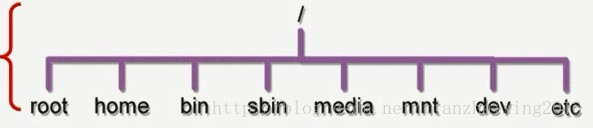
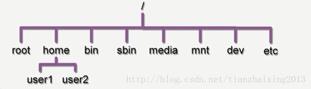
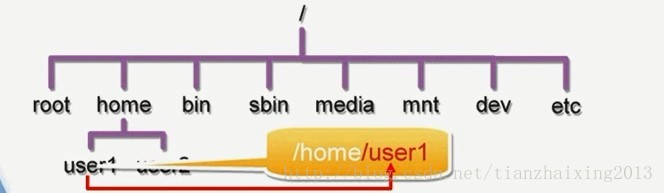
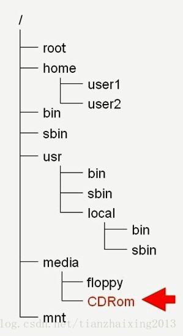
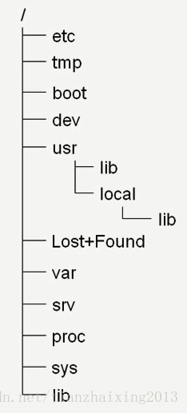
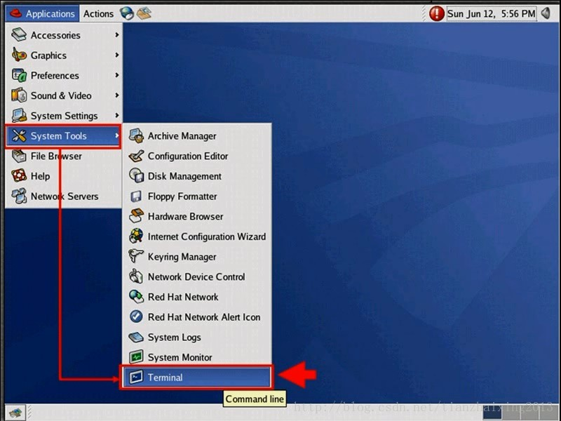
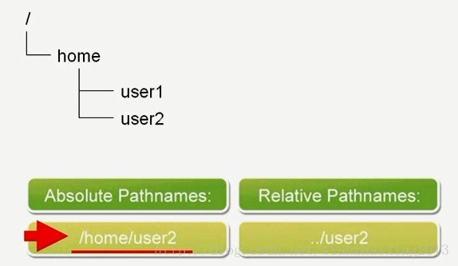
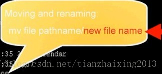

# Linux档案浏览系统

一、linux的阶层架构  
档案系统以"root"根目录开始，/root "/"读作slash  
..表示当前所在目录的上一层目录  
.表示当前目录  
如果一个档案或者目录的名称开始为一个点".",则其是隐藏的  

  

  

二、linux档案系统中一些重要的目录  
1.home家目录  
/root和/home/<username>  
2.bin目录  
bin目录里面存放了一些常用的执行档  
/bin，/usr/bin，/usr/local/bin(预设一般为空)  
sbin目录里面存放了系统管理用的执行档  
/sbin，/usr/sbin，/usr/local/sbin(预设一般为空)  
3.mountpoints目录  
/media,/mnt  
  

三、linux档案系统中其他重要的目录  
/etc:存放系统配置文件，如帐号密码等等  
/tmp:一般使用者暂存档案，方便与其他使用者交换资源  
/boot:linux系统核心与系统开机时需要的档案,即Kernel and bootloader  
/dev:linux系统中包含的设备，Device  
/usr:存放应用程式，与指令相关的系统咨询，类似windows系统中的Programs  
/lost+found:遗失的片段  
/var:存放系统中经常会变动的档案，例如e-mail档等  
/srv:存放目前所有和server有关的服务  
/proc:存放系统信息，是虚拟的目录，不暂用任何的硬碟空间  
/lib:存放系统的函式库  
/lib,/usr/lib,/usr/local/lib  
  

四、如何确定目前所在目录  
1.每一个shell和系统运行都有一个目前所在的工作目录（cwd,current working directory)  
2.pwd指令来确认目前所在那个目录  
cd <变更的目录>来切换目录  
  
  
五、为一个档案或者目录命名的原则  
1.不能超过255字元  
2.除了“/”以外，所有的字元都可以用来当作档案或者目录的名称  
如果使用空格或者是特殊字元来为档案或者目录命名时，要用引号括起来  
3.使用有意义的名称命名  
区分大小写命名：MAIL,Mail,mail,mAiL  
用户要可以区分以上命名的档案或者目录  
  
六、什么是绝对路径  
1.绝对路径有/(读作slash)开头  
2.用于为档案所在位置做指向  
3.在任何时候都可以使用绝对路径来找到我们想要的档案  
  
七、什么是相对路径  
1.相对路径不一定以/开头  
2.使用相对目前所在的位置来为目的地指向  
目前位置为user1  
  
  
3.相对路径比绝对路径短，查找速度快  
  
八、如何变更工作的目录  
1.cd指令来变更工作目录  
$cd /root/doc  
$cd ~/jpg:变更到home目录的jpg目录  
$cd ..:回到上一层目录  
$cd -:回到刚才工作的目录  
  
九、如何解释一个目录里面有哪些内容  
如果要解释当前目录或者是制定目录里面有哪些内容  
ls [options][files_or_dirs]  
ls /:解释根目录的内容  
ls -a:解释隐藏的目录内容  
ls -l /usr:解释usr目录里面的详细内容  
ls -ld:解释目录本身的属性(-读作dash)  
  
十、如何把一个档案或者目录复制到别的地方  
cp [options]file destination  
cp -p file destination:-p复制时保留原来的时间戳记  
cp -r doc jpg:把doc的目录复制到jpg目录，时间戳记为现在时间点  
cp -p -r doc jpg 等价于 cp -a doc jpg:把doc的目录复制到jpg目录，时间戳记不变  
  
cp [options]file1 file2 destination:目的为一个目录，可以同时复制多个档案  
  
十一、linux中的复制行为如何运作  
1.如果指定的位置为一个已经存在的目录时，就会把指定的档案复制到指定的目录里面，档案名称不变  
2.如果指定的位置为一个已经存在的档案时，就会用指定的档案覆盖掉目地位置的档案  
3.如果指定的位置并不存在时，就会先把指定位置的名称建立一个档案，再把档案的内容复制过来  
  
十二、如何搬移或重命名一个档案或者目录  
mv:搬移或者重命名一个档案或者目录  
mv [options]file destination  
如果把档案搬移到其他的地方，并重命名，如下图所示：  
  
如果只是把档案搬移到其他的地方的话：mv file pathname  
如果只是把目录重命名为其他名称的话：mv pathname newname  
如果只是把目录搬移到其他的目录的话：mv pathname destination  
  
如果目的的位置是一个目录的话，可以同时搬移多个档案到这个目录来  
mv [options] file1 file2 dest  
  
十三、linux环境中搬移或重命名是如何运作的  
1.如果指定的位置为一个已经存在的目录时，就会把指定的档案搬移到制定的目录里面，档案名称不变  
2.如果指定的位置为一个已经存在的档案时，就会用指定的档案重命名为目地位置的档案名称，并且会覆盖掉目的位置的档案  
3.如果指定目的位置档案并不存在时，重命名的行为就会把指定的档案或者目录重命名为目的位置的名称  
  
十四、如何建立或者移除档案  
rm:移除档案  
rm [options]filenames...  
-i:询问是否删除档案（预设时就存在）  
-r:删除目录时必须使用的  
-f:强制删除档案或者目录，不用提示询问是否删除档案或者目录  
注意：一旦删除档案或者目录后，就无法还原回来！除非 从先前备份的档案中还原回来  
  
touch:来建立一个空的档案或者如果要建立的档名已经存在同一个路径时，则更新时间戳记  
less:检测建立档案里面的内容，若为空，按下键盘上的v键，可以编辑该档案；再按下i键进入insert模式。编辑完成后，按ESC键推出insert模式；再输入wq推出编辑模式。再按q键回到提示字元  
cat:检测档案内容是否变更  
  
十五、如何建立或移除目录  
mkdir:建立目录  
rmdir:删除空目录  
rm -f:删除指定目录里面的制定档案  
rm -r:删除整个目录，包含目录里面的所有内容  
  
十六、使用Nautilus浏览档案系统  
1.Gnome图形档案系统的浏览工具  
2.Nautilus有Spatial模式（独立视窗）和Browser模式（统一视窗）  
3.开启Nautilus的三种方式：  
1）提示字元后输入nautilus  
2) 点选桌面图标 Home和Computer  
3) 点选File Browser  
  
十七、如何使用Nautilus来搬移或者复制档案或者目录  
1.点选拖移：纯鼠标操作，类似windows里面的操作；如果同时按下Ctrl键，则实现复制功能；如果同时按下Alt键，在放下鼠标左键的时候，会询问用户是要复制、搬移还是建立一个捷径。  
2.Context menu:点选档案，右击鼠标，选择重命名、剪切、复制或者粘贴。  
  
十八、如何改变档案格式  
1.linux环境下有许多不同的档案格式  
2.在开启一个档案前，最好先确认一下这个档案的格式，这样才可以使用合适的指令或者应用程式来开启该档案。  
3.file [options]filename(s):变更档案格式  
  
十九、如何检测文字档案中全部内容  
1.cat [options][file...]:  
2.不分页全部显示出检测文字档案中的全部内容  
3.如果同时显示多个档案时，则多个档案会连续显示在荧幕上  
cat -A doc/doc1:则会显示doc1全部内容加换行字元$  
cat -s doc/doc1:则会显示doc1全部内容,如果有两个以上的空白行，会压缩为一个空白行显示在荧幕上  
cat -b doc/doc1:则会在doc1文档中每一行的最前面显示该行的行号  
  
二十、  
如何分页浏览文字档案  
1.less [options][filename]  
2.可以使用键盘上的上下键，pgUp,pgDown来卷动页面，空白键跳到下一个，b键回到上一页  
按下Ctrl+d键可以向下卷动半页，按下Ctrl+u键可以向上卷动半页，按下g键回到档案的最顶端，按下G键跳到档案的最末端  
3.常用的指令：  
1）/text:搜索字串text  
2) n:查找下一个符合的字串  
3）v:快速进入编辑模式,按下i进入insert模式，按下q退出到提示字元  
4) ?text:向上查询字串text  
  