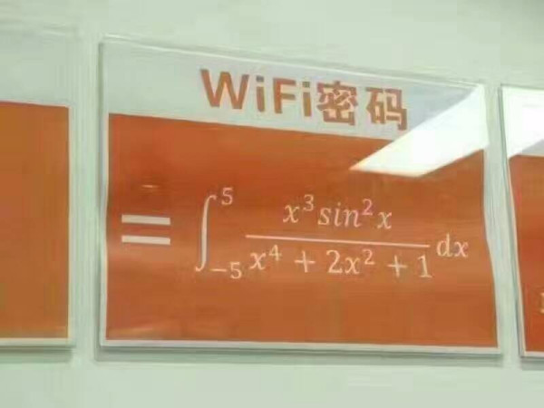

# Mathematics

### 1 WIFI密码



∫5−5x3sin2xx4+2x2+1dx

#### 方法一

因为 

x∈[−5,5]

对称区间内，同时，   
令 

f(x)=x3sin2xx4+2x2+1

  


f(−x)=−f(x)

所以，

∫5−5x3sin2xx4+2x2+1dx=0

#### 方法二


```python
    In [1]: import numpy as np

    In [2]: from scipy.integrate import quad

    In [3]: def fractionFunction(x):
       ...:     return (x**3*(np.sin(x)**2))/(x**4+2*x**2+1)
       ...:

    In [4]: I = quad(fractionFunction, -5, 5)

    In [5]: I[0]
    Out[5]: 0.0

    In [6]:
```


#### 参考

  1. [常用数学符号的 LaTeX 表示方法](http://www.mohu.org/info/symbols/symbols.htm)


### 2 TODO
```