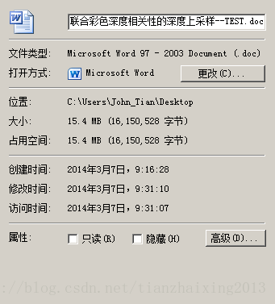
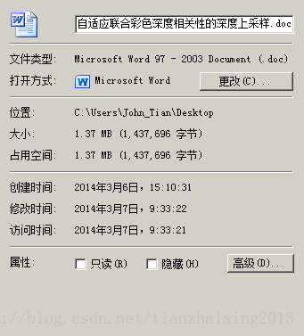
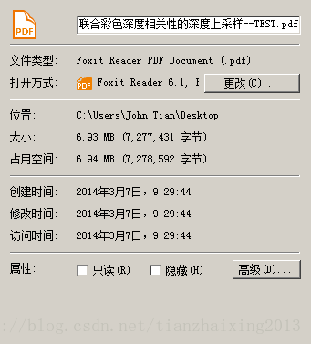
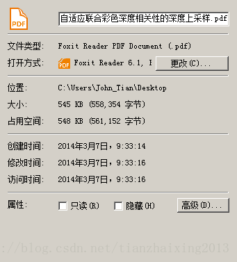
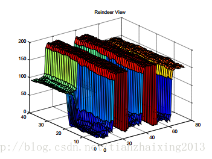
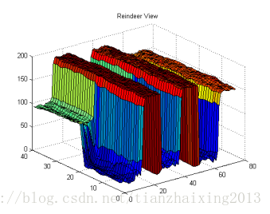

# Matlab 生成图形复制到word

由于要书写实验室的周报，需要把这一周的工作总结一下。我在把Matlab2010Rb生成的图像里面，Edit->Copy figure复制到剪贴板以后，再在word2010文档的适当位置复制进去，调节大小后，发现图像变的不清晰了，而且word文档大小突然增加十几倍！！！

  

解决方案：

  

在Matlab运行生成的图像，File --> Save as 里面选择保存为*.bmp格式的图像，再在word里面，选择 插入-->图像 。这样就很好的解决了matlab运行生成图像复制到word中缩小后不清晰，并且word大小倍增的问题喽。

:-)

  

两种不同方法截图：

1\. word 大小对比(有些期刊的投稿word大小是有限制的，比如8M以内) 

   

2.利用word2010另存为功能保存的pdf格式大小对比

   

3.pdf格式125%放大后，局部Matlab生成图像对比

   