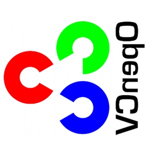
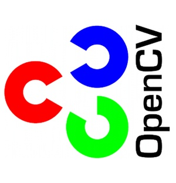

# OpenCV 90°旋转

### 顺时针旋转90°思路

原始图像像素矩阵2行2列：


```
    | 1 | 2 |
    ---------
    | 3 | 4 |


    | 1 | 2 |     T        | 1 | 3 |     Y轴镜像    | 3 | 1 |
    ---------   ------->   ---------   ------->    ---------
    | 3 | 4 |              | 2 | 4 |               | 4 | 2 |
```


### 逆时针旋转90°思路


```
    | 1 | 2 |     T        | 1 | 3 |     X轴镜像    | 2 | 4 |
    ---------   ------->   ---------    ------->   ---------
    | 3 | 4 |              | 2 | 4 |               | 1 | 3 |
```


### OpenCV代码


```cpp
    #include <iostream>
    #include <string>
    #include <vector>

    #include <opencv2/core/core.hpp>
    #include <opencv2/highgui/highgui.hpp>
    #include <opencv2/imgproc/imgproc.hpp>

    using namespace std;
    using namespace cv;

    void myRotateClockWise90(Mat &src)
    {
        if (src.empty())
        {
            return;
        }
        // 矩阵转置
        transpose(src, src);
        //0: 沿X轴翻转； >0: 沿Y轴翻转； <0: 沿X轴和Y轴翻转
        flip(src, src, 1);
    }


    void myRotateAntiClockWise90(Mat &src)
    {
        if (src.empty())
        {
            return;
        }
        transpose(src, src);
        flip(src, src, 0);
    }


    int main(int argc, char* argv[])
    {
        const string imgpath = "D:/opencv.jpg";
        Mat src = imread(imgpath, 1);
        Mat srcT;
        transpose(src, srcT);
        imwrite("D:/opencvT.jpg", srcT);

        Mat srcClockWise90 = src.clone();
        myRotateClockWise90(srcClockWise90);
        imwrite("D:/opencvCW90.jpg", srcClockWise90);

        Mat srcAntiClockWise90 = src.clone();
        myRotateAntiClockWise90(srcAntiClockWise90);
        imwrite("D:/opencvACW90.jpg", srcAntiClockWise90);
        return 0;
    }
```


### 测试结果

  * 输入图像


  * 输入图像的矩阵转置




  * 输入图像顺时针旋转90°后的图像


  * 输入图像逆时针选择90°后的图像




### 参考

[opencv 图片旋转90度](http://blog.csdn.net/wells3/article/details/7283651)
```