# OpenCV && Tesseract-OCR in Android Studio

由于本周工作的需要，我利用Java重构了之前自己**C++** 实现的图像识别算法。因为自己之前只在慕课网上面看过一些Java基础入门教程，如下所示：


```
  * [Java入门第一季](http://www.imooc.com/learn/85)
  * [Java入门第二季](http://www.imooc.com/learn/124)
  * [Java入门第三季](http://www.imooc.com/learn/110)
```


所以，这五天利用Java重构图像识别算法，并进行Android开发的过程是痛苦的。我把自己实现的过程记录下来，以便遇到相关项目的小伙伴可以节省时间:)

### 一、版本说明

#### Android

安卓开发工具采用Android Studio 2.2.2，[下载地址](https://dl.google.com/dl/android/studio/install/2.2.2.0/android-studio-bundle-145.3360264-windows.exe).

#### OpenCV

OpenCV采用**steveliles** 基于OpenCV3.1.0编译的opencv-android1.

#### Tesseract-OCR

Tesseract-OCR 我利用了**rmtheis** 封装好的tess-two2.

### 二、创建安卓库

#### 设置Android SDK

参考[Android Studio上进行OpenCV 3.1开发 – JohnHany的博客](http://johnhany.net/2016/01/opencv-3-development-in-android-studio/)，设置Android SDK。

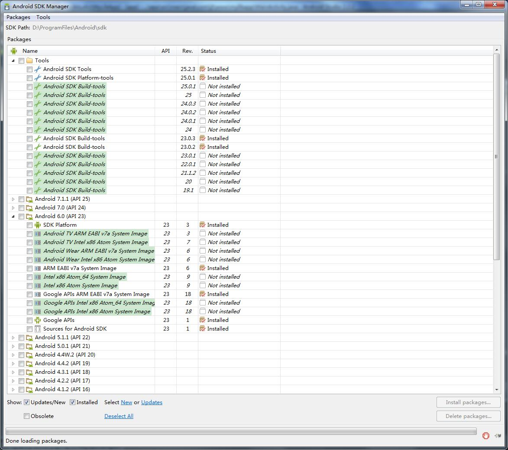

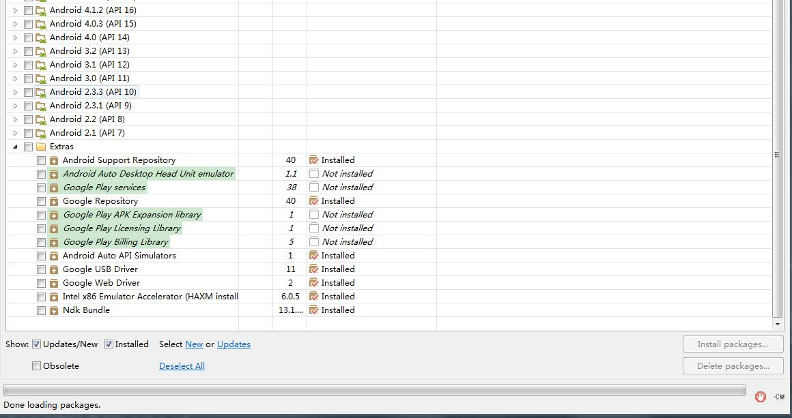

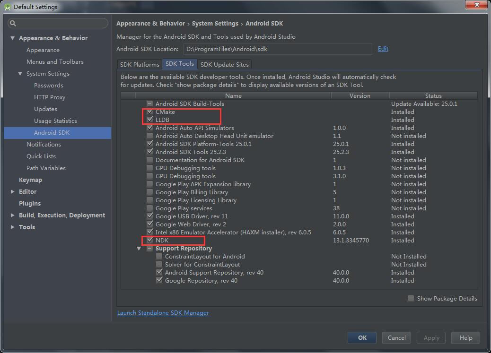

#### 创建Android App

  1. 打开**Android Studio** ，点击**Start a new Android Studio Project** ；
  2. 在**Application name** 和 **Company Domain** 输入应用名称和公司域名，并在**Project location** 指定项目存放位置，然后点击**next** 。例如我的测试为：   


```
     * Application name: MyLibApp
     * Company Domain: www.jt.com
     * Project location: D:\Projects\androidstudio\MyLibApp
```


  3. 在**Phone and Tablet** 的Minimum SDK选择**API 21: Android 5.0 (Lollipop)** ，点击**Next** ；
  4. 选择**Empty Activity** ，点击**Next** ；
  5. **Customize the Activity** 页面保持默认设置，点击**Finish** 。


#### 创建Android Library


```
  * 依次点击**File- >New->New Module…**；
  * 选择**Android Library** ，点击**Next** ；
  * 设置**Application/Library name**(例如： Tesscv)，点击**Finish**.
```


#### 配置Android Library

  * 修改**Android** 视图下，**Project** 的build.gradle，再点击右上角附近的**Sync Now** ；


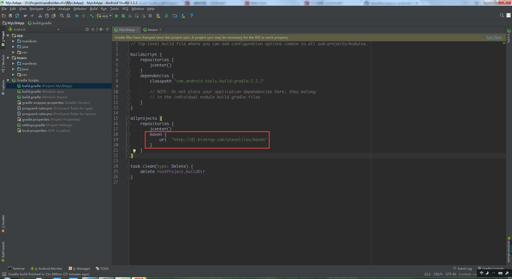


```
    allprojects {
        repositories {
            jcenter()
            maven {
                url  "http://dl.bintray.com/steveliles/maven"
            }
        }
    }
```


  * 修改**Android** 视图下，**tesscv** 的build.gradle，再点击右上角附近的**Sync Now** ；


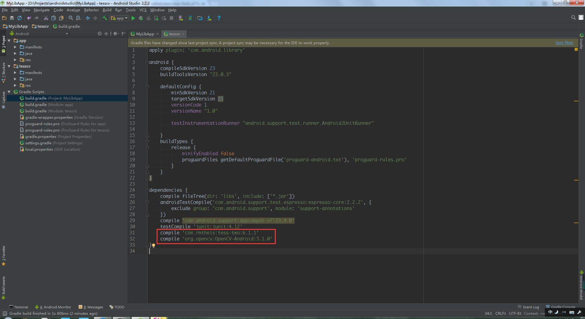


```
    dependencies {
        compile fileTree(dir: 'libs', include: ['*.jar'])
        androidTestCompile('com.android.support.test.espresso:espresso-core:2.2.2', {
            exclude group: 'com.android.support', module: 'support-annotations'
        })
        compile 'com.android.support:appcompat-v7:23.4.0'
        testCompile 'junit:junit:4.12'
        compile 'com.rmtheis:tess-two:6.1.1'
        compile 'org.opencv:OpenCV-Android:3.1.0'
    }
```


> Sync的过程可能会比较慢，需要下载tess-two和OpenCV-Android的aar文件，依据网速不同，需要等待10分钟左右。

* * *

#### 修改tesscv相关文件

在**Android** 视图下，右击tesscv->java->com.jt.www.tesscv文件夹，选择**New- >Java Class**，在弹出的**Create New Class** 对话框的**Name** 后面输入**tesscv** ，点击**OK** 。

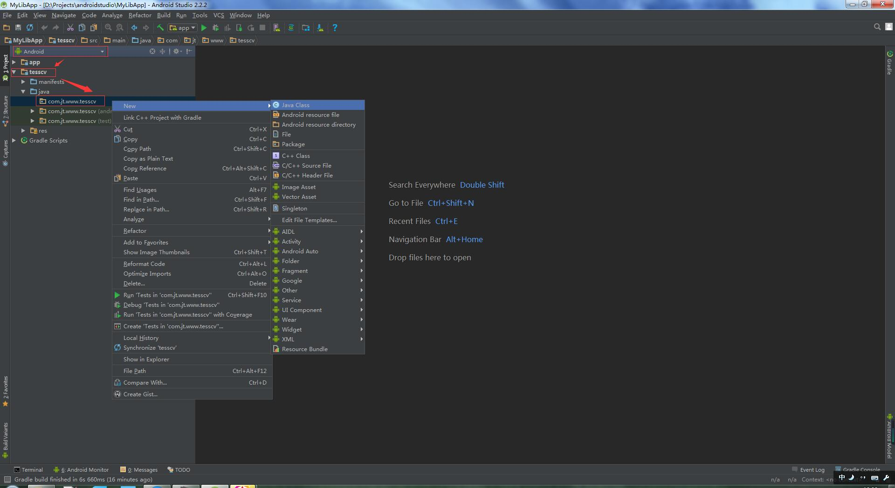

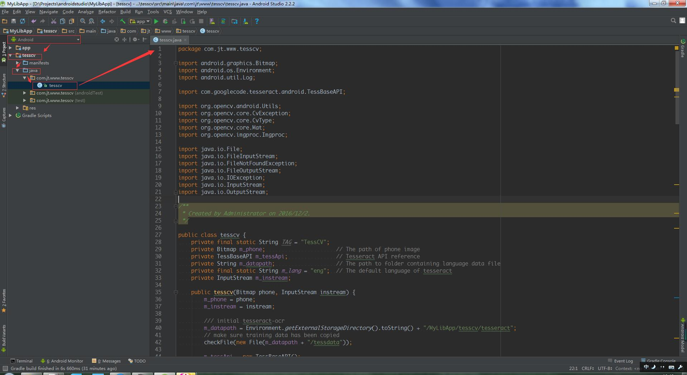

  * tesscv.java


```
    package com.jt.www.tesscv;

    import android.graphics.Bitmap;
    import android.os.Environment;
    import android.util.Log;

    import com.googlecode.tesseract.android.TessBaseAPI;

    import org.opencv.android.Utils;
    import org.opencv.core.CvException;
    import org.opencv.core.CvType;
    import org.opencv.core.Mat;
    import org.opencv.imgproc.Imgproc;

    import java.io.File;
    import java.io.FileInputStream;
    import java.io.FileNotFoundException;
    import java.io.FileOutputStream;
    import java.io.IOException;
    import java.io.InputStream;
    import java.io.OutputStream;

    /**
     * Created by Administrator on 2016/12/2.
     */

    public class tesscv {
        private final static String TAG = "TessCV";
        private Bitmap m_phone;                      // The path of phone image
        private TessBaseAPI m_tessApi;               // Tesseract API reference
        private String m_datapath;                   // The path to folder containing language data file
        private final static String m_lang = "eng";  // The default language of tesseract
        private InputStream m_instream;

        public tesscv(Bitmap phone, InputStream instream) {
            m_phone = phone;
            m_instream = instream;

            /// initial tesseract-ocr
            m_datapath = Environment.getExternalStorageDirectory().toString() + "/MyLibApp/tesscv/tesseract";
            // make sure training data has been copied
            checkFile(new File(m_datapath + "/tessdata"));

            m_tessApi = new TessBaseAPI();
            m_tessApi.init(m_datapath, m_lang);
            // 设置psm模式
            //m_tessApi.setPageSegMode(TessBaseAPI.PageSegMode.PSM_SINGLE_BLOCK);
            // 设置白名单
            //m_tessApi.setVariable(TessBaseAPI.VAR_CHAR_WHITELIST, "ABCDEFGHIJKLMNOPQRSTUVWXYZabcdefghijklmnopqrstuvwxyz");
            //m_tessApi.setVariable(TessBaseAPI.VAR_CHAR_WHITELIST, "0123456789");
        }


        private void saveTmpImage(String name, Mat image) {
            Mat img = image.clone();
            if (img.channels() ==3 ) {
                Imgproc.cvtColor(img, img, Imgproc.COLOR_BGR2RGBA);
            }

            Bitmap bmp = null;
            try {
                bmp = Bitmap.createBitmap(img.cols(), img.rows(), Bitmap.Config.ARGB_8888);
                Utils.matToBitmap(img, bmp);
            } catch (CvException e) {
                Log.d("mat2bitmap", e.getMessage());
            }
            File mediaStorageDir = new File(Environment.getExternalStorageDirectory(), "MyLibApp/tesscv");
            if (!mediaStorageDir.exists()) {
                if (!mediaStorageDir.mkdirs()) {
                    Log.d("saveTmpImage", "failed to create directory");
                    return;
                }
            }
            //String timeStamp = new SimpleDateFormat("yyyyMMdd_HHmmss").format(new Date());
            //File dest = new File(mediaStorageDir.getPath() + File.separator + name + timeStamp + ".png");
            File dest = new File(mediaStorageDir.getPath() + File.separator + name + ".png");
            FileOutputStream out = null;
            try {
                out = new FileOutputStream(dest);
                bmp.compress(Bitmap.CompressFormat.PNG, 100, out);
                // bmp is your Bitmap instance
                // PNG is a lossless format, the compression factor (100) is ignored
            } catch (Exception e) {
                e.printStackTrace();
            } finally {
                if (out != null) {
                    try {
                        out.close();
                    } catch (IOException e) {
                        e.printStackTrace();
                    }
                }
            }
        }


        public String getOcrOfBitmap() {
            if (m_phone == null) {
                return "";
            }

            Mat imgBgra = new Mat(m_phone.getHeight(), m_phone.getWidth(), CvType.CV_8UC4);
            Utils.bitmapToMat(m_phone, imgBgra);
            Mat imgBgr = new Mat();
            Imgproc.cvtColor(imgBgra, imgBgr, Imgproc.COLOR_RGBA2BGR);
            Mat img = imgBgr;
            saveTmpImage("srcInputBitmap", img);
            if (img.empty()) {
                return "";
            }
            if (img.channels()==3) {
                Imgproc.cvtColor(img, img, Imgproc.COLOR_BGR2GRAY);
            }
            return getResOfTesseractReg(img);
        }


        private String getResOfTesseractReg(Mat img) {
            String res;
            if (img.empty()) {
                return "";
            }
            byte[] bytes = new byte[(int)(img.total()*img.channels())];
            img.get(0, 0, bytes);
            m_tessApi.setImage(bytes, img.cols(), img.rows(), 1, img.cols());
            res = m_tessApi.getUTF8Text();
            return res;
        }


        private void checkFile(File dir) {
            //directory does not exist, but we can successfully create it
            if (!dir.exists() && dir.mkdirs()){
                copyFiles();
            }
            //The directory exists, but there is no data file in it
            if(dir.exists()) {
                String datafilepath = dir.toString() + "/eng.traineddata";
                File datafile = new File(datafilepath);
                if (!datafile.exists()) {
                    copyFiles();
                }
            }
        }


        private void copyFiles() {
            try {
                if (m_instream == null) {
                    //TODO
                    String resInPath = "/tessdata/eng.traineddata";
                    //Log.d(TAG, "copyFiles: resInPath " + resInPath);
                    m_instream = new FileInputStream(resInPath);
                }

                //location we want the file to be a
                String resOutPath = m_datapath + "/tessdata/eng.traineddata";

                //open byte streams for writing
                OutputStream outstream = new FileOutputStream(resOutPath);

                //copy the file to the location specified by filepath
                byte[] buffer = new byte[1024];
                int read;
                while ((read = m_instream.read(buffer)) != -1) {
                    outstream.write(buffer, 0, read);
                }
                outstream.flush();
                outstream.close();
                m_instream.close();

            } catch (FileNotFoundException e) {
                e.printStackTrace();
            } catch (IOException e) {
                e.printStackTrace();
            }
        }
    }
```


* * *

#### 修改app相关文件

  * 在**Android** 视图下，右击app文件夹，选择**New- >Folder->Assets Folder**， 点击**Finish** ；


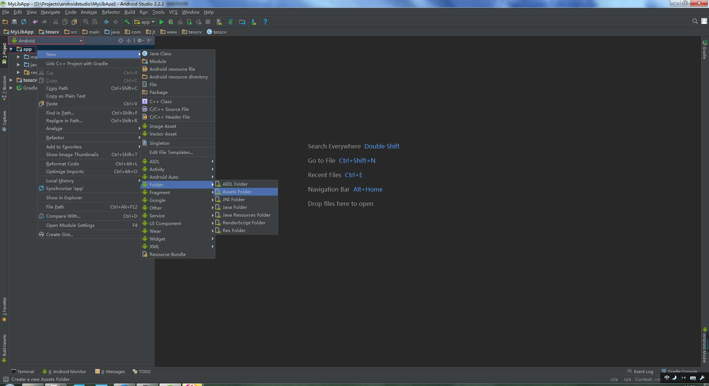

  * 右击新建的**assets** 文件夹，选择**New- >Directory**，在弹出的对话框中，输入新建文件夹名称为**tessdata** ！ 一定要是**tessdata** ！！！


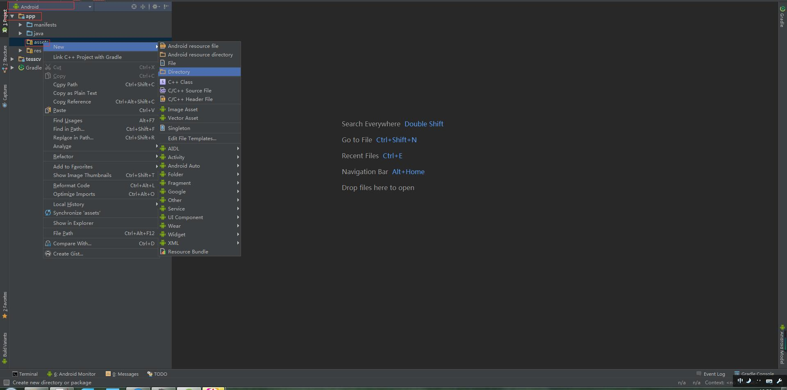

  * 右击新建的**tessdata** 文件夹，选项**Show in Explorer** ，点击进入**tessdata** 文件夹内。


> tessdata文件夹用于存放训练好的语言数据集合，可以从 [这里下载](https://github.com/tesseract-ocr/tessdata)，本文采用 [**eng.traineddata**](https://github.com/tesseract-ocr/tessdata/blob/master/eng.traineddata)。将下载好的 **eng.traineddata** 文件放到 **tessdata** 文件夹内！ 


##### 添加app依赖库tesscv


```
  * 点击**File- >Project structure…**；
  * 在弹出框左边**Modules** 下选择**app** ；
  * 右边选择**Dependencies** ；
  * 再在最右边点击**+** ，选择**Module Dependecy** ；
  * 在弹出框中，点击**:tesscv** ，点击**OK** ；
  * 最后，在**Project Structure** 对话框中，就可以看到新添加的**:tesscv** 文件，然后点击**OK** 。
```


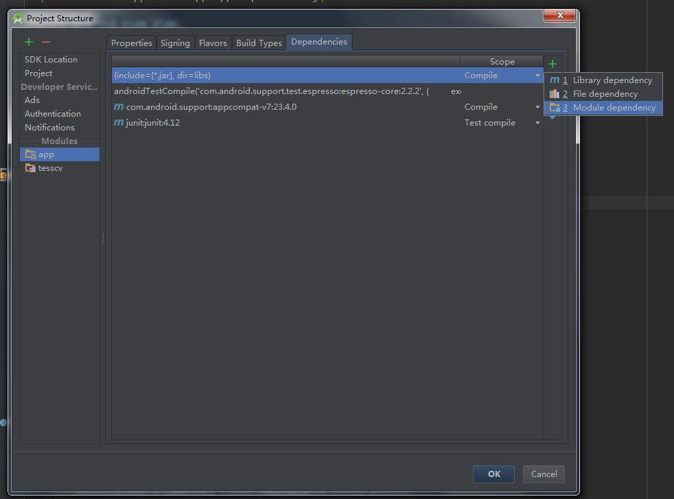

##### AndroidManifest.xml/activity_main.xml/MainActivity.java

依次修改**Android** 视图下，app文件内的AndroidManifest.xml、activity_main.xml和MainActivity.java三个文件。

  * app->manifests->AndroidManifest.xml


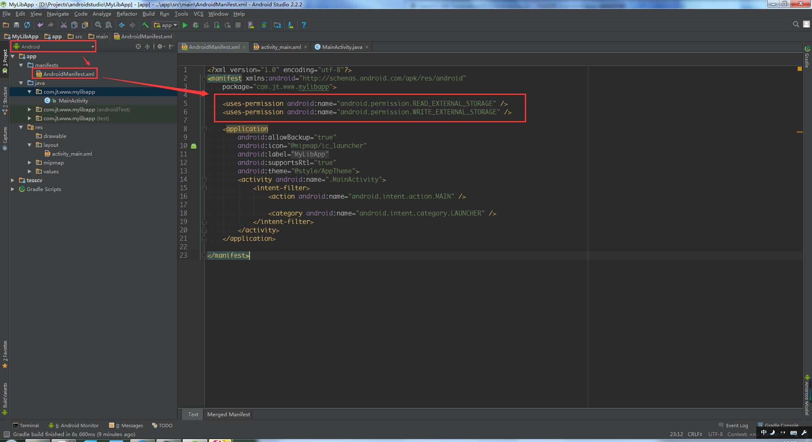


```
    <?xml version="1.0" encoding="utf-8"?>
    <manifest xmlns:android="http://schemas.android.com/apk/res/android"
        package="com.jt.www.mylibapp">

        <uses-permission android:name="android.permission.READ_EXTERNAL_STORAGE" />
        <uses-permission android:name="android.permission.WRITE_EXTERNAL_STORAGE" />

        <application
            android:allowBackup="true"
            android:icon="@mipmap/ic_launcher"
            android:label="@string/app_name"
            android:supportsRtl="true"
            android:theme="@style/AppTheme">
            <activity android:name=".MainActivity">
                <intent-filter>
                    <action android:name="android.intent.action.MAIN" />

                    <category android:name="android.intent.category.LAUNCHER" />
                </intent-filter>
            </activity>
        </application>

    </manifest>
```


  * app->res->layout->activity_main.xml


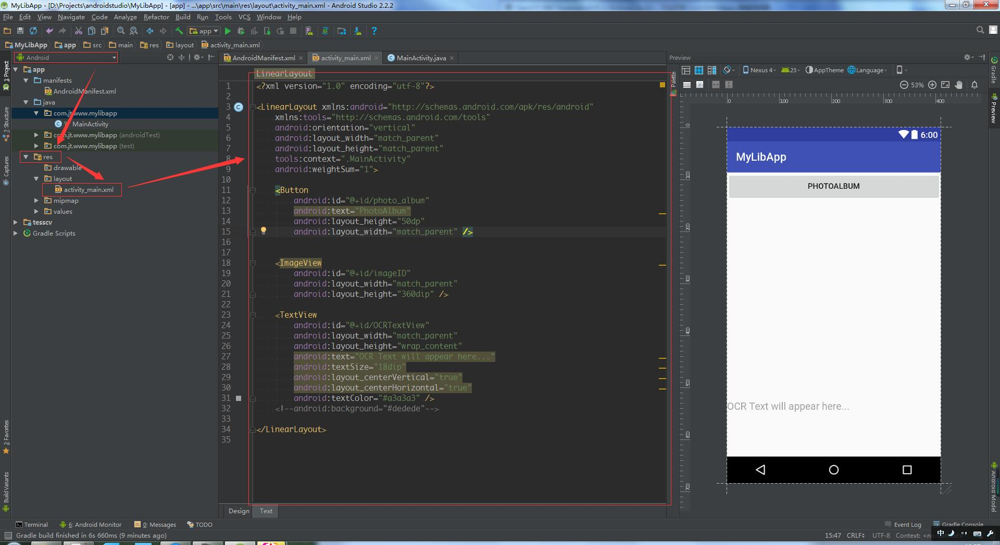


```
    <?xml version="1.0" encoding="utf-8"?>

    <LinearLayout xmlns:android="http://schemas.android.com/apk/res/android"
        xmlns:tools="http://schemas.android.com/tools"
        android:orientation="vertical"
        android:layout_width="match_parent"
        android:layout_height="match_parent"
        tools:context=".MainActivity"
        android:weightSum="1">

        <Button
            android:id="@+id/photo_album"
            android:text="PhotoAlbum"
            android:layout_height="50dp"
            android:layout_width="match_parent" />


        <ImageView
            android:id="@+id/imageID"
            android:layout_width="match_parent"
            android:layout_height="360dip" />

        <TextView
            android:id="@+id/OCRTextView"
            android:layout_width="match_parent"
            android:layout_height="wrap_content"
            android:text="OCR Text will appear here..."
            android:textSize="18dip"
            android:layout_centerVertical="true"
            android:layout_centerHorizontal="true"
            android:textColor="#a3a3a3" />
        <!--android:background="#dedede"-->

    </LinearLayout>
```


  * app->java->com.jt.www.mylibapp->MainActivity.java


```
    package com.jt.www.mylibapp;

    import android.content.Intent;
    import android.content.res.AssetManager;
    import android.graphics.Bitmap;

    import android.net.Uri;
    import android.os.Bundle;
    import android.provider.MediaStore;
    import android.support.v7.app.AppCompatActivity;

    import android.view.View;
    import android.widget.Button;
    import android.widget.ImageView;
    import android.widget.TextView;

    import com.jt.www.tesscv.tesscv;

    import java.io.IOException;
    import java.io.InputStream;

    import org.opencv.android.OpenCVLoader;


    public class MainActivity extends AppCompatActivity {
        public static final String IMAGE_UNSPECIFIED = "image/*";
        public static final int PHOTOALBUM = 1;   // 相册
        Button photo_album = null;                // 相册
        ImageView imageView = null;               // 截取图像
        TextView textView = null;                 // OCR 识别结果

        Bitmap m_phone;                           // Bitmap图像
        String m_ocrOfBitmap;                     // Bitmap图像OCR识别结果
        InputStream m_instream;

        @Override
        protected void onCreate(Bundle savedInstanceState) {
            super.onCreate(savedInstanceState);
            setContentView(R.layout.activity_main);

            imageView = (ImageView) findViewById(R.id.imageID);
            photo_album = (Button) findViewById(R.id.photo_album);
            textView = (TextView) findViewById(R.id.OCRTextView);
            photo_album.setOnClickListener(new View.OnClickListener(){
                @Override
                public void onClick(View v) {
                    Intent intent = new Intent(Intent.ACTION_PICK, null);
                    intent.setDataAndType(MediaStore.Images.Media.EXTERNAL_CONTENT_URI, IMAGE_UNSPECIFIED);
                    startActivityForResult(intent, PHOTOALBUM);
                }
            });

            //get access to AssetManager
            AssetManager assetManager = getAssets();
            //open byte streams for reading/writing
            try {
                m_instream = assetManager.open("tessdata/eng.traineddata");
            } catch (IOException e) {
                e.printStackTrace();
            }
        }

        @Override
        protected void onActivityResult(int requestCode, int resultCode, Intent data) {
            if (resultCode == 0 || data == null) {
                return;
            }
            // 相册
            if (requestCode == PHOTOALBUM) {
                Uri image = data.getData();
                try {
                    m_phone = MediaStore.Images.Media.getBitmap(getContentResolver(), image);
                } catch (IOException e) {
                    e.printStackTrace();
                }
            }
            // 处理结果
            imageView.setImageBitmap(m_phone);
            if (OpenCVLoader.initDebug()) {
                // do some opencv stuff
                tesscv jmi = new tesscv(m_phone, m_instream);
                m_ocrOfBitmap = jmi.getOcrOfBitmap();
            }
            textView.setText(m_ocrOfBitmap);
            super.onActivityResult(requestCode, resultCode, data);
        }
    }
```


#### 真机测试截图

小米5标准版，测试截图如下所示：

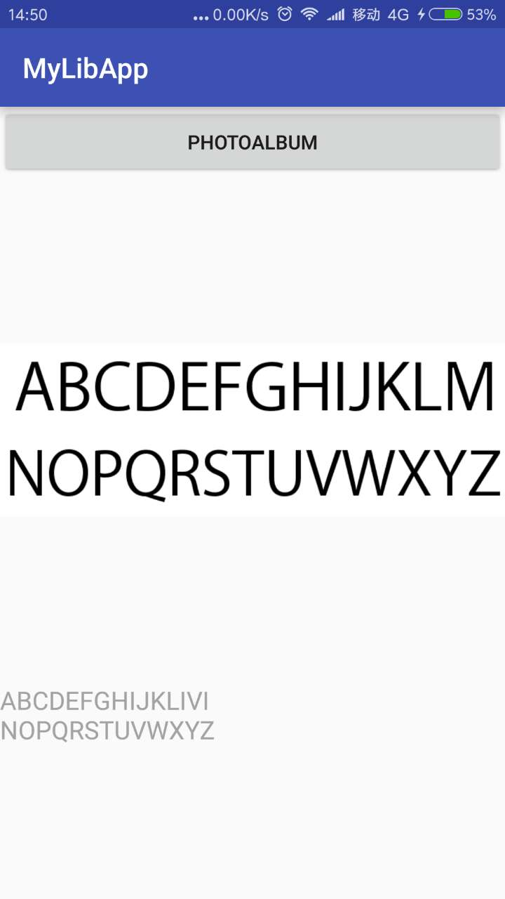

### 三、在新项目中引用tesscv库

#### 找到tesscv生成的release版本的**tesscv-release.aar** 文件

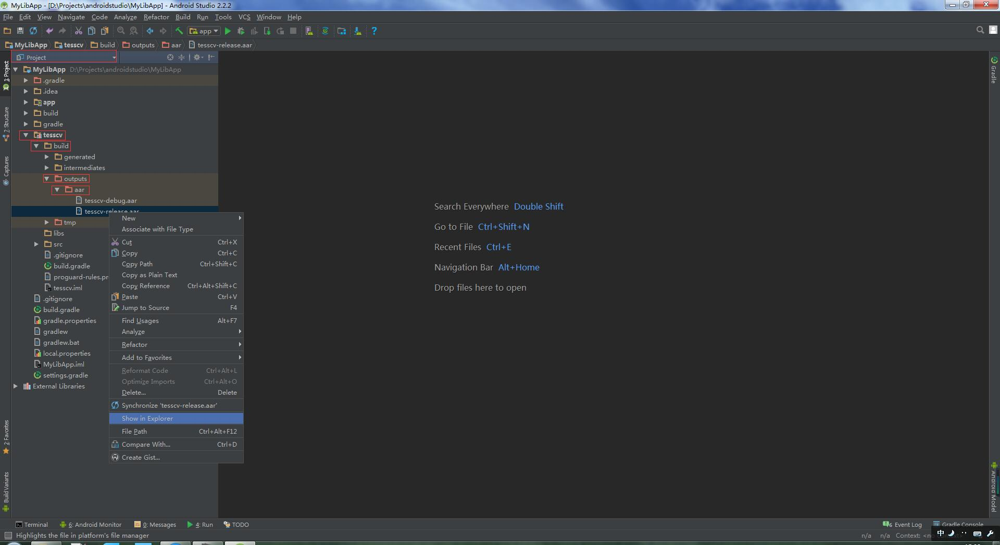

按照上图打开**tesscv-release.aar** 文件所在目录，将**tesscv-release.aar** 重命名为**tesscv-1.0.0.aar**

#### 将**tesscv-1.0.0.aar** 复制到**新建Android Studio项目** ，**Project** 视图下的**app- >libs**文件夹内；

#### 修改**Android** 视图下，**Project的build.gradle** ，再点击右上角附近的**Sync Now** ；


```
    allprojects {
        repositories {
            jcenter()
            maven {
                url  "http://dl.bintray.com/steveliles/maven"
            }
        }
    }
```


#### 修改**Android** 视图下，**app的build.gradle** ，再次点击右上角附近的**Sync Now** ；

  * 在**dependencies** 前添加：


```
    allprojects {
        repositories {
            jcenter()
            flatDir {
                dirs 'libs'
            }
        }
    }
```


  * 修改**dependencies** 部分为：


```
    dependencies {
        compile fileTree(dir: 'libs', include: ['*.jar'])
        androidTestCompile('com.android.support.test.espresso:espresso-core:2.2.2', {
            exclude group: 'com.android.support', module: 'support-annotations'
        })
        compile 'com.android.support:appcompat-v7:23.4.0'
        testCompile 'junit:junit:4.12'

        compile(name:'tesscv-1.0.0', ext:'aar')
        compile 'com.rmtheis:tess-two:6.1.1'
        compile 'org.opencv:OpenCV-Android:3.1.0'
    }
```


#### 添加训练的语言库

参考上述工程中添加tesseract-ocr语言库**eng.traineddata** 方法。

#### 调用实例代码


```
    // 导入包
    import com.jt.www.tesscv.tesscv;
    import org.opencv.android.OpenCVLoader;

    // 调用OpenCV代码
    if (OpenCVLoader.initDebug()) {
        // do some opencv stuff
        tesscv jmi = new tesscv(m_phone, m_instream);
        String ocrResult = jmi.getOcrOfBitmap();
    }
```


### 参考

  1. [Simple OCR Android App Using Tesseract Tutorial](http://imperialsoup.com/2016/04/29/simple-ocr-android-app-using-tesseract-tutorial/#comment-3026837740)

  2. [How to manually include external aar package using new Gradle Android Build System - Stack Overflow](http://stackoverflow.com/questions/16682847/how-to-manually-include-external-aar-package-using-new-gradle-android-build-syst)

  3. [拍照+相册选取+剪裁图片，不过百行代码搞定 - JavAndroid - 博客频道 - CSDN.NET](http://blog.csdn.net/yy1300326388/article/details/43731579)


* * *

  1. [OpenCV-Android](https://github.com/steveliles/opencv-android) ↩
  2. [Tess-two](https://github.com/rmtheis/tess-two) ↩
