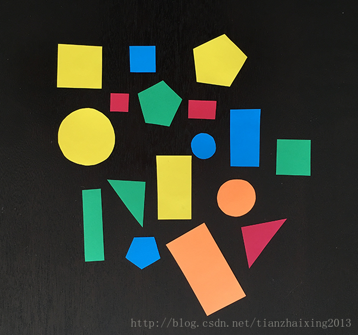
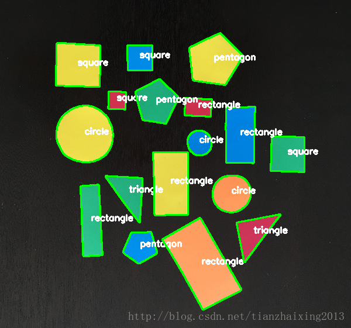

# OpenCV shape detection -- C++版本

本文主要参考[OpenCV shape detection](http://www.pyimagesearch.com/2016/02/08/opencv-shape-detection/) ，用C++版的OpenCV API进行重写。

### 源码

#### ShapeDetector.h


```
    #pragma once
    #ifndef SHAPEDETECTOR_H_
    #define SHAPEDETECTOR_H_

    #include <iostream>
    #include <vector>
    #include <string>

    using namespace std;

    #include "opencv2/core/core.hpp"
    #include "opencv2/highgui/highgui.hpp"
    #include "opencv2/imgproc/imgproc.hpp"
    #include "opencv2/features2d/features2d.hpp"

    using namespace cv;

    class ShapeDetector
    {
    public:
        ShapeDetector();
        ~ShapeDetector();
        void detect(const Mat &curve);
        string get_shape_type();

    private:
        string m_shape;
    };

    #endif
```


#### ShapeDetector.cpp


```
    #include "ShapeDetector.h"

    ShapeDetector::ShapeDetector()
    {
    }

    ShapeDetector::~ShapeDetector()
    {
    }

    void ShapeDetector::detect(const Mat &curve)
    {
        string shape = "unidentified";
        double peri = arcLength(curve, true);
        Mat approx;
        approxPolyDP(curve, approx, 0.04 * peri, true); // 0.01~0.05
        const int num_of_vertices = approx.rows;

        // if the shape is a triangle, it will have 3 vertices
        if (num_of_vertices == 3)
        {
            shape = "triangle";
        }
        else if (num_of_vertices == 4)
        {// if the shape has 4 vertices, it is either a square or a rectangle
            // Compute the bounding box of the contour and
            // use the bounding box to compute the aspect ratio
            Rect rec = boundingRect(approx);
            double ar = 1.0 * rec.width / rec.height;

            // A square will have an aspect ratio that is approximately
            // equal to one, otherwise, the shape is a rectangle
            if (ar >= 0.95 && ar <= 1.05)
            {
                shape = "square";
            }
            else
            {
                shape = "rectangle";
            }
        }
        else if (num_of_vertices == 5)
        {// if the shape is a pentagon, it will have 5 vertices
            shape = "pentagon";
        }
        else
        {// otherwise, we assume the shape is a circle
            shape = "circle";
        }
        m_shape = shape;
    }

    string ShapeDetector::get_shape_type()
    {
        return m_shape;
    }
```


#### main.cpp


```
    #include "ShapeDetector.h"

    int main(int argc, char* argv[])
    {
        const string imgpath = "D:/TMP/test.png";
        Mat image = imread(imgpath);
        if (image.empty())
        {
            return -1;
        }
        Mat gray;
        if (image.channels()==3)
        {
            cvtColor(image, gray, COLOR_BGR2GRAY);
        }
        else
        {
            gray = image.clone();
        }

        Mat blurred, thresh;
        GaussianBlur(gray, blurred, Size(5, 5), 0.0);
        threshold(blurred, thresh, 60, 255, THRESH_BINARY);

        vector< vector<Point> > contours;
        vector<Vec4i> hierarchy;
        findContours(thresh, contours, hierarchy, CV_RETR_TREE, CV_CHAIN_APPROX_SIMPLE);

        ShapeDetector sd;
        vector<Point> c;
        for (size_t i = 0; i < contours.size(); i++)
        {
            c = contours[i];
            Rect crect = boundingRect(c);
            // compute the center of the contour, then detect the name of the
            // shape using only the contour
            Moments M = moments(c);
            int cX = static_cast<int>(M.m10 / M.m00);
            int cY = static_cast<int>(M.m01 / M.m00);
            sd.detect(Mat(c));
            string shape = sd.get_shape_type();
            drawContours(image, contours, i, Scalar(0, 255, 0), 2);
            Point pt(cX, cY);
            putText(image, shape, pt, FONT_HERSHEY_SIMPLEX, 0.5, Scalar(255, 255, 255), 2);
            imshow("Image", image);
            waitKey(0);
        }
        return 0;
    }
```


### 测试

#### 测试图像



#### 最终输出图像



### 参考

[OpenCV shape detection](http://www.pyimagesearch.com/2016/02/08/opencv-shape-detection/)