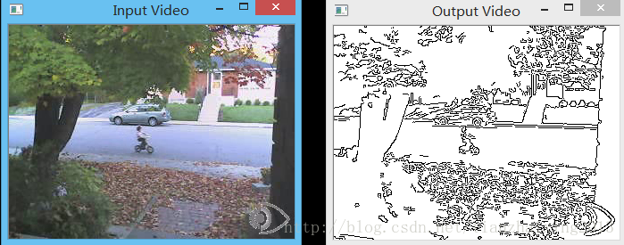
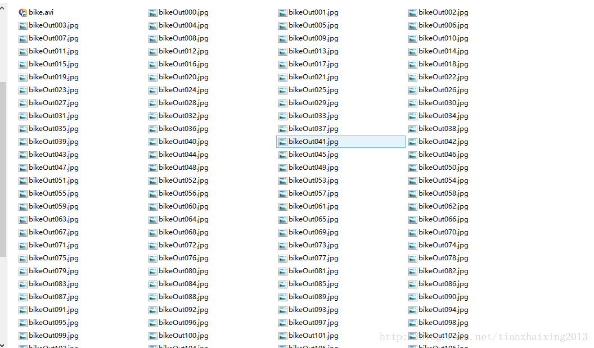
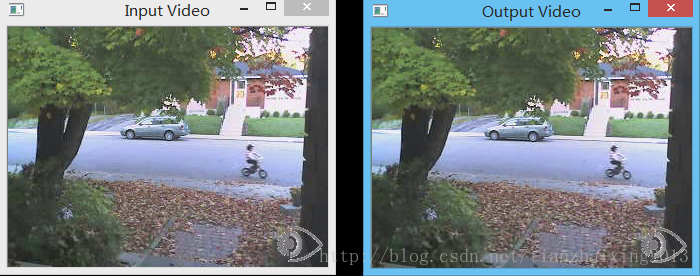

# 《OpenCV2 计算机视觉编程手册》视频处理一

本文主要结合《OpenCV2 计算机视觉编程手册》第10章的内容，学习OpenCV 处理视频图像的一般方法，包括读入，处理，写出。

1.头文件


```
    #ifndef HEAD_H_
    #define HEAD_H_

    #include <iostream>
    #include <iomanip>// 控制输出格式
    #include <sstream>// 文件流控制
    #include <string>
    #include <vector>

    #include <opencv2/core/core.hpp>
    #include <opencv2/imgproc/imgproc.hpp>
    #include <opencv2/highgui/highgui.hpp>

    #endif // HEAD_H_
```


  


2\. VideoProcessor头文件 

  


```
    #ifndef VPROCESSOR_H_
    #define VPROCESSOR_H_

    #include "head.h"

    void canny(cv::Mat& img, cv::Mat& out)
    {
        cv::cvtColor(img, out, CV_BGR2GRAY);                      // 灰度转换
        cv::Canny(out, out, 100, 200);                            // Canny边缘检测
        cv::threshold(out, out, 128, 255, cv::THRESH_BINARY_INV); // 二值图像反转, 小于128设置为255, 否则为0;即边缘为黑色
    }

    // 抽象类FrameProcessor中纯虚函数process必须在子类(其继承类)中重新定义。
    // http://blog.csdn.net/hackbuteer1/article/details/7558868
    // 帧处理器接口
    class FrameProcessor
    {
      public:
        // 处理方法,定义为纯虚函数, 让其子类实现具体的接口
        virtual void process(cv:: Mat &input, cv:: Mat &output)= 0;
    };


    class VideoProcessor
    {
      private:
          cv::VideoCapture capture;           // OpenCV视频采集对象(object)
          void (*process)(cv::Mat&, cv::Mat&);// 每帧处理的回调函数, 函数指针调用
          FrameProcessor *frameProcessor;     // 基类(含纯虚函数的抽象类)FrameProcessor接口指针, 指向子类的实现
          bool callIt;                        // 启动回调函数与否的bool判断, true:调用, false:不调用
          std::string windowNameInput;        // 输入显示窗口名字
          std::string windowNameOutput;       // 输出显示窗口名字
          int delay;                          // 帧间处理延迟
          long fnumber;                       // 已处理帧总数
          long frameToStop;                   // 在该帧停止
          bool stop;                          // 停止处理标志位!

          std::vector<std::string> images;               // 输入的图像集或者图像向量(vector容器)
          std::vector<std::string>::const_iterator itImg;// 图像集的迭代器

          cv::VideoWriter writer;             // OpenCV视频写出对象
          std::string outputFile;             // 输出视频文件名字
          int currentIndex;                   // 输出图像集的当前索引
          int digits;                         // 输出图像文件名字的数字
          std::string extension;              // 输出图像集的扩展名

          // Getting the next frame which could be: video file; camera; vector of images
          bool readNextFrame(cv::Mat& frame)
          {
              if (images.size()==0)
                  return capture.read(frame);
              else
              {
                  if (itImg != images.end())
                  {
                      frame= cv::imread(*itImg);
                      itImg++;
                      return frame.data != 0;
                  }
                  else
                  {
                      return false;
                  }
              }
          }

          // Writing the output frame which could be: video file or images
          void writeNextFrame(cv::Mat& frame)
          {
              if (extension.length())
              { // 输出图像文件
                  std::stringstream ss;
                  ss << outputFile << std::setfill('0') << std::setw(digits) << currentIndex++ << extension;
                  cv::imwrite(ss.str(),frame);
              }
              else
              { // 输出视频文件
                  writer.write(frame);
              }
          }

      public:
          // 构造函数
          VideoProcessor() : callIt(false), delay(-1),
              fnumber(0), stop(false), digits(0), frameToStop(-1),
              process(0), frameProcessor(0) {}

          // 设置视频文件的名字
          bool setInput(std::string filename)
          {
            fnumber= 0;
            // In case a resource was already
            // associated with the VideoCapture instance
            capture.release();            // 释放之前打开过的资源
            images.clear();               // 释放之前打开过的资源
            return capture.open(filename);// 打开视频文件
          }

          // 设置相机ID
          bool setInput(int id)
          {
            fnumber= 0;
            // In case a resource was already
            // associated with the VideoCapture instance
            capture.release();
            images.clear();
            // 打开视频文件
            return capture.open(id);
          }

          // 设置输入的图像集
          bool setInput(const std::vector<std::string>& imgs)
          {
            fnumber= 0;
            // In case a resource was already
            // associated with the VideoCapture instance
            capture.release();//释放之前打开过的资源

            // 输入的是图像集
            images= imgs;
            itImg= images.begin();
            return true;
          }

          // 设置输出视频文件, 默认参数和输入的一样
          bool setOutput(const std::string &filename, int codec=0, double framerate=0.0, bool isColor=true)
          {
              outputFile= filename;
              extension.clear();

              if (framerate==0.0)
                  framerate= getFrameRate(); // 与输入相同

              char c[4];                     // 使用和输入相同的编码格式
              if (codec==0)
              {
                  codec= getCodec(c);
              }

              // 打开输出视频
              return writer.open(outputFile, // 文件名
                  codec,                     // 使用的解码格式
                  framerate,                 // 帧率
                  getFrameSize(),            // 帧大小
                  isColor);                  // 是否为彩色视频
          }

          // 设置输出是图像集, 后缀必须是".jpg", ".bmp" ...
          bool setOutput(const std::string &filename, // 文件名前缀
              const std::string &ext,                 // 图像文件后缀
              int numberOfDigits=3,                   // 数字位数
              int startIndex=0)                       // 开始索引000
          {
              if (numberOfDigits<0)                   // 数字位数必须是正数
                  return false;

              outputFile = filename;                  // 文件名
              extension  = ext;                       // 公共后缀名

              digits       = numberOfDigits;          // 文件名中的数字位数
              currentIndex = startIndex;              // 开始索引

              return true;
          }

          // 设置每一帧的回调函数
          void setFrameProcessor(void (*frameProcessingCallback)(cv::Mat&, cv::Mat&))
          {
              // invalidate frame processor class instance 使FrameProcessor实例无效化
              frameProcessor = 0;
              process = frameProcessingCallback;
              callProcess();
          }

          // 设置FrameProcessor接口实例
          void setFrameProcessor(FrameProcessor* frameProcessorPtr)
          {
              // invalidate callback function 使回调函数无效化
              process = 0;
              frameProcessor= frameProcessorPtr;
              callProcess();
          }

          // 在frame帧停止
          void stopAtFrameNo(long frame)
          {
              frameToStop= frame;
          }

          // 处理回调函数
          void callProcess()
          {
              callIt= true;
          }

          // 不调用回调函数
          void dontCallProcess()
          {
              callIt= false;
          }

          // 显示输入的图像帧
          void displayInput(std::string wn)
          {
              windowNameInput= wn;
              cv::namedWindow(windowNameInput);
          }

          // 显示处理的图像帧
          void displayOutput(std::string wn)
          {
              windowNameOutput= wn;
              cv::namedWindow(windowNameOutput);
          }

          // 不显示处理的图像帧
          void dontDisplay()
          {
              cv::destroyWindow(windowNameInput);
              cv::destroyWindow(windowNameOutput);
              windowNameInput.clear();
              windowNameOutput.clear();
          }

          // 设置帧间延迟时间
          // 0 means wait at each frame
          // negative means no delay
          void setDelay(int d)
          {
              delay= d;
          }

          // 处理帧的总数
          long getNumberOfProcessedFrames()
          {
              return fnumber;
          }

          // 返回视频帧的大小
          cv::Size getFrameSize()
          {
            if (images.size()==0)
            {
                // get size of from the capture device
                int w= static_cast<int>(capture.get(CV_CAP_PROP_FRAME_WIDTH));
                int h= static_cast<int>(capture.get(CV_CAP_PROP_FRAME_HEIGHT));

                return cv::Size(w,h);
            }
            else
            { // if input is vector of images
                cv::Mat tmp= cv::imread(images[0]);
                if (!tmp.data) return cv::Size(0,0);
                else return tmp.size();
            }
          }

          // 返回下一帧的帧数
          long getFrameNumber()
          {
            if (images.size()==0)
            {
                // get info of from the capture device
                 long f= static_cast<long>(capture.get(CV_CAP_PROP_POS_FRAMES));
                return f;
            }
            else
            { // if input is vector of images
                return static_cast<long>(itImg-images.begin());
            }
          }

          // return the position in ms
          double getPositionMS()
          {
              // undefined for vector of images
              if (images.size()!=0) return 0.0;

               double t= capture.get(CV_CAP_PROP_POS_MSEC);
              return t;
          }

          // 返回帧率
          double getFrameRate()
          {
              // undefined for vector of images
              if (images.size()!=0) return 0;

               double r= capture.get(CV_CAP_PROP_FPS);
              return r;
          }

          // 返回视频中图像的总数
          long getTotalFrameCount()
          {
              // for vector of images
              if (images.size()!=0) return images.size();

               long t= capture.get(CV_CAP_PROP_FRAME_COUNT);
              return t;
          }

          // 获取输入视频的编解码器
          int getCodec(char codec[4])
          {
              // 未制定的图像集
              if (images.size()!=0) return -1;

              union
              {// 4-char编码的数据结果
                  int value;
                  char code[4];
              } returned;
              // 获取编码
              returned.value= static_cast<int>(capture.get(CV_CAP_PROP_FOURCC));
              // 获得4字符
              codec[0]= returned.code[0];
              codec[1]= returned.code[1];
              codec[2]= returned.code[2];
              codec[3]= returned.code[3];
              // 返回对应的整数
              return returned.value;
          }

          // 设置帧位置
          bool setFrameNumber(long pos)
          {
              // for vector of images
              if (images.size()!=0)
              {
                  // move to position in vector
                  itImg= images.begin() + pos;
                  // is it a valid position?
                  if (pos < images.size())
                      return true;
                  else
                      return false;

              }
              else
              { // if input is a capture device
                return capture.set(CV_CAP_PROP_POS_FRAMES, pos);
              }
          }

          // go to this position
          bool setPositionMS(double pos)
          {
              // not defined in vector of images
              if (images.size()!=0)
                  return false;
              else
                  return capture.set(CV_CAP_PROP_POS_MSEC, pos);
          }

          // go to this position expressed in fraction of total film length
          bool setRelativePosition(double pos)
          {
              // for vector of images
              if (images.size()!=0)
              {
                  // move to position in vector
                  long posI= static_cast<long>(pos*images.size()+0.5);
                  itImg= images.begin() + posI;
                  // is it a valid position?
                  if (posI < images.size())
                      return true;
                  else
                      return false;
              }
              else
              { // if input is a capture device
                  return capture.set(CV_CAP_PROP_POS_AVI_RATIO, pos);
              }
          }

          // 停止运行
          void stopIt()
          {
              stop= true;
          }
          // 是否已停止运行?
          bool isStopped()
          {
              return stop;
          }


          // 判断是否是视频捕获设备或图像集
          bool isOpened()
          {
              return capture.isOpened() || !images.empty();
          }

          // 获取并处理图像
          void run()
          {
              cv::Mat frame;  // 当前帧
              cv::Mat output; // 输出帧

              // if no capture device has been set
              if (!isOpened())
                  return;

              stop= false;
              while (!isStopped())
              {
                  // 读取下一帧
                  if (!readNextFrame(frame))
                      break;

                  // 显示输出帧
                  if (windowNameInput.length()!=0)
                      cv::imshow(windowNameInput,frame);

                  // 调用帧处理回调函数或FrameProcessor实例
                  if (callIt)
                  {
                    // 处理当前帧
                    if (process)             // 如果是回调函数
                        process(frame, output);
                    else if (frameProcessor) //如果是FrameProcessor实例
                        frameProcessor->process(frame,output);
                    // 增加帧数
                    fnumber++;

                  }
                  else
                  {
                    output= frame;
                  }

                  // 写出输出图像序列
                  if (outputFile.length()!=0)
                      writeNextFrame(output);

                  // 显示输出帧
                  if (windowNameOutput.length()!=0)
                      cv::imshow(windowNameOutput,output);

                  // 引入帧间延迟
                  if (delay>=0 && cv::waitKey(delay)>=0)
                    stopIt();

                  // 检查是否需要停止运行
                  if (frameToStop>=0 && getFrameNumber()==frameToStop)
                      stopIt();
              }
          }
    };

    #endif // VPROCESSOR_H_
```


  
3\. 主函数 

  


```cpp
    #include "head.h"
    #include "videoprocessor.h"


    int main()
    {
        //----Zero Test----
        cv::VideoCapture capture("../bike.avi"); // 打开视频/摄像头0
        if (!capture.isOpened())
            return 1;
        double rate= capture.get(CV_CAP_PROP_FPS);// 获取帧率
        bool stop(false);
        cv::Mat frame;                            // 当前帧
        cv::namedWindow("Extracted Frame");
        int delay= 1000/rate;                     // 延迟的毫秒
        //int delay = 1000;
        // 处理视频所有帧
        while (!stop)
        {
            // read next frame if any
            if (!capture.read(frame))
                break;
            cv::imshow("Extracted Frame",frame);
            if (cv::waitKey(delay)>=0)            // 延迟等待直到cv::waitKey(delay)<0
                    stop= true;
        }
        capture.release();                       // 因为capture自动调用析构函数，所以capture.release不是必须的!
        cv::waitKey();

        //----First Test----
        VideoProcessor processor;                           // 创建VideoProcessor类实例 processor
        processor.setInput("../bike.avi");                  // 打开视频文件bike.avi
        processor.displayInput("Input Video");              // 声明输入视频显示窗口
        processor.displayOutput("Output Video");            // 声明输出视频显示窗口
        processor.setDelay(1000./processor.getFrameRate()); // 设置播放视频为原始输入视频帧率
        processor.setFrameProcessor(canny);                 // 设置帧处理器的回调函数--canny
        processor.run();                                    // 开始处理视频文件
        cv::waitKey();                                      // 等待按键响应

        //----Second test----
        processor.setInput("../bike.avi");                            // 重新设置打开视频
        cv::Size size= processor.getFrameSize();                      // 获取视频文件的基本信息
        std::cout << size.width << " " << size.height << std::endl;   // 视频图像的宽度(列)和高度(行)
        std::cout << processor.getFrameRate() << std::endl;           // 视频的帧率
        std::cout << processor.getTotalFrameCount() << std::endl;     // 视频总的帧数
        std::cout << processor.getFrameNumber() << std::endl;         // 视频帧的编号
        std::cout << processor.getPositionMS() << std::endl;          // 视频帧的位置(ms)
        processor.dontCallProcess();                                   // 不处理打开视频文件
        // 输出.jpg视频图像到output文件夹, 图像名字为bikeOut000.jpg~bikeOut118.jpg
        processor.setOutput("../output/bikeOut",".jpg");
        processor.run();
        cv::waitKey();
        // 输出bike.avi视频到output文件夹,编解码器为:XVID, 基于MPEG-4视频标准的开源解码库
        char codec[4];                                                 // 编解码器标识
        processor.setOutput("../output/bike.avi",processor.getCodec(codec),processor.getFrameRate());
        std::cout << "Codec: " << codec[0] << codec[1] << codec[2] << codec[3] << std::endl;
        processor.run();
        cv::waitKey();


        //----Three test----
        processor.setInput("../bike.avi");
        processor.displayInput("Input Video");              // 声明输入视频显示窗口
        processor.displayOutput("Output Video");            // 声明输出视频显示窗口
        processor.setFrameNumber(80);                       // 设置帧的位置
        processor.stopAtFrameNo(120);                       // 停止的帧位置
        processor.setDelay(1000./processor.getFrameRate());
        processor.run();
        cv::waitKey();

        return 0;
    }
```


  
Canny边缘检测 

  


  


视频写出结果(包含文件和视频)

  


  


制定开始帧和结束帧位置

  


  


  


  


  


  
  
```