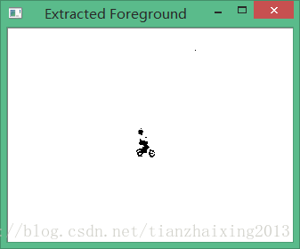
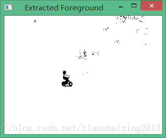

# 《OpenCV2 计算机视觉编程手册》视频处理三

本文在[《OpenCV2 计算机视觉编程手册》视频处理一](http://blog.csdn.net/tianzhaixing2013/article/details/42463937)的基础上，引入视频前背景分割的处理方法。

首先，给出了OpenCV2自带的前背景分割方法，该方法基于混合高斯模型对背景建模，从而提前视频序列中的前景对象。

接着，利用建立的前背景分割类实例，实现对视频序列中背景建模，从而提取其前景对象。

1\. main函数


```cpp
    #include "head.h"
    #include "BGFGSegmentor.h"
    #include "videoprocessor.h"
    #include <opencv2/video/background_segm.hpp>

    int main()
    {
        cv::VideoCapture capture("../bike.avi"); // 打开视频文件
        if (!capture.isOpened())                 // 检查是否成功打开
            return 0;

        cv::Mat frame;                           // 当前视频帧
        cv::Mat foreground;                      // 前景二值图像

        cv::namedWindow("Extracted Foreground");

        cv::BackgroundSubtractorMOG mog;         // 使用默认参数的Mixture of Gaussian对象 混合高斯模型

        bool stop(false);
        // 遍历每一帧
        while (!stop)
        {
            // 读取下一帧
            if (!capture.read(frame))
                break;

            mog(frame,foreground,0.01);           // 更新背景并返回前景

            cv::threshold(foreground,foreground,128,255,cv::THRESH_BINARY_INV); // 对二值图像取反
            cv::imshow("Extracted Foreground",foreground);                      // 显示前景

            if (cv::waitKey(10)>=0)                                             // 引入延迟或等待按键按下
                    stop= true;
        }
        cv::waitKey();


        VideoProcessor processor;                           // 创建一个视频处理实例
        BGFGSegmentor segmentor;                            // 创建前背景分割器
        segmentor.setThreshold(25);                         // 设置阈值

        processor.setInput("../bike.avi");                  // 打开视频文件
        processor.setFrameProcessor(&segmentor);            // 设置帧处理器为前背景分割器实例segmentor
        processor.displayOutput("Extracted Foreground");    // 声明显示窗口
        processor.setDelay(1000./processor.getFrameRate()); // 以 原始帧率播放视频
        processor.run();                                    // 处理视频

        cv::waitKey();
    }
```
cpp


  


2\. 前背景分割类


```cpp
    #include "head.h"
    #include "BGFGSegmentor.h"
    #include "videoprocessor.h"
    #include <opencv2/video/background_segm.hpp>

    int main()
    {
        cv::VideoCapture capture("../bike.avi"); // 打开视频文件
        if (!capture.isOpened())                 // 检查是否成功打开
            return 0;

        cv::Mat frame;                           // 当前视频帧
        cv::Mat foreground;                      // 前景二值图像

        cv::namedWindow("Extracted Foreground");

        cv::BackgroundSubtractorMOG mog;         // 使用默认参数的Mixture of Gaussian对象 混合高斯模型

        bool stop(false);
        // 遍历每一帧
        while (!stop)
        {
            // 读取下一帧
            if (!capture.read(frame))
                break;

            mog(frame,foreground,0.01);           // 更新背景并返回前景

            cv::threshold(foreground,foreground,128,255,cv::THRESH_BINARY_INV); // 对二值图像取反
            cv::imshow("Extracted Foreground",foreground);                      // 显示前景

            if (cv::waitKey(10)>=0)                                             // 引入延迟或等待按键按下
                    stop= true;
        }
        cv::waitKey();


        VideoProcessor processor;                           // 创建一个视频处理实例
        BGFGSegmentor segmentor;                            // 创建前背景分割器
        segmentor.setThreshold(25);                         // 设置阈值

        processor.setInput("../bike.avi");                  // 打开视频文件
        processor.setFrameProcessor(&segmentor);            // 设置帧处理器为前背景分割器实例segmentor
        processor.displayOutput("Extracted Foreground");    // 声明显示窗口
        processor.setDelay(1000./processor.getFrameRate()); // 以 原始帧率播放视频
        processor.run();                                    // 处理视频

        cv::waitKey();
    }
```


  


OpenCV自带函数前背景分割结果：

  




  


基于前背景分割类实现的前背景分割结果：

  


  


  


  


  