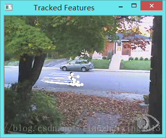

# 《OpenCV2 计算机视觉编程手册》视频处理二

本文结合上文[《OpenCV2 计算机视觉编码手册》视频处理一](http://blog.csdn.net/tianzhaixing2013/article/details/42463937)的基础上，添加视频跟踪类，来对视频中运动对象进行跟踪。

  


1\. 添加特征跟踪类


```cpp
    #ifndef FTRACKER
    #define FTRACKER

    #include "head.h"
    #include "videoprocessor.h"
    #include <opencv2/video/tracking.hpp>
    #include <opencv2/features2d/features2d.hpp>

    class FeatureTracker : public FrameProcessor
    {
    private:
        cv::Mat gray;                        // 当前灰度图像
        cv::Mat gray_prev;                    // 前一个灰度图像
        std::vector<cv::Point2f> points[2]; // 两幅图像跟踪特征 0->1
        std::vector<cv::Point2f> initial;   // 跟踪点的初始化
        std::vector<cv::Point2f> features;  // 检测到的特征
        int max_count;                        // 需要跟踪的最大特征数目
        double qlevel;                      // 特征检测中的质量等级
        double minDist;                     // 两特征点之间的最小距离
        std::vector<uchar> status;          // 跟踪的特征状态
        std::vector<float> err;             // 跟踪错误

    public:
        // 构造函数
        FeatureTracker() : max_count(500), qlevel(0.01), minDist(10.) {}

        // 处理方法
        void process(cv:: Mat &frame, cv:: Mat &output)
        {
            cv::cvtColor(frame, gray, CV_BGR2GRAY);  // 转换为灰度图像
            frame.copyTo(output);

            // 1. 如果需要添加新的特征点
            if(addNewPoints())
            {
                detectFeaturePoints();                                            // 检测特征点
                points[0].insert(points[0].end(),features.begin(),features.end());// 添加检测的特征到当前跟踪的特征
                initial.insert(initial.end(),features.begin(),features.end());
            }

            // 对应视频序列中的第一幅图像
            if(gray_prev.empty())
               gray.copyTo(gray_prev);

            // 2.跟踪特征
            cv::calcOpticalFlowPyrLK(gray_prev, gray, // 两幅连续图像
                points[0],                            // 图1中的输入点坐标
                points[1],                            // 图2中的输出点坐标
                status,                               // 跟踪成功
                err);                                 // 跟踪失败

            // 2. 遍历所有跟踪点进行筛选
            int k=0;
            for( int i= 0; i < points[1].size(); i++ )
            {
                // 是否需要保留该跟踪点？
                if (acceptTrackedPoint(i))
                {
                    // 保留该跟踪点到vector
                    initial[k]= initial[i];
                    points[1][k++] = points[1][i];
                }
            }

            // 去除不成功点
            points[1].resize(k);
            initial.resize(k);

            // 3. 处理接受的跟踪点
            handleTrackedPoints(frame, output);

            // 4. 当前的点和图像变为它之前的点和图像
            std::swap(points[1], points[0]);
            cv::swap(gray_prev, gray);
        }

        // 特征点检测
        void detectFeaturePoints()
        {    // 检测特征
            cv::goodFeaturesToTrack(gray, // 图像
                features,   // 检测到的特征
                max_count,  // 特征的最大数目
                qlevel,     // 质量等级
                minDist);   // 两个特征之间的最小距离
        }

        // 决定是否添加新点
        bool addNewPoints()
        {
            // 如果点的数量太少
            return points[0].size()<=10;
        }

        // 决定哪些点应该跟踪
        bool acceptTrackedPoint(int i)
        {
            return status[i] &&
                // 如果它移动了
                (abs(points[0][i].x-points[1][i].x)+
                (abs(points[0][i].y-points[1][i].y))>2);
        }

        // 处理当前跟踪点
        void handleTrackedPoints(cv:: Mat &frame, cv:: Mat &output)
        {
            // 遍历所有跟踪点
            for(int i= 0; i < points[1].size(); i++ )
            {
                // 绘制直线和圆
                cv::line(output,
                    initial[i],            // 初始位置
                    points[1][i],          // 新位置
                    cv::Scalar(255,255,255)// 白色
                    );

                cv::circle(output,          // 输出图像
                    points[1][i],           // 圆心
                    3,                      // 半径
                    cv::Scalar(255,255,255),// 白色
                    -1                      // 负数表示填充圆圈, 整数表示线条厚度
                    );
            }
        }
    };

    #endif
```


  
2\. main函数 


```
    #include "featuretracker.h"

    int main()
    {
        VideoProcessor processor;                           // 创建一个视频处理实例
        FeatureTracker tracker;                             // 创建一个特征跟踪实例
        processor.setInput("../bike.avi");                  // 打开视频文件
        processor.setFrameProcessor(&tracker);              // 设置帧处理器为一个特征跟踪实例tracker
        processor.displayOutput("Tracked Features");        // 声明跟踪特征显示窗口
        processor.setDelay(1000./processor.getFrameRate()); // 设置视频播放帧率为原始帧率
        processor.run();                                    // 开始处理
        cv::waitKey();                                      // 等待按键响应

        return 0;
    }
```


  
  


  


  


  


  


  


  


  


  
```