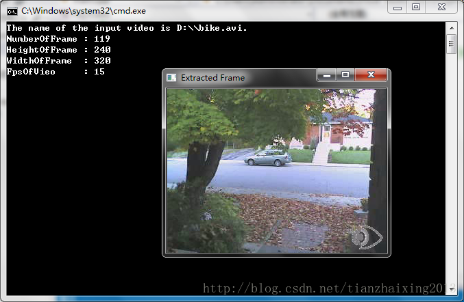

# Opencv 简单视频播放器

最近看了一下[1]_2011_OpenCV 2 Computer Vision Application Programming Cookbook.pdf，写了一个利用Opencv库实现的简单视频播放器。源码如下所示，英文注释大家应该可以看懂的。O(∩_∩)O~


```cpp
    // C++ header and namespace
    #include <iostream>
    #include <string>
    #include <cstdlib>
    using namespace std;

    // Opencv header and namespace
    #include <opencv2/core/core.hpp>
    #include <opencv2/highgui/highgui.hpp>
    #include <opencv2/imgproc/imgproc.hpp>
    #include <opencv2/video/video.hpp>
    using namespace cv;

    bool JumpToFrame(false);

    int main(int argc, char* argv[])
    {
        //!< Check out Input video
        if (argc != 2)
        {
            cerr << "Usage: VideoPlayer.exe VideoFilename." << endl;
            exit(1);
        }

        //!< Check out Open Video
        VideoCapture capture(argv[1]);
        if (!capture.isOpened())
        {
            return 1;
        }

    #pragma region InfoOfVideo

        long    NumberOfFrame = static_cast<long>(capture.get(CV_CAP_PROP_FRAME_COUNT));
        double  HeightOfFrame = capture.get(CV_CAP_PROP_FRAME_HEIGHT);
        double  WidthOfFrame  = capture.get(CV_CAP_PROP_FRAME_WIDTH);
        double  FpsOfVideo    = capture.get(CV_CAP_PROP_FPS);

        cout << "The name of the input video is " << argv[1] << "." << endl;
        cout << "NumberOfFrame : " << NumberOfFrame << endl;
        cout << "HeightOfFrame : " << HeightOfFrame << endl;
        cout << "WidthOfFrame  : " << WidthOfFrame << endl;
        cout << "FpsOfVieo     : " << FpsOfVideo << endl;

    #pragma endregion

        // !< JumpToFrame function
        while (JumpToFrame)
        {
            double Position = 0.0;
            cout << "Please input the number of frame which you want jump to!" << endl;
            cin >> Position;
            capture.set(CV_CAP_PROP_POS_FRAMES, Position);
        }

        // !< Delay between each frame in ms corresponds to video frame rate(fps)
        Mat frame;
        bool stop(false);
        int delay = 1000 / FpsOfVideo;
        namedWindow("Extracted Frame");

        while (!stop)
        {
            //read next frame if any
            if (!capture.read(frame))
            {
                break;
            }
            imshow("Extracted Frame", frame);
            //introduce a delay or press key to stop
            if (waitKey(delay) >= 0)
            {
                stop = true;
            }
        }

        // !< Close the video file.
        // Not required since called by destructor
        capture.release();

        return 0;
    }
```


  
  
```