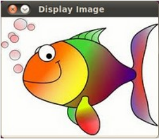

# Opencv2.4.3_tutorials(学习指南)——load and display an Image


```cpp
    1 #include <opencv2/core/core.hpp>
    2 #include <opencv2/highgui/highgui.hpp>
    3 #include <iostream>
    4
    5 using namespace cv;
    6 using namespace std;
    7
    8 int main( int argc, char**argv )
    9 {
    10 if( argc != 2)
    11 {
    12 cout <<" Usage: display_image ImageToLoadAndDisplay" << endl;
    13 return -1;
    14 }
    15
    16 Mat image;
    17 image = imread(argv[1], CV_LOAD_IMAGE_COLOR); // Read the file读取文件
    18
    19 if(! image.data ) // Check for invalid input检测输入文件无效性
    20 {
    21 cout << "Could not open or find the image" << std::endl ;
    22 return -1;
    23 }
    24
    25 namedWindow( "Display window", CV_WINDOW_AUTOSIZE );// Create a window for display.创建显示窗口
    26 imshow( "Display window", image ); // Show our image inside it.在创建窗口中显示图像
    27
    28 waitKey(0); // Wait for a keystroke in the window等待按键按下
    29 return 0;

    30 }
```  

目标

In this tutorial you will learn how to:  
• Load an image (usingimread)  
• Create a named OpenCV window (usingnamedWindow)  


• Display an image in an OpenCV window (usingimshow)

在这个教程中你将学会如何用imread加载一幅图像，

用namedWindow创建一个OpenCV窗口，

用imshow在创建的OpenCV窗口中显示加载的图像  

Source Code

源代码  


Explanation

解释说明  


In OpenCV 2 we have multiple modules. Each one takes care of a different area or approach towards image processing.  
You could already observe this in the structure of the user guide of these tutorials itself. Before you use any of them  


you first need to include the header files where the content of each individual module is declared.

在OpenCV2中，我们拥有多种模块。每个模块负责一个不同的方面或者图像处理的入口。

你可以在这个学习指南自身中的用户向导中查看这个结构。在你使用它们之前，你必须输入含有各自模块声明的头文件。  


  


You’ll almost always end up using the:

• core section, as here are defined the basic building blocks of the library  


• highgui module, as this contains the functions for input and output operations

你可能很多时候要用到core部分（因为这里定义了创建项目的基本库文件），highgui模块（因为它包含了输入输出操作的功能）。  


// Video Image PSNR and SSIM视频图像的PSNR(峰值信噪比)和SSIM(结构相似度)
#include <iostream> // for standard I/O标准输入输出


#include <string> // for strings字符串库

We also include the iostream to facilitate console line output and input. To avoid data structure and function name  
conflicts with other libraries, OpenCV has its own namespace:cv. To avoid the need appending prior each of these the  
cv::keyword you can import the namespace in the whole file by using the lines:  
using namespace cv;  


using namespace std;

  


This is true for the STL library too (used for console I/O). Now, let’s analyze themainfunction. We start up assuring  


that we acquire a valid image name argument from the command line.

  


if( argc != 2)
{
cout <<" Usage: display_image ImageToLoadAndDisplay" << endl;  
return -1;


}

  


Then create a Mat object that will store the data of the loaded image.

  


Mat image;

  


Now we call the imread function which loads the image name specified by the first argument (argv[1]).  


The second argument specifies the format in what we want the image. This may be:  


• CV_LOAD_IMAGE_UNCHANGED (<0) loads the image as is (including the alpha channel if present)  
• CV_LOAD_IMAGE_GRAYSCALE ( 0) loads the image as an intensity one  


• CV_LOAD_IMAGE_COLOR (>0) loads the image in the RGB format

  


image = imread(argv[1], CV_LOAD_IMAGE_COLOR); // Read the file

  


Note: OpenCV offers support for the image formats Windows bitmap (bmp), portable image formats (pbm, pgm,  
ppm) and Sun raster (sr, ras). With help of plugins (you need to specify to use them if you build yourself the library,  
nevertheless in the packages we ship present by default) you may also load image formats like JPEG (jpeg, jpg, jpe),  
JPEG 2000 (jp2 - codenamed in the CMake as Jasper), TIFF files (tiff, tif) and portable network graphics (png).  


Furthermore, OpenEXR is also a possibility.

  


After checking that the image data was loaded correctly, we want to display our image, so we create an OpenCV  
window using thenamedWindowfunction. These are automatically managed by OpenCV once you create them. For  
this you need to specify its name and how it should handle the change of the image it contains from a size point of  
view. It may be:  
• CV_WINDOW_AUTOSIZEis the only supported one if you do not use the Qt backend. In this case the window  
size will take up the size of the image it shows. No resize permitted!  
• CV_WINDOW_NORMALon Qt you may use this to allow window resize. The image will resize itself according  
to the current window size. By using the | operator you also need to specify if you would like the image to keep  


its aspect ratio (CV_WINDOW_KEEPRATIO) or not (CV_WINDOW_FREERATIO).

  


namedWindow( "Display window", CV_WINDOW_AUTOSIZE );// Create a window for display.

  


Finally, to update the content of the OpenCV window with a new image use theimshowfunction. Specify the OpenCV  
window name to update and the image to use during this operation:  
  


imshow( "Display window", image ); // Show our image inside it.

  


Because we want our window to be displayed until the user presses a key (otherwise the program would end far too  
quickly), we use thewaitKeyfunction whose only parameter is just how long should it wait for a user input (measured  


in milliseconds). Zero means to wait forever.

  


waitKey(0); // Wait for a keystroke in the window

  


Result  
• Compile your code and then run the executable giving an image path as argument. If you’re on Windows the  


executable will of course contain anexeextension too. Of course assure the image file is near your program file.

./DisplayImage HappyFish.jpg

• You should get a nice window as the one shown below:

  
```
