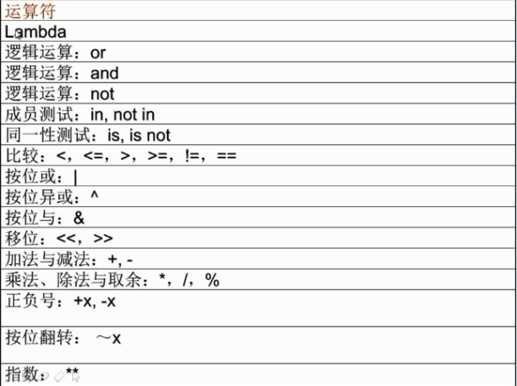

# Python--变量/运算符/表达式

**1.python变量**

**python变量名称只是用来引用内存中存储数据的标签；内存中相同的存储数据可以有多个标签，即多个变量名称。**

**变量名有字母、数字、下划线组成，数字不能开头，不可以使用关键字。**

**变量赋值：变量声明和定义的过程。eg:a=1，id(a)获取a的地址。**

**2.python运算符与表达式**

**—赋值运算符：=、+=、-=、*=、/=、%=**


```
**—算术运算符：+、-、*、/(实数除法)、//(整数除法)、%(求余数)、**(求幂运算，2**3=8)**


    user1@ubuntu:~$ su
    Password:
    root@ubuntu:/home/user1# cd ~
    root@ubuntu:~# cd csvtpy/
    root@ubuntu:~/csvtpy# python
    Python 2.7.3 (default, Apr 10 2013, 06:20:15)
    [GCC 4.6.3] on linux2
    Type "help", "copyright", "credits" or "license" for more information.
    >>> 1+1
    2
    >>> 3-2
    1
    >>> 3*4
    12
    >>> 4/2
    2
    >>> 3/2
    1
    >>> 3.0/2
    1.5
    >>> 3.0//2
    1.0
    >>> 17/6
    2
    >>> 17%6
    5
    >>> 3**2
    9
    >>> 3**3
    27
    >>> a33=3**3
    >>> a33
    27
    >>> print a33
    27
    >>> a33-12
    15
    >>> a15=a33-12
    >>> a15
    15
    >>> a=100
    >>> a-50
    50
    >>> b=a-50
    >>> b
    50
    >>> a
    100
    >>> a=a-50
    >>> a
    50
    >>> a-=50
    >>> a
    0
    >>> a+=20
    >>> a
    20
    >>> a*=3
    >>> a
    60
    >>> a/=2
    >>> a
    30
    >>> a%=4
    >>> a
    2
    >>>
```


  
四则运算器：


```
    root@ubuntu:~/csvtpy# vim 3.py
    root@ubuntu:~/csvtpy# python 3.py
    5
    1
    6
    1
    root@ubuntu:~/csvtpy# vim 3.py
    root@ubuntu:~/csvtpy# python 3.py
    5
    2
    52
    Traceback (most recent call last):
      File "3.py", line 6, in <module>
        print a-b
    TypeError: unsupported operand type(s) for -: 'str' and 'str'
    root@ubuntu:~/csvtpy# vim 3.py
    root@ubuntu:~/csvtpy# python 3.py
    5
    2
    7
    3
    10
    2
    root@ubuntu:~/csvtpy# vim 3.py
    root@ubuntu:~/csvtpy# python 3.py
    please input num1:8
    please input num1:9
    17
    -1
    72
    0
    root@ubuntu:~/csvtpy# vim 3.py
    root@ubuntu:~/csvtpy# python 3.py
    please input num1:3
    please input num2:5
    8
    -2
    15
    0
    root@ubuntu:~/csvtpy#


    3.py里面的内容：
    #!/usr/bin/python
    a=int(raw_input("please input num1:"))
    b=int(raw_input("please input num2:"))

    print a+b
    print a-b
    print a*b
    print a/b
```


  


```
**—关系运算符： <、>、<=、>=、!=、== (均返回bool值)**


    >>> 1<2
    True
    >>> 3<1
    False
    >>> 3>2
    True
    >>> 3>5
    False
    >>> 3!=5
    True
    >>> 3!=3
    False
    >>> 3==3
    True
    >>> 3==3.0
    True
    >>> 3==33
    False
    >>>
```


```
**—逻辑运算符：and、or、not (均返回bo** ol值)


    >>> 1>2 2<3
      File "<stdin>", line 1
        1>2 2<3
            ^
    SyntaxError: invalid syntax
    >>> 1>2 and  2<3
    False
    >>> 5>2 and  2<3
    True
    >>> 5>2 and  2>3
    False
    >>> 5<2 and  2>3
    False
    >>>
    >>> 1>2 or  2<3
    True
    >>> 5<2 and  5<3
    False
    >>>
    >>> 1>2
    False
    >>> not 1>2
    True
    >>>
```


  


```
**表达式是将不同数据(包括变量、函数)，用运算符按一定规则连接起来的一种式子。**


    user1@ubuntu:~$ su
    Password:
    root@ubuntu:/home/user1# cd ~
    root@ubuntu:~# cd csvtpy/
    root@ubuntu:~/csvtpy# python
    Python 2.7.3 (default, Apr 10 2013, 06:20:15)
    [GCC 4.6.3] on linux2
    Type "help", "copyright", "credits" or "license" for more information.
    >>> a=3
    >>> a
    3
    >>> b=5
    >>> b
    5
    >>> 3+5
    8
    >>> a+b
    8
    >>> a1=1
    >>> a_1=2
    >>> _a_2=3
    >>> a1
    1
    >>> a_1
    2
    >>> _a_2
    3
    >>> _a3=3
    >>> _a3
    3
    >>> a=33
    >>> a
    33
    >>> a=44
    >>> a
    44
    >>> id(a)
    24767352
    >>> a=33
    >>> id(a)
    24765624
    >>> jb=23
    >>> print jb
    23
    >>> jb=23+2
    >>> print jb
    25
    >>> yd=45
    >>> yd=kao
    Traceback (most recent call last):
      File "<stdin>", line 1, in <module>
    NameError: name 'kao' is not defined
    >>> yd='kao'
    >>> print yd
    kao
    >>> HoursPerDay=24
    >>> MinutesPerHour=60
    >>> DaysPerWeek=7
    >>> TotalMinutesPerWeek=DaysPerWeek*HoursPerDay*MinutesPerHour
    >>> print TotalMinutesPerWeek
    10080
    >>> HoursPerDay=26
    >>> TotalMinutesPerWeek=DaysPerWeek*HoursPerDay*MinutesPerHour
    >>> print TotalMinutesPerWeek
    10920
    >>>
```


  
  


**以下图像来自中谷教育Python视频教学截图**

  