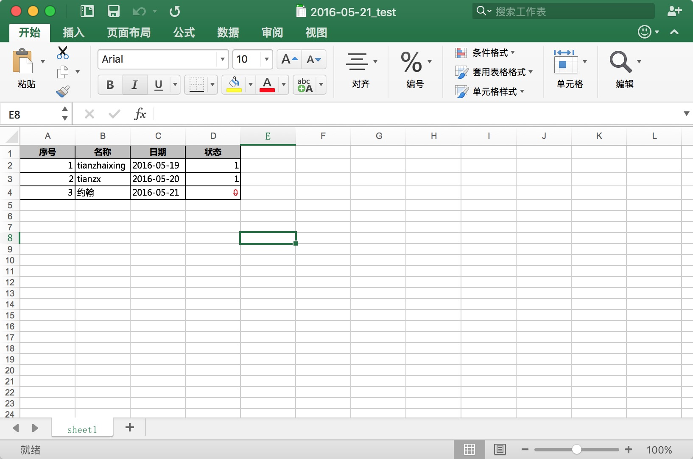

# Python Excel

最近，因为工作的需要，我用到了Python处理数据写入到Excel中进行一些统计相关的工作。

Show me the code:


```
    # -*- encoding:utf-8 -*-
    import sys
    import datetime
    import xlwt
    from xlwt import *

    reload(sys)
    sys.setdefaultencoding('utf-8')

    # excel表格操作
    workbook = xlwt.Workbook(encoding='utf-8')
    # 单元格边框
    borders = xlwt.Borders()
    borders.left = xlwt.Borders.THIN
    borders.right = xlwt.Borders.THIN
    borders.top = xlwt.Borders.THIN
    borders.bottom = xlwt.Borders.THIN

    # 普通单元格内容格式--One
    style = xlwt.XFStyle()
    font = xlwt.Font()
    # font.name = 'Times New Roman'
    # font.name = 'Arial'
    font.name = 'Microsoft YaHei'  # 微软雅黑字体
    style.font = font
    style.borders = borders

    # 日期类型单元格内容格式--Two
    dateStyle = xlwt.XFStyle()
    dateStyle.num_format_str = 'YYYY-MM-DD hh:mm:ss'
    dateStyle.font = font
    dateStyle.borders = borders

    # 标题类单元格内容格式--Three
    bgstyle = xlwt.XFStyle()
    font1 = xlwt.Font()
    font1.name = 'Microsoft YaHei'
    font1.bold = True
    bgstyle.font = font1
    # 对齐
    al = Alignment()
    al.horz = Alignment.HORZ_CENTER
    al.vert = Alignment.VERT_CENTER
    bgstyle.alignment = al
    # 填充
    pattern = xlwt.Pattern()
    pattern.pattern = xlwt.Pattern.SOLID_PATTERN
    pattern.pattern_fore_colour = 22
    bgstyle.pattern = pattern
    bgstyle.borders = borders

    # 单元格内容字体设置为红色，并添加删除线
    zeroStyle = xlwt.XFStyle()
    font2 = xlwt.Font()
    font2.struck_out = True
    font2.colour_index = 2
    zeroStyle.font = font2
    zeroStyle.borders = borders

    # 添加工作表, 允许单元格内容重写
    sheet = workbook.add_sheet('sheet1', cell_overwrite_ok=True)
    titles = ['序号', '名称', '日期', '状态']
    datas = [
        [1, 'tianzhaixing', '2016-05-19', 1],
        [2, 'tianzx', '2016-05-20', 1],
        [3, '约翰', '2016-05-21', 0]
    ]

    # 写入标题相关内容
    for i, v in enumerate(titles):
        sheet.write(0, i, v, bgstyle)

    # 写入数据内容
    for row, data in enumerate(datas):
        idx, name, date, status = data
        sheet.write(row + 1, 0, idx, style)
        sheet.write(row + 1, 1, name, style)
        sheet.write(row + 1, 2, date, dateStyle)
        sheet.write(row + 1, 3, status, style)
        if status == 0:
            sheet.write(row + 1, 3, status, zeroStyle)

    # 保存excel内容
    dayTime = datetime.datetime.now().strftime('%Y-%m-%d')
    workbookName = dayTime + '_test.xls'
    workbook.save(workbookName)
```


The result:



参考博客：

  * [xlwt](https://github.com/python-excel/xlwt/tree/master/examples)
  * [Python 读入Excel中数据方法](http://www.cnblogs.com/lhj588/archive/2012/01/06/2314181.html)
