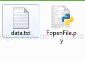
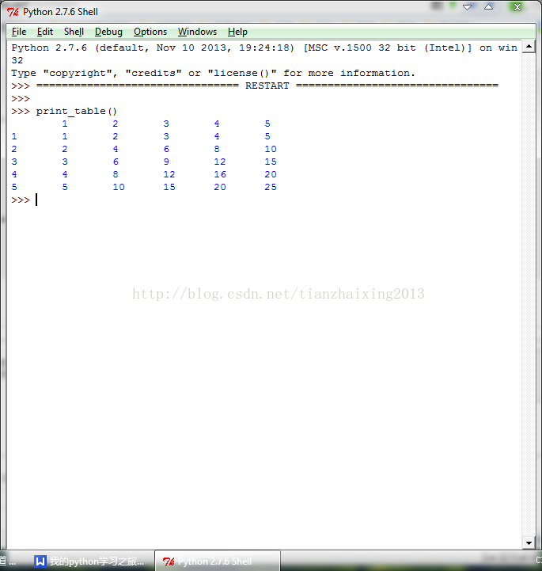

# <<Python编程实践>>之FileListTuple

1.FileList操作


```
    #!/usr/bin/python
    #encoding:utf8

    data = open('data.txt', 'r')

    print 'Including the blank character!'
    for line in data:
        '''包含空白字符，如空格，制表符以及换行符等'''
        print len(line)
    data.close()

    data = open('data.txt', 'r')
    print 'Excluding the blank character!'
    for line in data:
        '''不包含空白字符'''
        print len(line.strip())
    data.close()
```


  
  


2 ListTuple


```
    #!/usr/bin/python
    #encoding:utf8
    #5*5乘法表
    def print_table():
        '''Print the multiplication table for numbers 1 through 5.'''

        numbers = [1, 2, 3, 4, 5]

        # Print the header now.
        for i in numbers:
            print '\t' + str(i),
        print #End the header now.

        # Print the column number and the contents of the table.
        for i in numbers:
            print i,
            for j in numbers:
                print '\t' + str(i*j),
            print #End the current now.
```


  
  


  