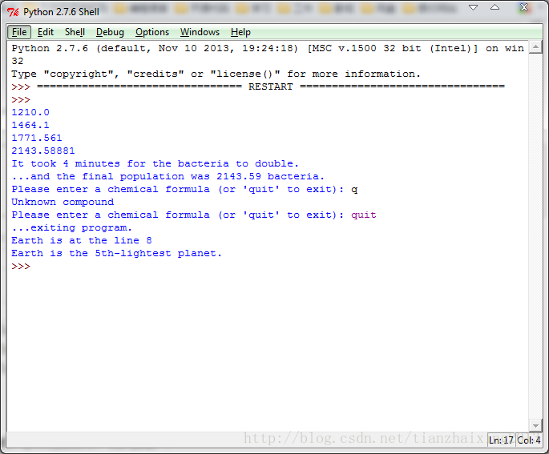

# <<Python编程实践>>之WhileBreakContinue


```
    #!user/bin/python
    #encoding:utf8

    #while
    time = 0
    population = 1000 # 1000 bacteria to start with
    grow_rate  = 0.21 # 21% growth per minute
    while population < 2000:
        population = population + grow_rate * population
        print population
        time = time + 1
    print "It took %d minutes for the bacteria to double." % time
    print "...and the final population was %6.2f bacteria." % population

    text = ' '
    while text != "quit":
        text = raw_input("Please enter a chemical formula (or 'quit' to exit): ")
        if text == "quit":
            print "...exiting program."
        elif text == "H2O":
            print "Water"
        elif text == "NH3":
            print "Ammonia"
        elif text == "CH3":
            print "Methane"
        else:
            print "Unknown compound"

    #break
    earth_line = 1
    file = open("data.txt","r")
    for line in file:
        line = line.strip()
        if line == "Earth":
            break
        earth_line += 1
    print "Earth is at the line %d" % earth_line
    file.close()

    #continue
    entry_number = 1
    file = open("data.txt","r")
    for line in file:
        line = line.strip()
        if line.startswith('#'):
            continue
        if line == "Earth":
            break
        entry_number += 1
    print "Earth is the %dth-lightest planet." % entry_number
```


  