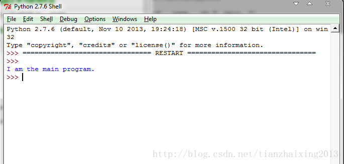
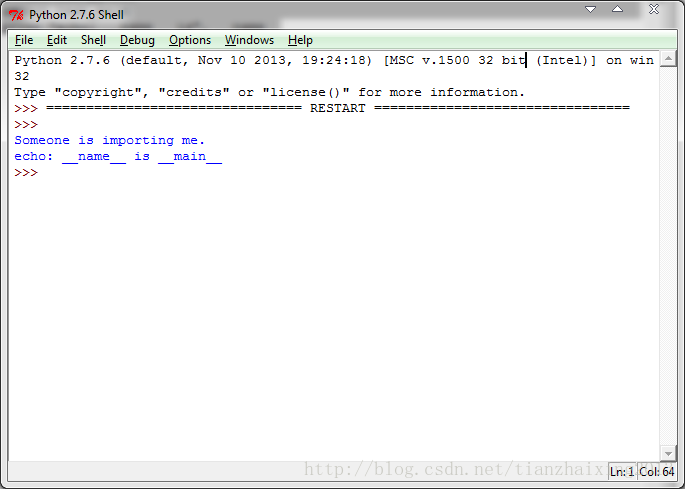
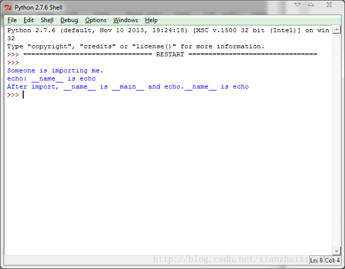

# <<Python编程实践>>之which is __main__

源代码文件

1.test_main.py


```
    #!/usr/bin/python

    if __name__ == "__main__":
        print "I am the main program."
    else:
        print "Someone is importing me."
```


  
运行结果： 

  


  


2.echo.py


```
    #!/usr/bin/python
    import test_main
    print "echo: __name__ is", __name__
```


  
运行结果： 

  


  


3.import_echo.py


```
    #!/usr/bin/python

    import echo
    print "After import, __name__ is", __name__, "and echo.__name__ is", echo.__name__
```


运行结果：

  