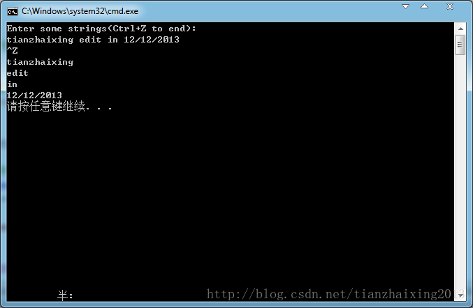

# STL_Sequence_StringList


```cpp
    #include <iostream>
    #include <list>            //修改地方
    #include <string>
    #include <cstdlib>

    using namespace std;

    int main()
    {
        list<string> lvec;   //修改地方
        string str;

        //将读入string对象存储在list对象中
        cout << "Enter some strings(Ctrl+Z to end):" << endl;

        while (cin >> str){
            lvec.push_back(str);
        }
        //输出list对象中的元素
        for (list<string>::iterator iter = lvec.begin();
            iter != lvec.end(); ++iter)//修改地方
        {
            cout << *iter << endl;
        }

        return EXIT_SUCCESS;
    }
```


  
```