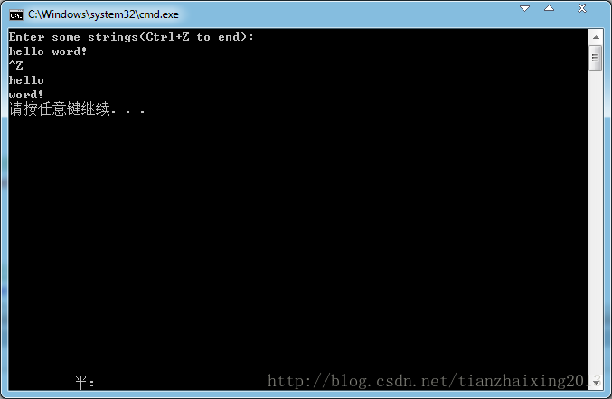

# STL_Sequence_StringVector


```cpp
    #include <iostream>
    #include <vector>
    #include <string>
    #include <cstdlib>

    using namespace std;

    int main()
    {
        vector<string> svec;
        string str;

        //将读入string对象存储在vector对象中
        cout << "Enter some strings(Ctrl+Z to end):" << endl;

        while (cin>>str){
            svec.push_back(str);
        }
        //输出vector对象中的元素
        for (vector<string>::iterator iter = svec.begin();
            iter != svec.end(); ++iter)
        {
            cout << *iter << endl;
        }
        return EXIT_SUCCESS;
    }
```


  
```