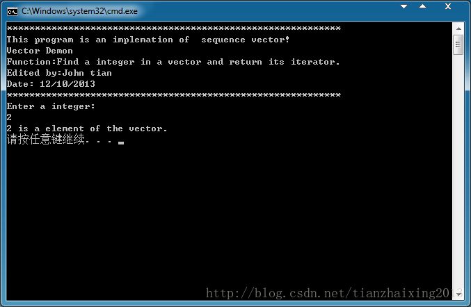

# STL_Sequence_Vector


```cpp
    #include <iostream>
    #include <vector>
    #include <string>
    #include <cstdlib>//return 数值不因机器环境而变

    using namespace std;

    vector<int>::iterator findint(vector<int>::iterator beg,
                                                      vector<int>::iterator end, int ival)
    {
        while (beg != end)
        {
            if (*beg == ival){
                break;
            }
            else{
                ++beg;
            }
        }
        return beg;
    }

    void DemonFunction(char * Demon)
    {
        cout << "************************************************************ \n"
            << "This program is an implemation of  sequence vector! \n"
            <<  Demon << "\n"
            << "Function:Find a integer in a vector and return its iterator.\n"
            << "Edited by:John tian\n"
            << "Date: 12/10/2013\n"
            << "************************************************************ "
            << endl;
    }
    int main()
    {
        char *Demon = "Vector Demon";
        DemonFunction(Demon);

        int ia[] = { 0, 1, 2, 3, 4, 5, 6 };
        vector<int> ivec(ia, ia + 7);
        //read data for finding
        cout << "Enter a integer:" << endl;
        int ival;
        cin >> ival;

        //findint function
        vector<int>::iterator it;
        it = findint(ivec.begin(), ivec.end(), ival);
        if (it != ivec.end()){
            cout << ival << " is a element of the vector." << endl;
        }
        else{
            cout << ival << " isn't a element of the vector." << endl;
        }
        return EXIT_SUCCESS;
    }
```


  
```