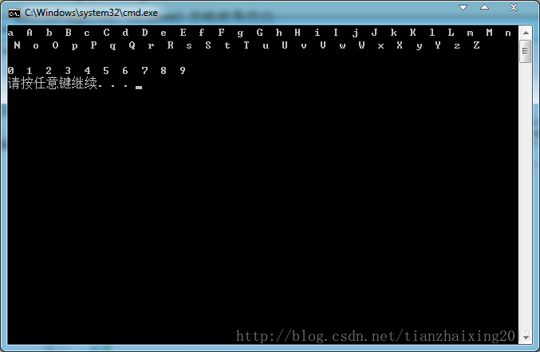

# STL_Sequence_大小写英文字母和数字进栈输出显示


```cpp
    #include  <iostream>
    #include <cstdlib>   //return结果不因机器环境改变
    #include <iomanip> //控制输出格式
    #include <vector>
    #include  <list>

    using namespace std;

    int main(int argc,char *argv[])
    {

        list<char> Alphabet;
        vector<int> Number;

        //小写和大写字母进栈
        for(char c = 'a', C='A'; c <= 'z',C<='Z'; ++c,++C)
        {
            Alphabet.push_back(c);
            Alphabet.push_back(C);
        }
        //数字进栈
        for (int i=0;i<10;++i)
        {
            Number.push_back(i);
        }

        //显示小写和大写字母
        list<char>::const_iterator pos1;
        for(pos1 = Alphabet.begin(); pos1 != Alphabet.end(); ++pos1)
        {
            cout <<setiosflags(ios::left)<< setw(2)<<*pos1 << ' ';
        }
        cout << endl<<endl;
        //显示数字
        vector<int>::const_iterator pos2;
        for (pos2 = Number.begin();pos2 != Number.end();++pos2)
        {
            cout<<setiosflags(ios::left)<<setw(2)<<*pos2<<' ';
        }
        cout<<endl;

        return EXIT_SUCCESS;

    }
```


  
```